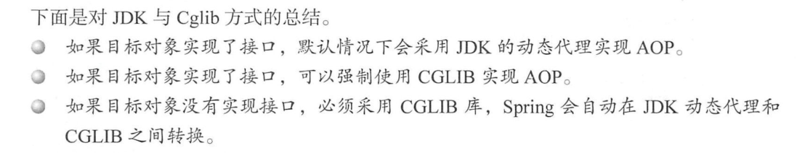

#                        AOP分析

### 核心概念

- 前置通知：在目标方法执行之前执行，不改变方法的执行流程及执行结果，前置通知的实现类要实现`MethodBeforeAdvice`这个接口。
- 环绕通知：也叫方法拦截器，可以改变方法的执行流程及执行结果，环绕通知的实现类要实现`MethodInterceptor`这个接口。 (最强大)

- 后置通知：在目标方法执行之后执行，不改变方法的执行流程及执行结果，后置通知的实现类要实现`AfterReturningAdvice`这个接口。
- 异常通知： 在方法执行出现异常时候 ,需要实现这个接口`ThrowsAdvice`。

- 顾问（advisor） 核心接口：`PointcutAdvisor `接口，通知增强版
- 切入点 ` Pointcut` : 切点的定义会匹配通知所要织入的一个或多个连接点.我们通常使用明确的类和方法名称，或是利用正则表达式定义所匹配的类和方法名称来指定这些切点。有些AOP框架允许我们创建动态的切
  点，可以根据运行时的决策（比如方法的参数值）来决定是否应用通知。
- 连接点：我们的应用可能也有数以千计的时机应用通知。这些时机被称为连接点。连接点是在应用执行过程中能够插入切面的一个点。这个点可以是调用方法时、抛出异常时、甚至修改一个字段时。切面代码可以利用这些点插入到应用的正常流程之中，并添加新的行为。
- 织入：织入是把切面应用到目标对象并创建新的代理对象的过程。切面在指定的连接点被织入到目标对象中。
- 切面： **切面是通知和切点的结合**。通知和切点共同定义了切面的全部内容——它是什么，在何时和何处完成其功能。

**总结  通知：解决了是它是什么和何时，切入点解决了在和何处完成，合并成为切面。称之面向切面编程**

- 是什么：是增强逻辑。
- 何时：前置 ，后置，环绕。
- 何处：在**那个方法**执行

```java
// 该接口的包名。
package org.aopalliance.intercept;
public interface Joinpoint {

	/**
	 * Proceed to the next interceptor in the chain.
	 * <p>The implementation and the semantics of this method depends
	 * on the actual joinpoint type (see the children interfaces).
	 * @return see the children interfaces' proceed definition
	 * @throws Throwable if the joinpoint throws an exception
	 */
	Object proceed() throws Throwable;

	/**
	 * Return the object that holds the current joinpoint's static part.
	 * <p>For instance, the target object for an invocation.
	 * @return the object (can be null if the accessible object is static)
	 */
	Object getThis();

	/**
	 * Return the static part of this joinpoint.
	 * <p>The static part is an accessible object on which a chain of
	 * interceptors are installed.
	 */
	AccessibleObject getStaticPart();
}
public interface Invocation extends Joinpoint {
	/**
	 * Get the arguments as an array object.
	 * It is possible to change element values within this
	 * array to change the arguments.
	 * @return the argument of the invocation
	 */
	Object[] getArguments();

}
public interface MethodInvocation extends Invocation {

	/**
	 * Get the method being called.
	 * <p>This method is a frienly implementation of the
	 * {@link Joinpoint#getStaticPart()} method (same result).
	 * @return the method being called
	 */
	Method getMethod();
}
```


```java
public interface Pointcut {
	/**
	 * Return the ClassFilter for this pointcut.
	 * @return the ClassFilter (never {@code null})
	 */
	ClassFilter getClassFilter();
	/**
	 * Return the MethodMatcher for this pointcut.
	 * @return the MethodMatcher (never {@code null})
	 */
	MethodMatcher getMethodMatcher();

	/**
	 * Canonical Pointcut instance that always matches.
	 */
	Pointcut TRUE = TruePointcut.INSTANCE;
}
```

```java
public interface PointcutAdvisor extends Advisor {
    //获取 Pointcut
    Pointcut getPointcut();
}
```

```java
public interface Advisor {
	/**
	 * Common placeholder for an empty {@code Advice} to be returned from
	 * {@link #getAdvice()} if no proper advice has been configured (yet).
	 * @since 5.0
	 */
	Advice EMPTY_ADVICE = new Advice() {};
	Advice getAdvice();
	boolean isPerInstance();
}
```


### AOP 代理实现 

关键在于类**` AnnotationAwareAspectJAutoProxyCreator`**

- `AnnotationAwareAspectJAutoProxyCreator`  创建
  - `AopNamespaceHandler#init`
  - `registerBeanDefinitionParser("aspectj-autoproxy", new AspectJAutoProxyBeanDefinitionParser());`

- 实现了` BeanPostProcesser `接口  调用时机在bean 实例化的生命周期中。
- `AbstractAutoProxyCreator#postProcessAfterInitialization` 这个方法是入口。



```java
@Override
	public Object postProcessAfterInitialization(@Nullable Object bean, String beanName) throws BeansException {
		// AOP 逻辑开始分析
		if (bean != null) {
			// 根据给定的bean的class 和name 构造一个key  返回值: beanClass 或者 beanName
			Object cacheKey = getCacheKey(bean.getClass(), beanName);
			if (!this.earlyProxyReferences.contains(cacheKey)) {
				// 如果适合被代理，则需要封装指定bean。
				return wrapIfNecessary(bean, beanName, cacheKey);
			}
		}
		return bean;
	}
```

```java
protected Object wrapIfNecessary(Object bean, String beanName, Object cacheKey) {
		// 已经处理过
		if (StringUtils.hasLength(beanName) && this.targetSourcedBeans.contains(beanName)) {
			return bean;
		}
		// 无需增强
		if (Boolean.FALSE.equals(this.advisedBeans.get(cacheKey))) {
			return bean;
		}
		// 如果给定bean 是基础设施bean 不代理，和指定bean 不需要代理
		if (isInfrastructureClass(bean.getClass()) || shouldSkip(bean.getClass(), beanName)) {
			this.advisedBeans.put(cacheKey, Boolean.FALSE);
			return bean;
		}

		// Create proxy if we have advice. 核心方法 --》获取通知和或者顾问
		Object[] specificInterceptors = getAdvicesAndAdvisorsForBean(bean.getClass(), beanName, null);
		// 需要增强的创建代理。
		if (specificInterceptors != DO_NOT_PROXY) {
			this.advisedBeans.put(cacheKey, Boolean.TRUE);
			// 创建代理
			Object proxy = createProxy(
					bean.getClass(), beanName, specificInterceptors, new SingletonTargetSource(bean));
			this.proxyTypes.put(cacheKey, proxy.getClass());
			return proxy;
		}

		this.advisedBeans.put(cacheKey, Boolean.FALSE);
		return bean;
	}
```

- 获取增强器
- 创建代理对象（匹配增强器）
- 当对象调用时以为是自己，其实是一个代理对象，同过调用增强方法。

```
MethodInvocation extends Invocation extends JoinPoint ,proceed()方法时JoinPoint接口声明的。

然后ReflectiveMethodInvocation implements ProxyMethodInvocation ,ProxyMethodInvocation extends MethodInvocation
spring的拦截器 xxxInterceptor都实现了自己的 Object invoke(MethodInvocation invocation)方法。

ReflectiveMethodInvocation类中的 proceed()方法会遍历拦截器链，调用每个拦截器的invoke方法，传入ReflectiveMethodInvocation自身作为参数。

每个拦截器的invoke方法做两件事(这两件事的执行顺序因拦截器的功能而异)：1.执行自己的业务逻辑 2.执行ReflectiveMethodInvocation的proceed()：这样就实现了链式调用。

这就是责任链模式：
   统一的业务接口：Handler接口 中的方法invoke(),即业务方法
   责任链相当于一个负责人集合，每一个负责人都实现了自己的invoke()方法来处理传进来的数据或对象或对象的指定方法
   如何通知下一个负责人处理业务：
   方法1：设计一个责任链执行器，包含责任链集合。责任链执行器中有一个proceed(),方法内遍历执行负责人的invoke()方法，invoke方法以执行器作为参数：
      invoke(执行器)，invoke(执行器)处理完业务后，执行器又调用proceed()方法，将索引移到下一个负责人位置。
      这样：执行器和负责人的方法相互调用，而执行器通过移动索引通知下一个负责人处理业务。
  方法2：基于链表的责任链，每一个负责人是一个责任节点Node，包含指向下一个负责人的next引用
      负责人的处理业务的方法 invoke()这时不带参数，invoke()方法里面递归调用invoke()方法，并设置出口条件。
     如何通知下一个负责人处理业务：invoke()方法：1.处理业务，2.next.invoke()，3.出口条件可以是next!=null
```

