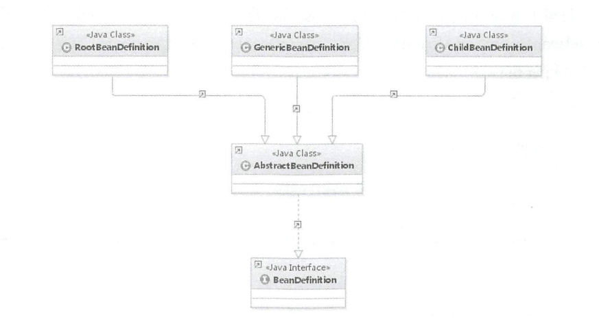
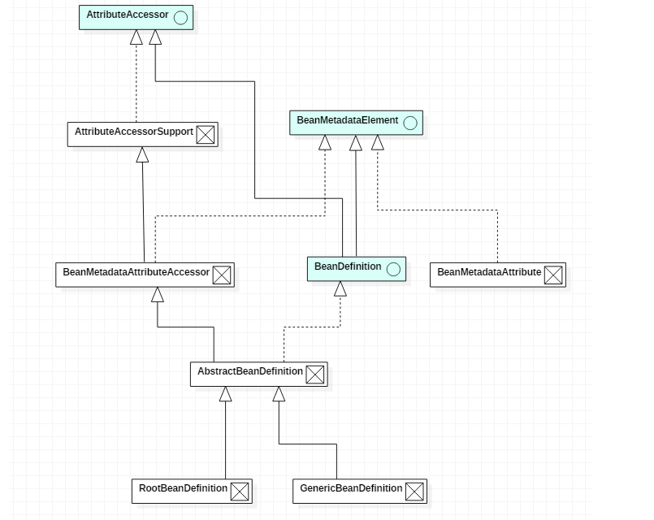

#                    BeanDefinition 解析




- 在创建`BeanDefinition`时，可以生成`RootBeanDefinition`或者是`GenericBeanDefinition`的实例。但是现在大多数情况下都是创建`GenericBeanDefinition`的实例。

  ```
  通常，使用此{@code GenericBeanDefinition}类来实现注册用户可见的bean定义（后置处理器可以操作，甚至可能重新配置父名称。
  使用{@code RootBeanDefinition} {@code ChildBeanDefinition}其中父/子关系恰好是预先确定的。
  
  查看该类的注释： GenericBeanDefinition
  ```

- Java是面向对象的语言，bean实例是一个对象，---》 BeanDefinition 

```java
//BeanDefinition描述了一个bean实例，它具有属性值，构造函数参数值，以及由具体实现提供的更多信息。
public interface BeanDefinition extends AttributeAccessor, BeanMetadataElement {

	/**
	 * 单例Scope的标识符
	 */
	String SCOPE_SINGLETON = ConfigurableBeanFactory.SCOPE_SINGLETON;

	/**
	 *  原型 bean  -- prototype
	 */
	String SCOPE_PROTOTYPE = ConfigurableBeanFactory.SCOPE_PROTOTYPE;


	/**
	 * 角色提示,表明BeanDefinition是应用程序的主要部分,通常对应于用户定义的Bean
	 */
	int ROLE_APPLICATION = 0;

	/**
	 * 角色提示,表明BeanDefinition是一些较大配置的支持部分,通常是外部                   
	 * org.springframework.beans.factory.parsing.ComponentDefinition配置
	 */
	int ROLE_SUPPORT = 1;

	/**
	 * 角色提示,表明BeanDefinition正在提供一个完全的背景角色,与最终用户无关
	 * 这个提示是在注册完全属于内部工作的bean时使用 
	 * org.springframework.beans.factory.parsing.ComponentDefinition
	 */
	int ROLE_INFRASTRUCTURE = 2;


	// Modifiable attributes

	/**
	 * 如果有 设置父BeanDefinition 名字
	 */
	void setParentName(@Nullable String parentName);

	/**
	 * 返回此bean定义的父定义的名称（如果有）。
	 */
	@Nullable
	String getParentName();

	/**
	 * 指定BeanDefinition的类名称
	 * 在bean工厂后置处理期间 修改类名
	 */
	void setBeanClassName(@Nullable String beanClassName);

	/**
	 * 返回此BeanDefinition的当前bean类名。
	 */
	@Nullable
	String getBeanClassName();

	/**
	 * 覆盖此bean的目标范围，指定新的范围名称。
	 */
	void setScope(@Nullable String scope);

	/**
	 * 返回此bean的当前目标作用域的名称 如果有
	 */
	@Nullable
	String getScope();

	/**
	 * 设置是否应该懒惰的初始化
	 * 如果为false,将会在BeanFactory的单例bean初始化时启动时bean的实例化。
	 */
	void setLazyInit(boolean lazyInit);

	/**
	 * 返回这个bean是否应该被懒惰的初始化
	 * 只应用于单例模式的Bean
	 */
	boolean isLazyInit();

	/**
	 * 设置此bean依赖于初始化的bean的名称
	 * bean工厂将保证首先初始化这些bean。
	 */
	void setDependsOn(@Nullable String... dependsOn);

	/**
	 * 返回此bean依赖的bean名称。
	 */
	@Nullable
	String[] getDependsOn();

	/**
	 * 设置这个bean是否可以自动连接(autowired)到其他bean
	 * 此标志仅用于影响基于类型的自动装配,不会影响名称的显式引用
	 */
	void setAutowireCandidate(boolean autowireCandidate);

	/**
	 * 返回此bean是否可以自动连接到其他bean
	 */
	boolean isAutowireCandidate();

	/**
	 *设置此bean是否为主要autowire候选者 如果为true，在autowire时，主要有它在的bean将会决胜。
	 */
	void setPrimary(boolean primary);

	/**
	 * Return whether this bean is a primary autowire candidate.
	 */
	boolean isPrimary();

	/**
	 * 设置工厂bean的名称（如果有）
	 */
	void setFactoryBeanName(@Nullable String factoryBeanName);

	/**	
	 * 获取工厂bean的名称
	 */
	@Nullable
	String getFactoryBeanName();

	/**
     * 设置工厂方法,这个方法将会被调用.如果有构造函数参数（如果没有指定，则没有参数）
	 * 将在指定的工厂bean上调用该方法,或者作为本地bean类的静态方法（？）
	 */
	void setFactoryMethodName(@Nullable String factoryMethodName);

	/**
	 * Return a factory method, if any.
	 */
	@Nullable
	String getFactoryMethodName();

	/**
	 * 返回此bean的构造函数参数值。
	 * <p>The returned instance can be modified during bean factory post-processing.
	 * @return the ConstructorArgumentValues object (never {@code null})
	 */
	ConstructorArgumentValues getConstructorArgumentValues();

	/**
	 * Return if there are constructor argument values defined for this bean.
	 * @since 5.0.2
	 */
	default boolean hasConstructorArgumentValues() {
		return !getConstructorArgumentValues().isEmpty();
	}

	/**
	 * Return the property values to be applied to a new instance of the bean.
	 * <p>The returned instance can be modified during bean factory post-processing.
	 * @return the MutablePropertyValues object (never {@code null})
	 */
	MutablePropertyValues getPropertyValues();

	/**
	 * Return if there are property values values defined for this bean.
	 * @since 5.0.2
	 */
	default boolean hasPropertyValues() {
		return !getPropertyValues().isEmpty();
	}


	// Read-only attributes

	/**
	 * Return whether this a <b>Singleton</b>, with a single, shared instance
	 * returned on all calls.
	 * @see #SCOPE_SINGLETON
	 */
	boolean isSingleton();

	/**
	 * Return whether this a <b>Prototype</b>, with an independent instance
	 * returned for each call.
	 * @since 3.0
	 * @see #SCOPE_PROTOTYPE
	 */
	boolean isPrototype();

	/**
	 * Return whether this bean is "abstract", that is, not meant to be instantiated.
	 */
	boolean isAbstract();

	/**
	 * Get the role hint（暗示） for this {@code BeanDefinition}. The role hint
	 * provides the frameworks as well as tools with an indication of（表明）
	 * the role and importance of a particular（特定的） {@code BeanDefinition}.
	 * @see #ROLE_APPLICATION
	 * @see #ROLE_SUPPORT
	 * @see #ROLE_INFRASTRUCTURE
	 */
	int getRole();

	/**
	 * 返回此bean定义的可读描述。
	 * Return a human-readable description of this bean definition.
	 */
	@Nullable
	String getDescription();

	/**
	 * Return a description of the resource that this bean definition
	 * came from (for the purpose of showing context in case of errors).
	 *             为了在出现错误时显示上下文
	 */
	@Nullable
	String getResourceDescription();

	/**
	 * 返回原始bean定义（如果有）。
	 * 允许检索修饰的bean定义（如果有）。
	 * <p>Note that this method returns the immediate originator. Iterate through the
	 * originator chain to find the original BeanDefinition as defined by the user.
	 */
	@Nullable
	BeanDefinition getOriginatingBeanDefinition();

}
```

### BeanDefinition 继承关系

（实线是继承，虚线是实现）



- 分析的**XmlBeanDefinitionReader **这个类
- [BeanDefinition的创建（BeanDefinitionHolder的创建）](https://www.cnblogs.com/GooPolaris/p/8177989.html)

- [Bean Definition从加载、解析、处理、注册到BeanFactory的过程。](https://www.cnblogs.com/GooPolaris/p/8169611.html)

