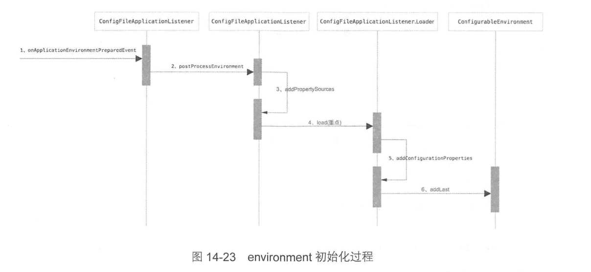

#              Environment解析

- 继承关系


### Spring中的Profile 是什么?

Spring中的Profile功能，它可以理解为我们在Spring容器中所定义的Bean的**逻辑组名称**，**只有当这些Profile被激活的时候，才会将Profile中所对应的Bean注册到Spring容器中**。举个更具体的例子，我们以前所定义的Bean，当Spring容器一启动的时候，就会一股脑的全部加载这些信息完成对Bean的创建；而使用了Profile之后，它会将Bean的定义进行更细粒度的划分，将这些定义的Bean划分为几个不同的组，当Spring容器加载配置信息的时候，首先查找激活的Profile，然后只会去加载被激活的组中所定义的Bean信息，而不被激活的Profile中所定义的Bean定义信息是不会加载用于创建Bean的。

- profile是要注册的bean定义的命名逻辑组。仅当给定的profile active时才使用容器，分配Beans
  无论是以XML还是通过annotations定义的profile ;
- 看看spring-beans 3.1版本 org.springframework.context.annotation.Profile @Profile}注释语法细节。
- Environment 对象与profile 相关的作用
  - 在确定当前getActiveProfiles 方法 的哪些 active profiles（如果有），
  - 以及通过getDefaultProfiles方法获取哪些profiles（如果有）在默认情况下 active。

### Environment中的Properties是什么?

- 在Environment对象中Properties作用是为用户提供方便的服务界面，用于 configuring property sources和resolving properties。
- property  sources
  - `properties files`
  - `JVM system properties`
  - `system environment variables`
  - `JNDI`
  - `servlet context parameters`
  - `ad-hoc Properties objects`  ad-hoc 特设
  - `map` 
  - ......

### 为什么要使用Profile

由于我们平时在开发中，通常会出现在开发的时候使用一个开发数据库，测试的时候使用一个测试的数据库，而实际部署的时候需要一个数据库。以前的做法是将这些信息写在一个配置文件中，当我把代码部署到测试的环境中，将配置文件改成测试环境；当测试完成，项目需要部署到现网了，又要将配置信息改成现网的，真的好烦。**而使用了Profile之后，我们就可以分别定义3个配置文件，一个用于开发、一个用户测试、一个用户生产，其分别对应于3个Profile。**当在实际运行的时候，只需给定一个参数来激活对应的Profile即可，那么容器就会只加载激活后的配置文件，这样就可以大大省去我们修改配置信息而带来的烦恼。




### spring boot 通过发布一个事件 `ApplicationEnvironmentPreparedEvent` 初始化 Environment

main 方法入口类进入

`ConfigurableEnvironment environment = prepareEnvironment(listeners, applicationArguments);`

调用流程：

1. `listeners.environmentPrepared(environment);`
2. `listener.environmentPrepared(environment);`
3. `this.initialMulticaster.multicastEvent(new ApplicationEnvironmentPreparedEvent(this.application, this.args, environment));`
4. `multicastEvent(event, resolveDefaultEventType(event));`

- 监听者 `ConfigFileApplicationListener`  也能触发`ApplicationEnvironmentPreparedEvent` `事件.

- `ConfigFileApplicationListener#onApplicationEvent` 方法。

```java
@Override
	public void onApplicationEvent(ApplicationEvent event) {
		if (event instanceof ApplicationEnvironmentPreparedEvent) {
			onApplicationEnvironmentPreparedEvent((ApplicationEnvironmentPreparedEvent) event);
		}
		if (event instanceof ApplicationPreparedEvent) {
			onApplicationPreparedEvent(event);
		}
	}
```

```java
private void onApplicationEnvironmentPreparedEvent(ApplicationEnvironmentPreparedEvent event) {
       //获取所有的EnvironmentPostProcessor 
		List<EnvironmentPostProcessor> postProcessors = loadPostProcessors();
		postProcessors.add(this);
		AnnotationAwareOrderComparator.sort(postProcessors);
       // 遍历postProcessors
		for (EnvironmentPostProcessor postProcessor : postProcessors) {
            // 触发postProcessEnvironment 方法,处理 ...
			postProcessor.postProcessEnvironment(event.getEnvironment(), event.getSpringApplication());
		}
	}
```

`ConfigFileApplicationListener#postProcessEnvironment`

```java 
protected void addPropertySources(ConfigurableEnvironment environment, ResourceLoader resourceLoader) {
		RandomValuePropertySource.addToEnvironment(environment);
		// 重点是load()方法
		new Loader(environment, resourceLoader).load();
	}
```


```java
// Environment 包含  profile 和 properties
public interface Environment extends PropertyResolver {

	/**
	 * 返回显式为此环境激活的配置文件集。
	 * Return the set of profiles explicitly made active for this environment. Profiles
	 * are used for creating logical groupings of bean definitions to be registered
	 * conditionally, for example based on deployment environment. Profiles can be
	 * activated by setting {@linkplain AbstractEnvironment#ACTIVE_PROFILES_PROPERTY_NAME
	 * "spring.profiles.active"} as a system property or by calling
	 * {@link ConfigurableEnvironment#setActiveProfiles(String...)}.
	 * <p>If no profiles have explicitly been specified as active, then any
	 * {@linkplain #getDefaultProfiles() default profiles} will automatically be activated.
	 * @see #getDefaultProfiles
	 * @see ConfigurableEnvironment#setActiveProfiles
	 * @see AbstractEnvironment#ACTIVE_PROFILES_PROPERTY_NAME
	 */
	String[] getActiveProfiles();

	/**
	 * 如果未明确设置active profile，则默认情况下返回要激活的配置文件集。
	 * Return the set of profiles to be active by default when no active profiles have
	 * been set explicitly.
	 * @see #getActiveProfiles
	 * @see ConfigurableEnvironment#setDefaultProfiles
	 * @see AbstractEnvironment#DEFAULT_PROFILES_PROPERTY_NAME
	 */
	String[] getDefaultProfiles();

	/**
	 * 返回一个或多个给定profile是否处于active，或者在没有显式active profile的情况下，返回一组或多个
	 * 给定profile是否包含在 default profiles set中。
	 * Return whether one or more of the given profiles is active or, in the case of no
	 * explicit active profiles, whether one or more of the given profiles is included in
	 * the set of default profiles. If a profile begins with '!' the logic is inverted,
	 * i.e. the method will return {@code true} if the given profile is <em>not</em> active.
	 * For example, {@code env.acceptsProfiles("p1", "!p2")} will return {@code true} if
	 * profile 'p1' is active or 'p2' is not active.
	 * @throws IllegalArgumentException if called with zero arguments
	 * or if any profile is {@code null}, empty, or whitespace only
	 * @see #getActiveProfiles
	 * @see #getDefaultProfiles
	 * @see #acceptsProfiles(Profiles)
	 * @deprecated as of 5.1 in favor of {@link #acceptsProfiles(Profiles)}
	 */
	@Deprecated
	boolean acceptsProfiles(String... profiles);

	/**
	 * 给定的profile 是否在通过 getActiveProfiles() 方法获取的 active profiles中。
	 * Return whether the {@linkplain #getActiveProfiles() active profiles}
	 * match the given {@link Profiles} predicate.
	 */
	boolean acceptsProfiles(Profiles profiles);

}
```

- `PropertyResolver`用于解析任何基础源的属性的接口。

```java
public interface PropertyResolver {

	/**
	 * Return whether the given property key is available for resolution,
	 * i.e. if the value for the given key is not {@code null}.
	 */
	boolean containsProperty(String key);

	/**
	 * Return the property value associated with the given key,
	 * or {@code null} if the key cannot be resolved.
	 * @param key the property name to resolve
	 * @see #getProperty(String, String)
	 * @see #getProperty(String, Class)
	 * @see #getRequiredProperty(String)
	 */
	@Nullable
	String getProperty(String key);

	/**
	 * Return the property value associated with the given key, or
	 * {@code defaultValue} if the key cannot be resolved.
	 * @param key the property name to resolve
	 * @param defaultValue the default value to return if no value is found
	 * @see #getRequiredProperty(String)
	 * @see #getProperty(String, Class)
	 */
	String getProperty(String key, String defaultValue);

	/**
	 * Return the property value associated with the given key,
	 * or {@code null} if the key cannot be resolved.
	 * @param key the property name to resolve
	 * @param targetType the expected type of the property value
	 * @see #getRequiredProperty(String, Class)
	 */
	@Nullable
	<T> T getProperty(String key, Class<T> targetType);

	/**
	 * Return the property value associated with the given key,
	 * or {@code defaultValue} if the key cannot be resolved.
	 * @param key the property name to resolve
	 * @param targetType the expected type of the property value
	 * @param defaultValue the default value to return if no value is found
	 * @see #getRequiredProperty(String, Class)
	 */
	<T> T getProperty(String key, Class<T> targetType, T defaultValue);

	/**
	 * Return the property value associated with the given key (never {@code null}).
	 * @throws IllegalStateException if the key cannot be resolved
	 * @see #getRequiredProperty(String, Class)
	 */
	String getRequiredProperty(String key) throws IllegalStateException;

	/**
	 * Return the property value associated with the given key, converted to the given
	 * targetType (never {@code null}).
	 * @throws IllegalStateException if the given key cannot be resolved
	 */
	<T> T getRequiredProperty(String key, Class<T> targetType) throws IllegalStateException;

	/**
	 * 解析 占位符（Placeholders） 
	 * Resolve ${...} placeholders in the given text, replacing them with corresponding
	 * property values as resolved by {@link #getProperty}. Unresolvable placeholders 
	 * with no default value are ignored and passed through unchanged.
	 * @param text the String to resolve
	 * @return the resolved String (never {@code null})
	 * @throws IllegalArgumentException if given text is {@code null}
	 * @see #resolveRequiredPlaceholders
	 * @see org.springframework.util.SystemPropertyUtils#resolvePlaceholders(String)
	 */
	String resolvePlaceholders(String text);

	/**
	 * Resolve ${...} placeholders in the given text, replacing them with corresponding
	 * property values as resolved by {@link #getProperty}. Unresolvable placeholders 
	 * with no default value will cause an IllegalArgumentException to be thrown.
	 * @return the resolved String (never {@code null})
	 * @throws IllegalArgumentException if given text is {@code null}
	 * or if any placeholders are unresolvable
	 * @see org.springframework.util.SystemPropertyUtils#resolvePlaceholders(String, 
	 * boolean)
	 */
	String resolveRequiredPlaceholders(String text) throws IllegalArgumentException;

}

```

- 在容器中启动是StandardServletEnvironment，

  - StandardServletEnvironment继承了StandardEnvironment，多了ServletConfig和ServletContext两个PropetySource

- 普通 main 方法启动是 StandardEnvironment

  - StandardEnvironment 本身就集合了System.getProperties() 和System.getEnv();

- 获取Environment   实现 EnvironmentAware接口

- springboot  调用流程 

  - `SpringApplication#run()· `-- 》`SpringApplication#prepareEnvironment` --》`SpringApplication#getOrCreateEnvironment`

  - 源码如下：

    ```java
    private ConfigurableEnvironment getOrCreateEnvironment() {
    		if (this.environment != null) {
    			return this.environment;
    		}
    		switch (this.webApplicationType) {
    		case SERVLET:
    			return new StandardServletEnvironment();
    		case REACTIVE:
    			return new StandardReactiveWebEnvironment();
    		default:
    			return new StandardEnvironment();
    		}
    }
    ```

    


`PropertySource` 是啥有啥用？