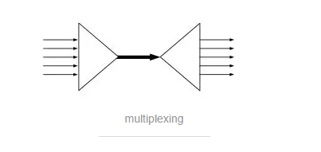
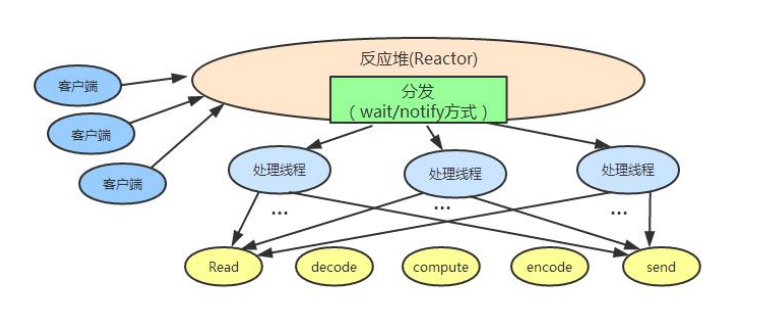

#                IO 多路复用技术

**I/O多路复用 (单个线程，通过记录跟踪每个I/O流的状态，来同时管理多个I/O流 )**

​        **I/O multiplexing 这里面的 multiplexing 指的其实是在单个线程通过记录跟踪每一个I/O流的状态(对应空管塔里面的Fight progress strip槽)来同时管理多个I/O流**. 

发明它的原因，是尽量多的提高服务器的吞吐能力。

**多个I/O凑在一起**就像下面这张图的前半部分一样，中间的那条线就是我们的**单个线程**，它通过记录传入的每一个I/O流的状态来同时管理多个IO

**多个Sock复用一根网线这个功能是在内核＋驱动层实现的**。

###  Java NIO 的工作原理

-  由一个专门的线程(可以用线程池)来处理所有的 IO 事件，并负责分发。

- 事件驱动机制：事件到的时候触发，而不是同步的去监视事件。

- 线程通讯：线程之间通过 wait,notify 等方式通讯。保证每次上下文切换都是有意义的。
  减少无谓的线程切换。

  

 可参考 ： 

Reactor 模型原理分析 ：https://www.cnblogs.com/doit8791/p/7461479.html

Reactor 模型代码实现 ： https://blog.csdn.net/u010168160/article/details/53019039