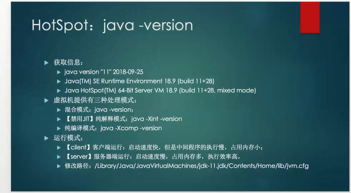

#                     JVM  内存模型（死背）

- jdk 1.8 及以后

  

- jdk 1.8 以前

​                 

- 堆调优（取消伸缩区）

- 上面写错了。
- -Xms 为jvm启动时分配的内存，比如-Xms200m，表示分配200M
- -Xmx 为jvm运行过程中分配的最大内存，比如-Xms500m，表示jvm进程最多只能够占用500M内存

