#                      JVM 体系结构

### jvm 体系结构

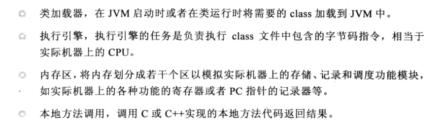

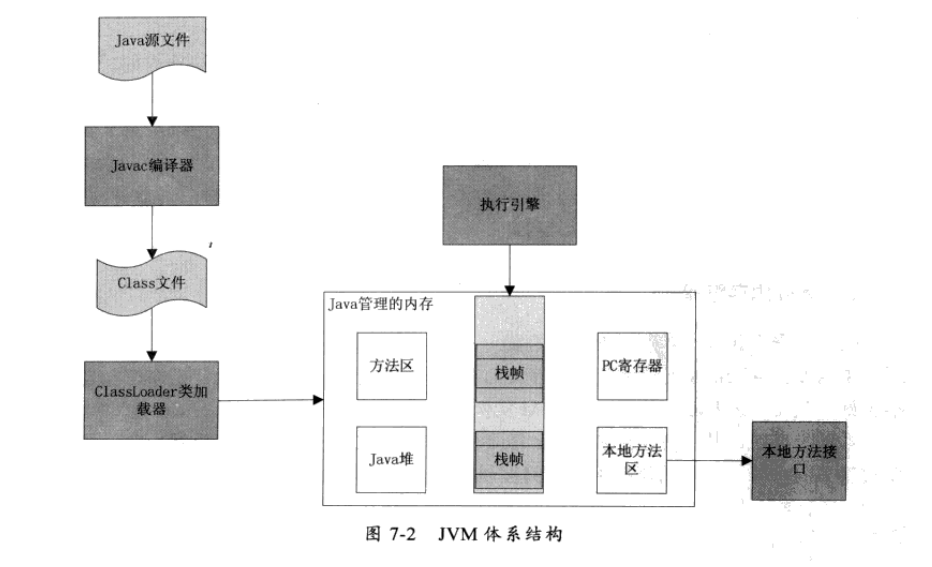

- 类加载器
  - 加载class 类
- 执行引擎
  - 解析JVM 字节码指令，得到执行结果
  - 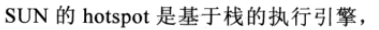
- java内存管理

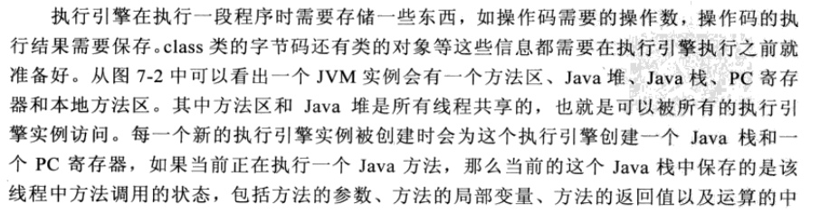

间结果等，而pc寄存器则会指向即将执行的下一条指令。

### 机器如何执行代码

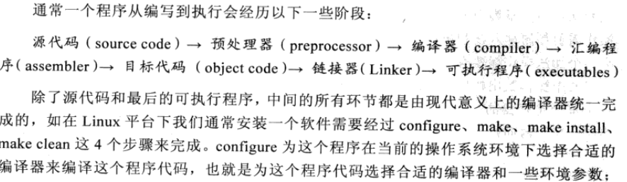

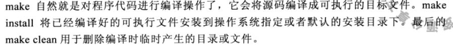

### 执行引擎的架构设计

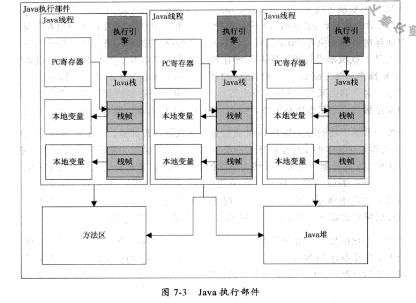

- 执行引擎的执行过程

```java
public class Math {
    public static void main(String[] args) {
         int a =1;
         int b =2;
         int c = (a+b)*10;
    }
}
```

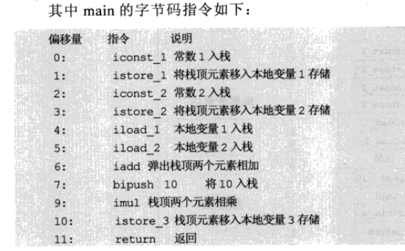

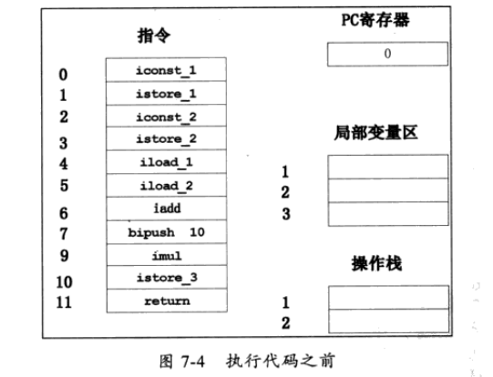

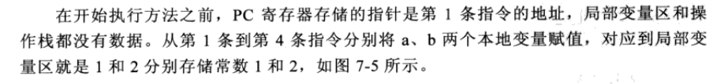

- java方法调用栈

```java
public class Math {
    public static void main(String[] args) {
         int a =1;
         int b =2;
         int c = (a+b)*10;
    }
    public  static  int math(int a,int b){
        return (a+b)/10;
    }
}
```

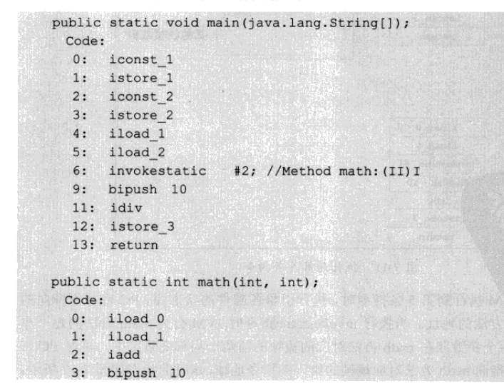


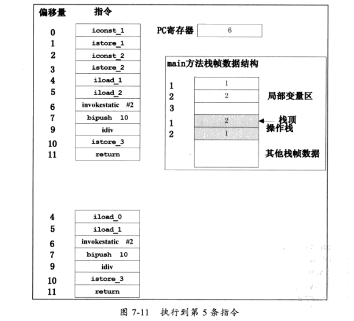

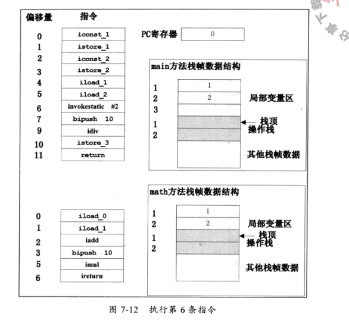

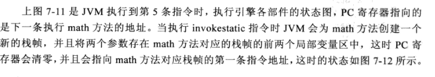