#                           JVM 内存管理

### 物理内存和虚拟内存

- 物理内存： 我们常说的RAM（随机存储器）

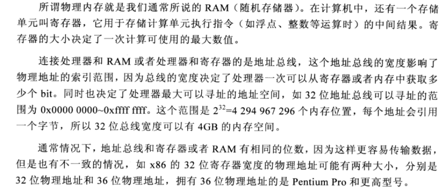

- 虚拟内存

### 内核空间和用户空间

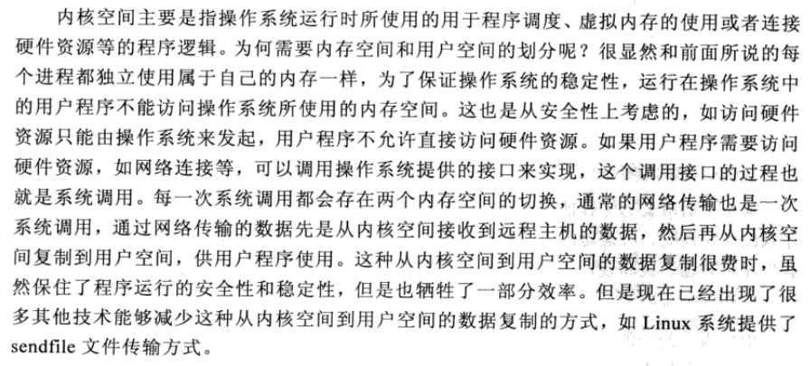

### java中那些组件需要使用内存

- java堆
- 线程
- 类和类加载器
- NIO
- JNI

### Java内存结构

- 在Java虚拟机规范中将java运行时数据分为6种，
  - PC寄存器数据
  - java栈
  - 堆
  - 方法区
  - 本地方法栈
  - 运行时常量池

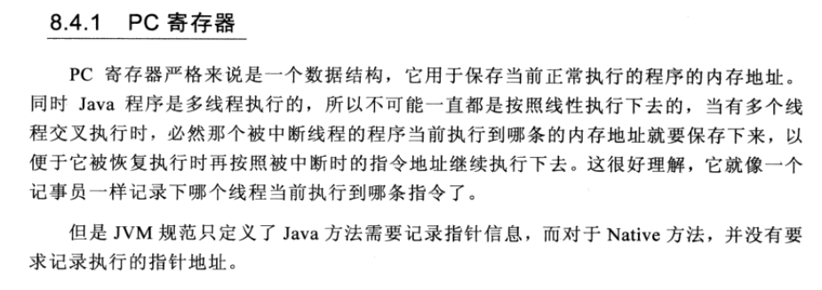

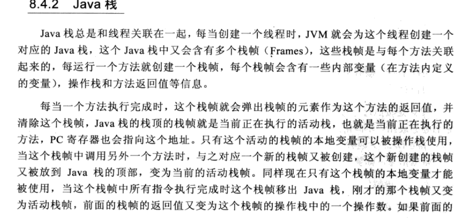

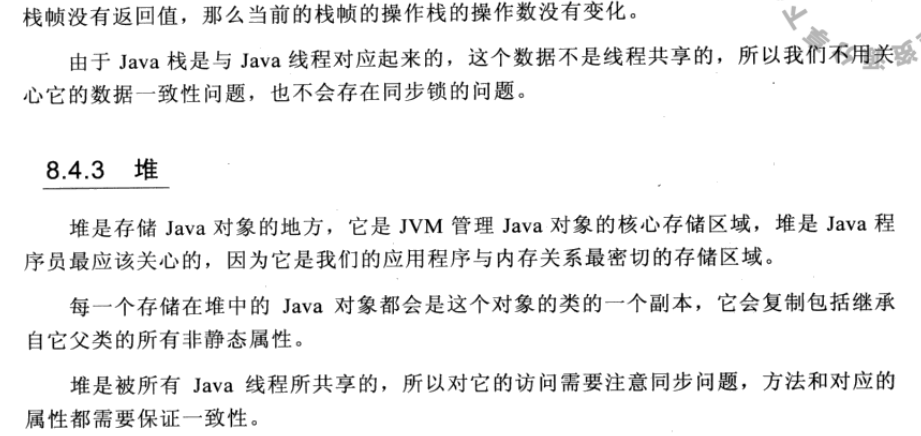

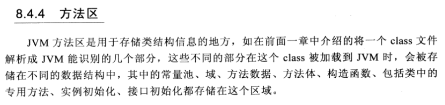

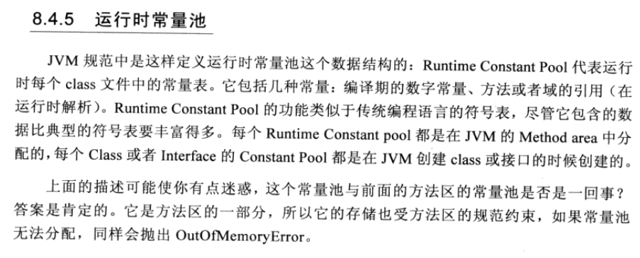

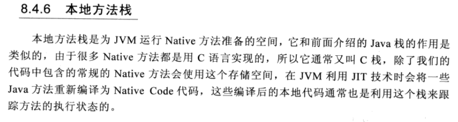

### JVM内存垃圾回收

- 如何检测垃圾（root 不可达）

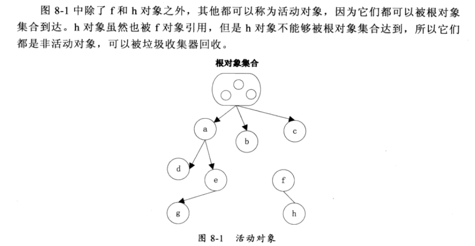

- 基于分代的垃圾回收算法

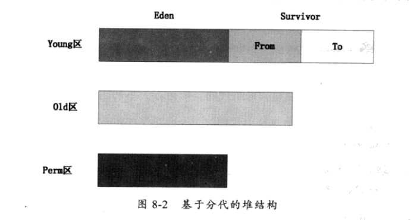

- Young区又分为Eden 区和两个Survivor 区，其中所有新创建的对象都在Eden 区，当Eden区满了后触发

  minor GC 将Eden区任然存活的对象复制到其中一个Survivor 区，以保证其中有一个Survivor 区是空的。

- Old 区存放是Young区Survivor区满了 触发minor GC 后任存活的对象，当Eden 区满后会将对象存放到Survivor区 中，如果Survivor区任然存放不下这些对象，GC收集器会将这些对象存到Old区。如果Survivor区的对象足够老（经历多次minor GC存活）也会放到Old 区，如果Old区也满了，将会触发Full GC回收整个堆内存。
- Perm 区存放类的class 对象，如果一个类被频繁地加载，也可能导致Perm 满，Perm区的垃圾回收也是由Full GC 触发。
-  新生代GC（Minor GC）：指发生在新生代的垃圾收集动作，因为Java对象大多都具备朝生夕灭的特性，所以Minor GC非常频繁，一般回收速度也比较快。
- 老年代GC（Major GC/Full GC）：指发生在老年代的GC，出现了Major GC，经常会伴随至少一次的Minor GCMajor GC的速度一般会比Minor GC慢10倍以上。

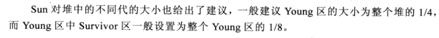

### 内存问题分析