#               Java 8  实战笔记

### 一言以蔽之，函数式接口就是只定义一个抽象方法的接口。

> **注意：** 接口现在还可以拥有 默认方法（即在类没有对方法进行实现时，其主体为方法提供默认实现的方法）。哪怕有很多默认方法，只要接口只定义了一个抽象方法抽象方法，它就仍然是一个函数式接口。


> **Java 8里面将代码传递给方法的功能（同时也能够返回代码并将其包含在数据结构中）还让我们能够使用一整套新技巧，通常称为函数式编程。**一言以蔽之，这种被函数式编程界称为函数的代码，可以被来回传递并加以组合，以产生强大的编程语汇。
>
> 1. 第一个编程概念是**流处理**。介绍一下，流是一系列数据项，一次只生成一项。程序可以从输入流中一个一个读取数据项，然后以同样的方式将数据项写入输出流。
> 2. 第二个编程概念是**行为参数化** ，通过API来传递代码的能力.---> 用行为参数化把代码传递给方法。例如将 `compareUsingCustomerId` 方法作为参数传给 `sort`方法。
> 3. 第三个编程概念**并行与共享的可变数据**。你的行为必须能够同时对不同的输入安全地执行。一般情况下这就意味着，你写代码时不能访问共享的可变数据。这些函数有时被称为“纯函数”或“无副作用函数”或“无状态函数”。

### Java 8新功能

- 方法引用

```java
File[] hiddenFiles = new File(".").listFiles(new FileFilter() {
public boolean accept(File file) {
    return file.isHidden();
    }
});
// 替换
File[] hiddenFiles = new File(".").listFiles(File::isHidden);
```

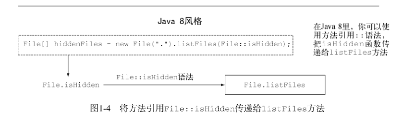

- `Lambda`——匿名函数

  编写把函数作为一等值来传递的程序。

> 谓词（predicate）
> 在数学上常常用来代表一个类似函数的东西，它接受一个参数值，并返回 true 或 false 。
>
> 但要是Lambda的长度多于几行（它的行为也不是一目了然）的话，那你还是应该用方法引用来指向一个有描述性名称的方法，而不是使用匿名的Lambda。
>
> 有了Stream API，你根本用不着操心循环的事情。数据处理完全是在库内部进行的。我们把这种思想叫作内部迭代.
>
> 现在最好记得，Collection主要是为了存储和访问数据，而Stream则主要用于描述对数据的计算。

- stream

- 默认方法

  Java 8中加入默认方法主要是为了支持库设计师，让他们能够写出更容易改进的接口。

-  Optional<T> 类。如果你能一致地使用它的话，就可以帮助你避免出现NullPointer 异常。

### 通过行为参数化传递代码

- 更高层次的抽象 ，选择标准建模。

### `Lambda`——匿名函数

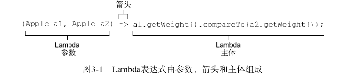

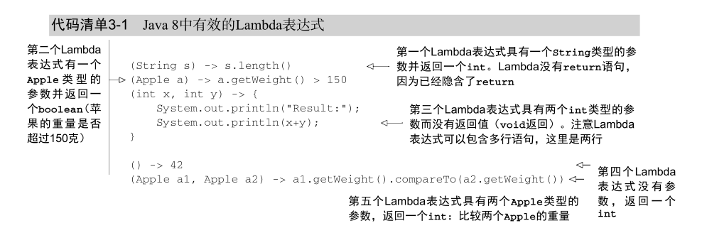

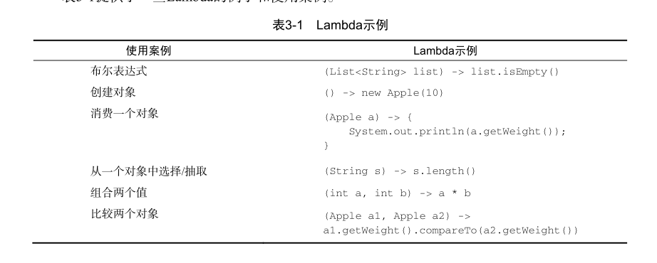

> 用函数式接口可以干什么呢？Lambda表达式允许你直接以内联的形式为函数式接口的抽象方法提供实现，并把整个表达式作为函数式接口的实例（具体说来，是函数式接口一个具体实现的实例）。
>
> 函数式接口的抽象方法的签名基本上就是Lambda表达式的签名。我们将这种抽象方法叫作函数描述符。

#### Lambda 表达式应用在函数式接口上。

> 请记住， (T,U) -> R 的表达方式展示了应当如何思考一个函数描述符。
>
> 表的左侧代表了参数类型。这里它代表一个函数，具有两个参数，分别为泛型T 和 U ，返回类型为 R 。

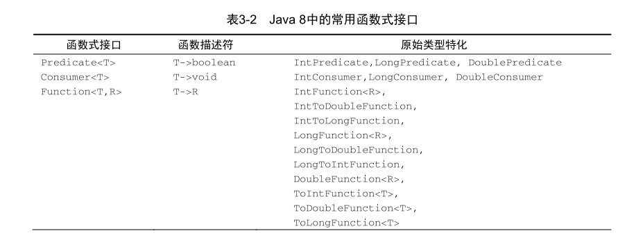

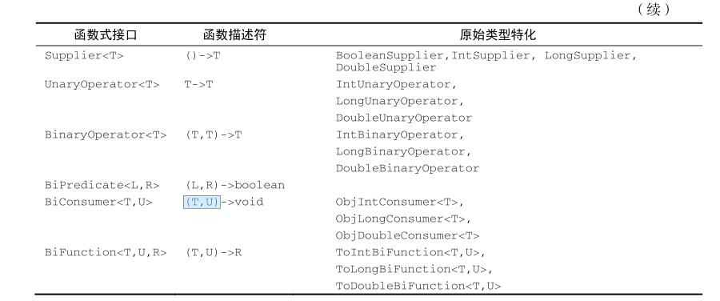

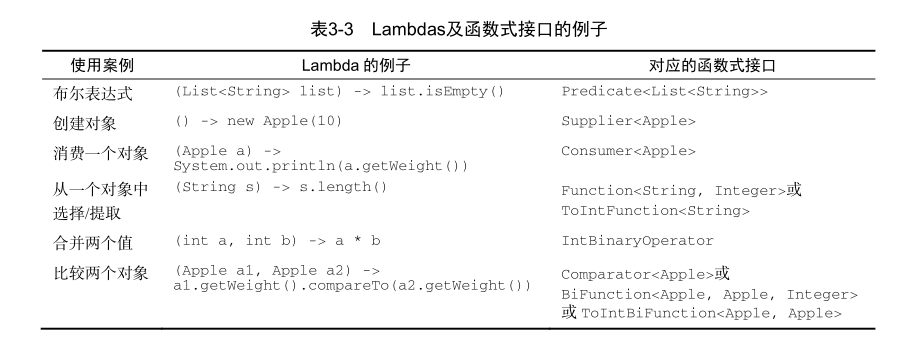

> 请注意，任何函数式接口都不允许抛出受检异常（checked exception）。如果你需要Lambda
> 表达式来抛出异常，有两种办法：定义一个自己的函数式接口，并声明受检异常，或者把Lambda
> 包在一个 try/catch 块中。
>
> 栗子：

```java 
Function<BufferedReader, String> f = (BufferedReader b) -> {
    try {
        return b.readLine();
    }
    catch(IOException e) {
        throw new RuntimeException(e);
    }
};
```

#### 类型检查

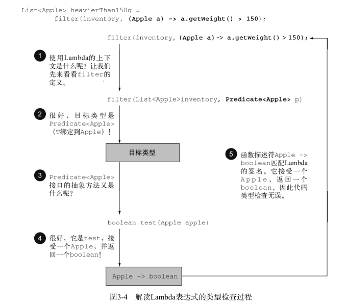

> Lambda的类型是从使用Lambda的上下文推断出来的。上下文（比如，接受它传递的方法的
> 参数，或接受它的值的局部变量）中Lambda表达式需要的类型称为目标类型。
>
> 有了目标类型的概念，同一个Lambda表达式就可以与不同的函数式接口联系起来，只要它
> 们的抽象方法签名能够兼容。
>
> 所以同一个Lambda可用于多个不同的函数式接口。

#### 使用局部变量

> 我们迄今为止所介绍的所有Lambda表达式都只用到了其主体里面的参数。但Lambda表达式也允许使用自由变量（不是参数，而是在外层作用域中定义的变量），就像匿名类一样。 它们被称作捕获Lambda。
>
> 关于能对这些变量做什么有一些限制。Lambda可以没有限制地捕获（也就是在其主体中引用）实例变量和静态变量。但局部变量必须显式声明为 final ，或事实上是 final 。换句话说，Lambda表达式只能捕获指派给它们的局部变量一次。（注：捕获实例变量可以被看作捕获最终局部变量 this 。） 例如，下面的代码无法编译，因为 portNumber变量被赋值两次：
>
> 

```java
// 错误，无法通过编译
int portNumber = 1337;
Runnable r = () -> System.out.println(portNumber);
portNumber = 31337;

// 可以。
int portNumber = 1337;
Runnable r = () -> System.out.println(portNumber);
```

> 对局部变量的限制你可能会问自己，为什么局部变量有这些限制。第一，实例变量和局部变量背后的实现有一个关键不同。实例变量都存储在堆中，而局部变量则保存在栈上。如果Lambda可以直接访问局部变量，而且Lambda是在一个线程中使用的，则使用Lambda的线程，可能会在分配该变量的线程将这个变量收回之后，去访问该变量。因此，Java在访问自由局部变量时，实际上是在访问它的副本，而不是访问原始变量。如果局部变量仅仅赋值一次那就没有什么区别了——因此就有了这个限制。
> 第二，这一限制不鼓励你使用改变外部变量的典型命令式编程模式

#### 方法引用

> 1.  指向静态方法的方法引用（例如 Integer 的 parseInt 方法，写作 Integer::parseInt ）。
> 2. 指 向 任 意 类 型 实 例 方 法 的 方 法 引 用 （ 例 如 String 的 length 方 法 ， 写 作String::length ）。
> 3. 指向现有对象的实例方法的方法引用（假设你有一个局部变量 expensiveTransaction用于存放 Transaction 类型的对象，它支持实例方法 getValue ，那么你就可以写 expensive-Transaction::getValue ）。

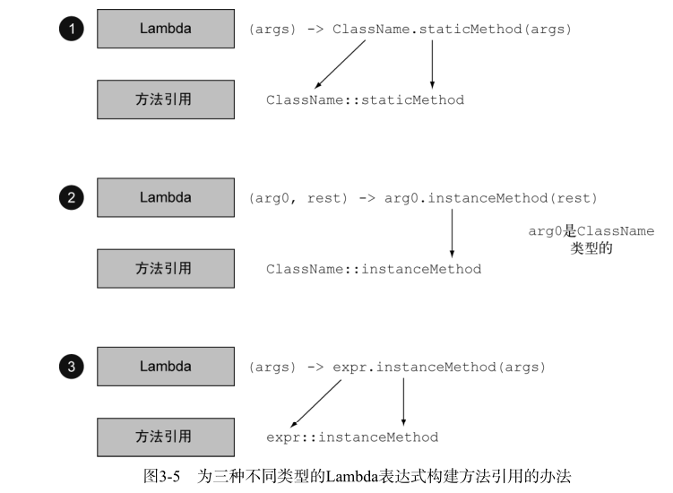

- lambda 表达式 传统方法对比

```java
public class AppleComparator implements Comparator<Apple> {
	public int compare(Apple a1, Apple a2){
		return a1.getWeight().compareTo(a2.getWeight());
	}
}
inventory.sort(new AppleComparator());
```

```java
inventory.sort(new Comparator<Apple>() {
public int compare(Apple a1, Apple a2){
	return a1.getWeight().compareTo(a2.getWeight());
	}
});
```

```java
inventory.sort((Apple a1, Apple a2)
		-> a1.getWeight().compareTo(a2.getWeight())
);

// ---------------------- 演进-------
 inventory.sort((a1, a2) -> a1.getWeight().compareTo(a2.getWeight()));

//-------------------------使用方法引用-------
inventory.sort(comparing(Apple::getWeight));
```

> 1. Lambda 表达式可以理解为一种匿名函数：它没有名称，但有参数列表、函数主体、返回类型，可能还有一个可以抛出的异常的列表.
> 2.  Lambda 表达式让你可以简洁地传递代码.
> 3.  函数式接口就是仅仅声明了一个抽象方法的接口.
> 4. 只有在接受函数式接口的地方才可以使用 Lambda 表达式。
> 5.  Lambda 表达式允许你直接内联，为函数式接口的抽象方法提供实现，并且将整个表达式作为函数式接口的一个实例。
> 6. Java 8 自带一些常用的函数式接口，放在 java.util.function 包里，包括 Predicate<T> 、 Function<T,R> 、 Supplier<T> 、 Consumer<T> 和 BinaryOperator<T> 等。
> 7. 为了避免装箱操作，对 Predicate<T> 和 Function<T, R> 等通用函数式接口的原始类型特化： IntPredicate 、 IntToLongFunction 等。
> 8. 环绕执行模式（即在方法所必需的代码中间，你需要执行点儿什么操作，比如资源分配和清理）可以配合 Lambda 提高灵活性和可重用性.（注意）
> 9. Lambda 表达式所需要代表的类型称为目标类型。
> 10. 方法引用让你重复使用现有的方法实现并直接传递它们。
> 11. Comparator 、 Predicate 和 Function 等函数式接口都有几个可以用来结合 Lambda 表达
>     式的默认方法。(注意)
>
> 以上为一些概念.

### 函数式数据处理 -->流

**请注意，和迭代器类似，流只能遍历一次。**

流是Java API的新成员，它允许你以**声明性方式处理**数据集合（通过查询语句来表达，而不是临时编写一个实现）.

> 思想：
>
> 集合讲的是数据，流讲的是计算.
>
> 内部迭代.
>
> 概念：
>
> 1.  元素序列——就像集合一样，流也提供了一个接口，可以访问特定元素类型的一组有序值.
> 2.  源——流会使用一个提供数据的源，如集合、数组或输入/输出资源。 请注意，从有序集合生成流时会保留原有的顺序。由列表生成的流，其元素顺序与列表一致。
> 3.  数据处理操作——流的数据处理功能支持类似于数据库的操作，以及函数式编程语言中的常用操作，如 filter 、 map 、 reduce 、 find 、 match 、 sort 等。流操作可以顺序执行，也可并行执行。
>
> 流操作有两个重要的特点。
>
> 1.  流水线——很多流操作本身会返回一个流，这样多个操作就可以链接起来，形成一个大的流水线.
> 2. 内部迭代——与使用迭代器显式迭代的集合不同，流的迭代操作是在背后进行的。

#### 	流和集合

> 集合与流之间的差异就在于什么时候进行计算。集合是一个内存中的数据结构，它包含数据结构中目前所有的值——集合中的每个元素都得先算出来才能添加到集合中。（你可以往集合里加东西或者删东西，但是不管什么时候，集合中的每个元素都是放在内存里的，元素都得先算出来才能成为集合的一部分。）
>
> 流则是在概念上固定的数据结构（你不能添加或删除元素），其元素则是按需计算的。 我们将展示构建一个质数流（2, 3, 5, 7, 11, …）有多简单，尽管质数有无穷多个。这个思想就是用户仅仅从流中提取需要的值，而这些值——在用户看不见的地方——只会按需生成。这是一种生产者－消费者的关系。
>
> 从另一个角度来说，流就像是一个延迟创建的集合：只有在消费者要求的时候才会计算值（用管理学的话说这就是需求驱动，甚至是实时制造)。
>
> 集合则是急切创建的（供应商驱动：先把仓库装满，再开始卖，就像那些昙花一现的圣诞新玩意儿一样）。

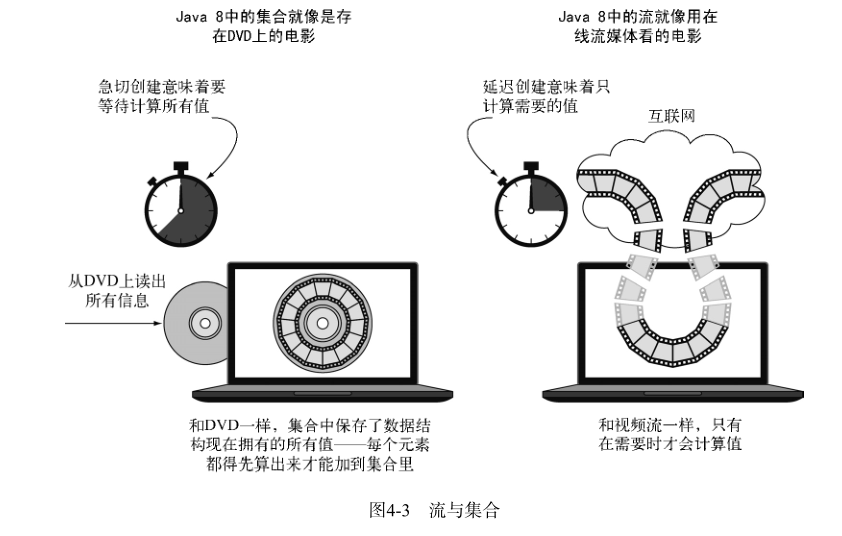

- 集合和流的另一个关键区别在于它们遍历数据的方式。

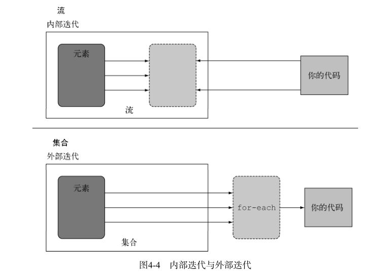

#### 流操作

可以连接起来的流操作称为中间操作，关闭流的操作称为终端操作。

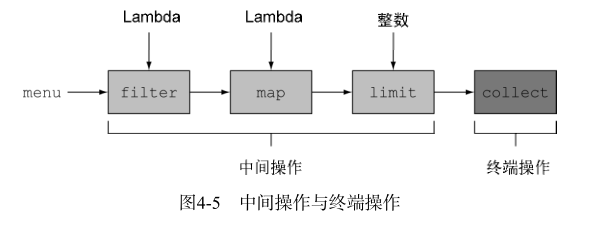

> 总而言之，流的使用一般包括三件事：
>
> - 一个数据源（如集合）来执行一个查询；
> -  一个中间操作链，形成一条流的流水线；
> - 一个终端操作，执行流水线，并能生成结果。
>
> 流的流水线背后的理念类似于构建器模式. 在构建器模式中有一个调用链用来设置一套配置（对流来说这就是一个中间操作链），接着是调用 built 方法（对流来说就是终端操作）。

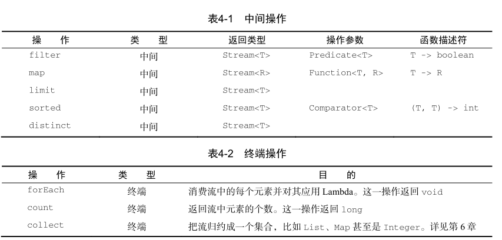

> **方法介绍**
>
> **谓词筛选**
>
>  filter 方法  用谓词筛选
>
>  distinct 的方法，它会返回一个元素各异（根据流所生成元素的hashCode 和 equals 方法实现）的流.
>
> **截短流**
>
>  limit(n) 方法，该方法会返回一个不超过给定长度的流。
>
> 流还支持 skip(n) 方法，返回一个扔掉了前 n 个元素的流。如果流中元素不足 n 个，则返回一个空流。
>
> **映射**
>
> 流支持 map 方法，它会接受一个函数作为参数。这个函数会被应用到每个元素上，并将其映射成一个新的元素（使用映射一词，是因为它和转换类似，但其中的细微差别在于它是“创建一个新版本”而不是去“修改”）。
>
> 使用 flatMap 方法的效果是，各个数组并不是分别映射成一个流，而是映射成流的内容。所有使用 map(Arrays::stream) 时生成的单个流都被合并起来，即扁平化为一个流。
>
> 一言以蔽之， flatmap 方法让你把一个流中的每个值都换成另一个流，然后把所有的流连接起来成为一个流。
>
> **查找和匹配**
>
> anyMatch方法流中是否有一个元素能匹配给定的谓词
>
> allMatch方法 是否匹配所有元素 返回检查谓词
>
>  noneMatch，它可以确保流中没有任何元素与给定的谓词匹配
>
> findAny 方法将返回当前流中的任意元素。它可以与其他流操作结合使用。返回一个Optional<T>
>
> findFirst 方法 查找第一个元素。
>
> **归约**
>
> reduce方法 接受两个参数：
>
> - 一个初始值，这里是0；
> - 一个 BinaryOperator<T> 来将两个元素结合起来产生一个新值，这里我们用的是
>   lambda (a, b) -> a + b 。
>
> reduce 还有一个重载的变体，它不接受初始值，但是会返回一个 Optional 对象
>
> 

```java 
//对于一张单词表 ，如 何 返 回 一 张 列 表 ，列 出 里 面 各 不 相 同 的 字 符 呢 、
String[] arrayOfWords = {"Goodbye", "World"};
        words = Arrays.asList(arrayOfWords);
 List<String> uniqueCharacters =
                words.stream()
                        .map(w -> w.split(""))
                        .flatMap(Arrays::stream)
                        .distinct()
                        .collect(Collectors.toList());
```

> 概念： 
>
> 短路：
>
> 有些操作不需要处理整个流就能得到结果。例如，假设你需要对一个用 and 连起来的大布尔表达式求值。不管表达式有多长，你只需找到一个表达式为 false ，就可以推断整个表达式将返回 false ，所以用不着计算整个表达式。这就是 短路
>
> 对于流而言，某些操作（例如 allMatch 、 anyMatch 、 noneMatch 、 findFirst 和 findAny ）
> 不用处理整个流就能得到结果。
>
> 归约：
>
> 你将看到如何把一个流中的元素组合起来，使用 reduce 操作来表达更复杂的查询，比如“计算菜单中的总卡路里”或“菜单中卡路里最高的菜是哪一个”。此类查询需要将流中所有元素反复结合起来，得到一个值，比如一个 Integer 。这样的查询可以被归类为归约操作（将流归约成一个值）。用函数式编程语言的术语来说，这称为折叠（fold），因为你可以将这个操作看成把一张长长的纸（你的流）反复折叠成一个小方块，而这就是折叠操作的结果
>
>  map-reduce 模式：
>
> map 和 reduce 的连接通常称为 map-reduce 模式，因Google用它来进行网络搜索而出名，
> 因为它很容易并行化。
>
> 无状态和有状态
>
> 诸如 map 或 filter 等操作会从输入流中获取每一个元素，并在输出流中得到0或1个结果。这些操作一般都是 无状态的：它们没有内部状态（假设用户提供的Lambda或方法引用没有内部可变状态）。
>
> 相反，诸如 sort 或 distinct 等操作一开始都和 filter 和 map 差不多——都是接受一个流，再生成一个流（中间操作），但有一个关键的区别。从流中排序和删除重复项时都需要知道先前的历史。例如，排序要求所有元素都放入缓冲区后才能给输出流加入一个项目，这一操作的存储要求是无界的。要是流比较大或是无限的，就可能会有问题（把质数流倒序会做什么呢？它应当返回最大的质数，但数学告诉我们它不存在）。我们把这些操作叫作 有状态操作。

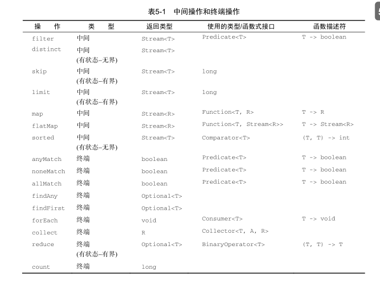

#### 数值流

> **映射到数值流**
>
> 将流转换为特化版本的常用方法是 mapToInt 、 mapToDouble 和 mapToLong 。这些方法和前面说的 map 方法的工作方式一样，只是它们返回的是一个特化流，而不是 Stream<T> 。
>
> **转换回对象流**
>
> 要把原始流转换成一般流（每个 int 都会装箱成一个Integer ），可以使用 boxed 方法，
>
> `IntStream intStream = menu.stream().mapToInt(Dish::getCalories);
> Stream<Integer> stream = intStream.boxed();`
>
> **数值范围**
>
> 帮助生成这种范围：
> range 和 rangeClosed 。这两个方法都是第一个参数接受起始值，第二个参数接受结束值。但range 是不包含结束值的，而 rangeClosed 则包含结束值。
>
> `IntStream evenNumbers = IntStream.rangeClosed(1, 100)`
>
> 

#### 构建流

- 由值创建流

```java 
Stream<String> stream = Stream.of("Java 8 ", "Lambdas ", "In ", "Action");
stream.map(String::toUpperCase).forEach(System.out::println);
// 空流
Stream<String> emptyStream = Stream.empty();
```

- 由数组创建流

```java
int[] numbers = {2, 3, 5, 7, 11, 13};
int sum = Arrays.stream(numbers).sum();
```

- 由文件生成流

  > `java.nio.file.Files` 中的很多静态方法都会返回一个流。例如，一个很有用的方法是
  > `Files.lines `，它会返回一个由指定文件中的各行构成的字符串流。

```java
long uniqueWords = 0;
try(Stream<String> lines = 
Files.lines(Paths.get("data.txt"), Charset.defaultCharset())){ // 流会自动关闭
uniqueWords = lines.flatMap(line -> Arrays.stream(line.split(" ")))
    .distinct() // 去重
    .count();	
}
catch(IOException e){
    // 如果打开文件时出现异常则加以处理
}
```

- 由函数生成流：创建无限流

> Stream API提供了两个静态方法来从函数生成流： Stream.iterate 和 Stream.generate 。
> 这两个操作可以创建所谓的无限流：不像从固定集合创建的流那样有固定大小的流。
>
> 一般来说，应该使用 limit(n) 来对这种流加以限制，以避免打印无穷多个值。

```java
Stream.iterate(0, n -> n + 2)
.limit(10)
.forEach(System.out::println);
//iterate 方法接受一个初始值（在这里是 0 ），还有一个依次应用在每个产生的新值上的
//Lambda（ UnaryOperator<t> 类型）。
```

```java 
Stream.generate(Math::random)
.limit(5)
.forEach(System.out::println);
```

### 用流收集数据

**流可以用类似于数据库的操作帮助你处理集合。**

> 它们支持两种类型的操作：中间操作（如 filter 或 map ）和终端操作（如 count 、 findFirst 、 forEach 和 reduce ）。
>
> 你会发现 collect 是一个归约操作，就像 reduce 一样可以接受各种做法作为参数，将流中的元素累积成一个汇总结果。具体的做法是通过定义新的Collector 接口来定义的，因此区分 Collection 、 Collector 和 collect 是很重要的。
>
> 我们主要探讨预定义收集器的功能，也就是那些可以从 Collectors类提供的工厂方法（例如 groupingBy ）创建的收集器。它们主要提供了三大功能：
>
> - 将流元素归约和汇总为一个值
> -  元素分组
> -  元素分区

#### 归约和汇总

**工厂-- > Collectors**

> **方法** 
>
> **求和 最大值 最小值，数量等**
>
> 利用 counting 工厂方法返回的收集器, counting 收集器在和其他收集器联合使用的时候特别有用
>
> `menu.stream().collect(Collectors.counting());`
>
> 不过很多时候，你可能想要得到两个或更多这样的结果，而且你希望只需一次操作就可以完成。在这种情况下，你可以使用 summarizingInt 工厂方法返回的收集器。例如，通过一次 summarizing 操作你可以就数出菜单中元素的个数，并得到菜肴热量总和、平均值、最大值和最小值：
>
> `IntSummaryStatistics menuStatistics =
> menu.stream().collect(summarizingInt(Dish::getCalories));`
>
> 这个收集器会把所有这些信息收集到一个叫作 IntSummaryStatistics 的类里，它提供了方便的取值（getter）方法来访问结果。
>
> 栗子打印处出来：
>
> `IntSummaryStatistics{count=9, sum=4300, min=120,average=477.777778, max=800}`
>
> 相应的 summarizingLong 和 summarizingDouble 工厂方法有相关的 LongSummary-Statistics 和 DoubleSummaryStatistics 类型，适用于收集的属性是原始类型 long 或double 的情况。
>
> **连接字符串**
>
> joining 工厂方法返回的收集器会把对流中每一个对象应用 toString 方法得到的所有字符串连接成一个字符串。
>
> 请注意， joining 在内部使用了 StringBuilder 来把生成的字符串逐个追加起来。
>
> `String shortMenu = menu.stream().map(Dish::getName).collect(joining());`
>
> 但该字符串的可读性并不好。幸好， joining 工厂方法有一个重载版本可以接受元素之间的分界符，
>
> `String shortMenu = menu.stream().map(Dish::getName).collect(joining(", "));`
>
> **广义的归约汇总**
>
>  Collectors.reducing 工厂方法是所有这些特殊情况的一般化。
>
> `int totalCalories = menu.stream().collect(reducing(0, Dish::getCalories, (i, j) -> i + j));`
>
> 它需要三个参数。
>
> - 第一个参数是归约操作的起始值，也是流中没有元素时的返回值，所以很显然对于数值和而言 0 是一个合适的值。
> -   第二个参数就是你在6.2.2节中使用的函数，将菜肴转换成一个表示其所含热量的 int 。（转换函数）
> -  第三个参数是一个 BinaryOperator ，将两个项目累积成一个同类型的值。这里它就是对两个 int 求和。

#### 分组

一个常见的数据库操作是根据一个或多个属性对集合中的项目进行分组。

- 一级分组

```java
Map<Dish.Type, List<Dish>> dishesByType=menu.stream().collect(groupingBy(Dish::getType));

//其结果是下面的 Map ：
{FISH=[prawns, salmon], OTHER=[french fries, rice, season fruit, pizza],MEAT=[pork, beef, chicken]}
```

> 你给 groupingBy 方法传递了一个 Function （以方法引用的形式），它提取了流中每一道 Dish 的 Dish.Type 。我们把这个 Function 叫作分类函数，因为它用来把流中的元素分成不同的组。分组操作的结果是一个 Map ，把分组函数返回的值作为映射的键，把流中所有具有这个分类值的项目的列表作为对应的映射值。

```java
// 自定义分组条件
public enum CaloricLevel { DIET, NORMAL, FAT }
Map<CaloricLevel, List<Dish>> dishesByCaloricLevel = menu.stream().collect(
groupingBy(dish -> {
    if (dish.getCalories() <= 400) 
        return CaloricLevel.DIET;
    else if (dish.getCalories() <= 700) 
        return CaloricLevel.NORMAL;
    else return CaloricLevel.FAT;
} ));
```

- 多级分组

```java
Map<Dish.Type, Map<CaloricLevel, List<Dish>>> dishesByTypeCaloricLevel =
menu.stream().collect(
	groupingBy(Dish::getType,  // 一级分组
			groupingBy(dish -> { // 二级分组
            if (dish.getCalories() <= 400) return CaloricLevel.DIET;
            else if (dish.getCalories() <= 700) return CaloricLevel.NORMAL;
            else return CaloricLevel.FAT;
            })
     )
);
// 结果 是两级 Map 
{MEAT={DIET=[chicken], NORMAL=[beef], FAT=[pork]},
FISH={DIET=[prawns], NORMAL=[salmon]},
OTHER={DIET=[rice, seasonal fruit], NORMAL=[french fries, pizza]}}
```

- 按子组收集数据

> 我们看到可以把第二个 groupingBy 收集器传递给外层收集器来实现多级分组。但进一步说，传递给第一个 groupingBy 的第二个收集器可以是任何类型，而不一定是另一个 groupingBy 。

```java
Map<Dish.Type, Long> typesCount = menu.stream().collect(
groupingBy(Dish::getType, counting()));
//其结果是下面的 Map ：
{MEAT=3, FISH=2, OTHER=4}
```

> 一般来说，通过 groupingBy 工厂方法的第二个参数传递的收集器将会对分到同一组中的所有流元素执行进一步归约操作
>
> 然而常常和 groupingBy 联合使用的另一个收集器是 mapping 方法生成的。这个方法接受两个参数：一个函数对流中的元素做变换，另一个则将变换的结果对象收集起来

```java
Map<Dish.Type, Set<CaloricLevel>> caloricLevelsByType =
menu.stream().collect(
	groupingBy(Dish::getType, mapping(
	dish -> {
        if (dish.getCalories() <= 400) 
            return CaloricLevel.DIET;
	else if (dish.getCalories() <= 700) 
        return CaloricLevel.NORMAL;
	else 
        return CaloricLevel.FAT; },
toSet() )));

// {OTHER=[DIET, NORMAL], MEAT=[DIET, NORMAL, FAT], FISH=[DIET, NORMAL]}

Map<Dish.Type, Set<CaloricLevel>> caloricLevelsByType =
menu.stream().collect(
	groupingBy(Dish::getType, mapping(
	dish -> { 
   if (dish.getCalories() <= 400) 
            return CaloricLevel.DIET;
	else if (dish.getCalories() <= 700) 
        return CaloricLevel.NORMAL;
	else
        return CaloricLevel.FAT; },
toCollection(HashSet::new) )));
```

#### 分区

> 分区是分组的特殊情况：由一个谓词（返回一个布尔值的函数）作为分类函数，它称分区函数。分区函数返回一个布尔值，这意味着得到的分组 Map 的键类型是 Boolean ，于是它最多可以分为两组—— true 是一组， false 是一组。
>
> 分区的好处在于保留了分区函数返回 true 或 false 的两套流元素列表。
>
> 你可以把分区看作分组一种特殊情况。

```java
Map<Boolean, List<Dish>> partitionedMenu =
menu.stream().collect(partitioningBy(Dish::isVegetarian));
// 结果
{false=[pork, beef, chicken, prawns, salmon],
true=[french fries, rice, season fruit, pizza]}
// 取值
List<Dish> vegetarianDishes = partitionedMenu.get(true);
// 普通获取
List<Dish> vegetarianDishes =
menu.stream().filter(Dish::isVegetarian).collect(toList());
```

 partitioningBy 工厂方法有一个重载版本，可以像下面这样传递第二个收集器。

```java
Map<Boolean, Map<Dish.Type, List<Dish>>> vegetarianDishesByType =
menu.stream().collect(
	partitioningBy(Dish::isVegetarian,
	groupingBy(Dish::getType)));
// 结果
{false={FISH=[prawns, salmon], MEAT=[pork, beef, chicken]},
true={OTHER=[french fries, rice, season fruit, pizza]}}
```

```java
// 栗子 ： 
(1)  menu.stream().collect(partitioningBy(Dish::isVegetarian,
partitioningBy (d -> d.getCalories() > 500)));
// 结果
// { false={false=[chicken, prawns, salmon], true=[pork, beef]},
// true={false=[rice, season fruit], true=[french fries, pizza]}}

(2)  menu.stream().collect(partitioningBy(Dish::isVegetarian,
partitioningBy (Dish::getType))); // 无法编译

(3)  menu.stream().collect(partitioningBy(Dish::isVegetarian,
counting()));
// 结果{false=5, true=4}
```

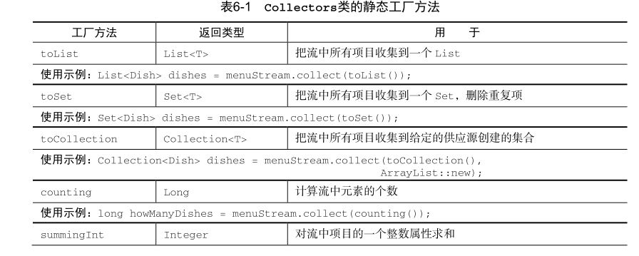

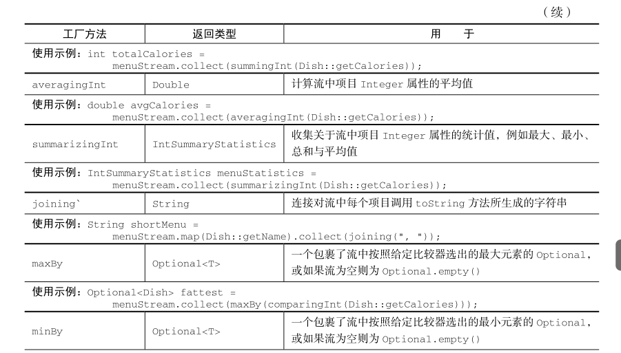

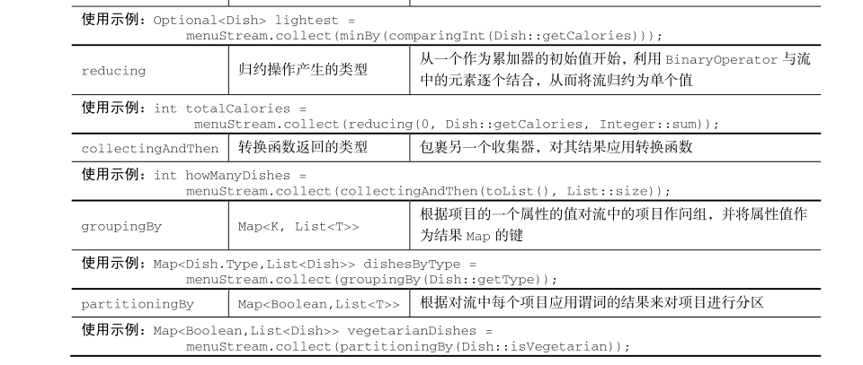

### 并行数据处理与性能

#### 分支/合并框架

> 分支/合并框架的目的是以递归方式将可以并行的任务拆分成更小的任务，然后将每个子任务的结果合并起来生成整体结果。它是 ExecutorService 接口的一个实现，它把子任务分配给线程池（称为 ForkJoinPool ）中的工作线程。
>
> 伪代码：
>
> if (任务足够小或不可分) {
> 	顺序计算该任务
> } else {
> 	将任务分成两个子任务
> 	递归调用本方法，拆分每个子任务，等待所有子任务完成
> 	合并每个子任务的结果
> }

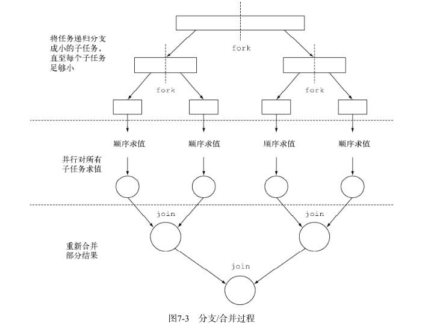

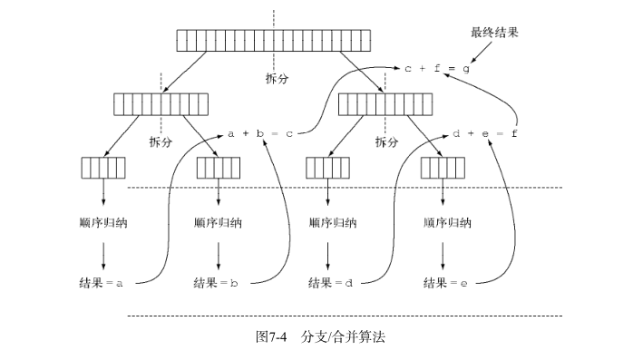

```java 
public class ForkJoinSumCalculator extends RecursiveTask<Long> {

    private final long[] numbers; // 要求的数组
    private final int start;
    private final int end;
    public static final long THRESHOLD = 10_000; // 不再将任务分解为子任务的数组大小

    public ForkJoinSumCalculator(long[] numbers) {
        this(numbers, 0, numbers.length);
    }
    // 私有构造函数用于以递归方式为主任务创建子任务
    private ForkJoinSumCalculator(long[] numbers, int start, int end) {
        this.numbers = numbers;
        this.start = start;
        this.end = end;
    }

    @Override
    protected Long compute() {
        int length = end - start;
        // 如果大小小于或等于阈值，顺序计算结果
        if (length <= THRESHOLD) {
            return computeSequentially();
        }
        // 创建一个子任务来为数组的前一半求和
        ForkJoinSumCalculator leftTask =
                new ForkJoinSumCalculator(numbers, start, start + length / 2);
         // 利用另一个ForkJoinPool线程异步执行新创建的子任务
        leftTask.fork();
        // 创建一个任务为数组的后一半求和
        ForkJoinSumCalculator rightTask =
                new ForkJoinSumCalculator(numbers, start + length / 2, end);
        // 同步执行第二个子任务，有可能允许进一步递归划分
        Long rightResult = rightTask.compute();
        // 读取第一个子任务的结果，如果尚未完成则阻塞等待
        Long leftResult = leftTask.join();
        // 该任务的结果是两个子任务结果的组合
        return leftResult + rightResult;
    }

    private long computeSequentially() {
        long sum = 0;
        for (int i = start; i < end; i++) {
            sum += numbers[i];
        }
       return sum;
    }

    // 在子任务不再可分时，计算结果的简单算法
    public static long forkJoinSum(long n) {
        long[] numbers = LongStream.rangeClosed(1, n).toArray();
        ForkJoinTask<Long> task = new ForkJoinSumCalculator(numbers);
        return new ForkJoinPool().invoke(task);
    }


    public static long  measureSumPerf(Function<Long, Long> adder, long n) {
        long fastest = Long.MAX_VALUE;
        for (int i = 0; i < 10; i++) {
            long start = System.nanoTime();
            long sum = adder.apply(n);
            long duration = (System.nanoTime() - start) / 1_000_000;
            System.out.println("Result: " + sum);
            if (duration < fastest) fastest = duration;
        }
        return fastest;
    }

    public static void main(String[] args) {
        System.out.println("ForkJoin sum done in: " + measureSumPerf(
                ForkJoinSumCalculator::forkJoinSum, 10_000_000) + " msecs" );
    }
}
```


> **使用分支/合并框架的最佳做法**
>
> -  对一个任务调用 join 方法会阻塞调用方，直到该任务做出结果。因此，有必要在两个子任务的计算都开始之后再调用它。否则，你得到的版本会比原始的顺序算法更慢更复杂，因为每个子任务都必须等待另一个子任务完成才能启动。
> - 不应该在 RecursiveTask 内部使用 ForkJoinPool 的 invoke 方法。相反，你应该始终直接调用 compute 或 fork 方法，只有顺序代码才应该用 invoke 来启动并行计算。
> -  对子任务调用 fork 方法可以把它排进 ForkJoinPool 。同时对左边和右边的子任务调用它似乎很自然，但这样做的效率要比直接对其中一个调用 compute 低。这样做你可以为其中一个子任务重用同一线程，从而避免在线程池中多分配一个任务造成的开销。
> -  调试使用分支/合并框架的并行计算可能有点棘手。特别是你平常都在你喜欢的IDE里面看栈跟踪（stack trace）来找问题，但放在分支合并计算上就不行了，因为调用 compute的线程并不是概念上的调用方，后者是调用 fork 的那个。
> -  和并行流一样，你不应理所当然地认为在多核处理器上使用分支/合并框架就比顺序计算快。我们已经说过，一个任务可以分解成多个独立的子任务，才能让性能在并行化时有所提升。所有这些子任务的运行时间都应该比分出新任务所花的时间长；一个惯用方法是把输入/输出放在一个子任务里，计算放在另一个里，这样计算就可以和输入/输出同时进行。此外，在比较同一算法的顺序和并行版本的性能时还有别的因素要考虑。就像任何其他Java代码一样，分支/合并框架需要“预热”或者说要执行几遍才会被JIT编译器优化。这就是为什么在测量性能之前跑几遍程序很重要，我们的测试框架就是这么做的。同时还要知道，编译器内置的优化可能会为顺序版本带来一些优势（例如执行死码分析——删去从未被使用的计算）。
> - 对于分支/合并拆分策略还有最后一点补充：你必须选择一个标准，来决定任务是要进一步
>   拆分还是已小到可以顺序求值。
>
> **工作窃取**
>
> 分支/合并框架工程用一种称为工作窃取（work stealing）的技术来解决这个问题。在实际应用中，这意味着这些任务差不多被平均分配到 ForkJoinPool 中的所有线程上。每个线程都为分配给它的任务保存一个双向链式队列，每完成一个任务，就会从队列头上取出下一个任务开始执行。基于前面所述的原因，某个线程可能早早完成了分配给它的所有任务，也就是它的队列已经空了，而其他的线程还很忙。这时，这个线程并没有闲下来，而是随机选了一个别的线程，从队列的尾巴上“偷走”一个任务。这个过程一直继续下去，直到所有的任务都执行完毕，所有的队列都清空。这就是为什么要划成许多小任务而不是少数几个大任务，这有助于更好地在工作线程之间平衡负载。
>
> 一般来说，这种工作窃取算法用于在池中的工作线程之间重新分配和平衡任务。
>
> 

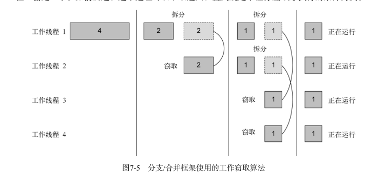