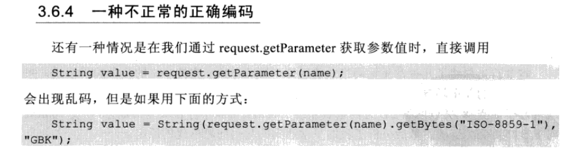

#               Java Web 中中文编码问题

### WEB环境中编码问题


- queryString 解析


- 在请求头中 指定 content-type 的编码
- 打开Tomcat conf 文件夹下的server.xml文件，对文件中设置如下：

​        在HTTP/1.1中增加**URIEncoding="utf-8；**

```xml
<Connector port="8098" protocol="HTTP/1.1"
connectionTimeout="20000"
redirectPort="8443" URIEncoding="utf-8"/>
```



### JAVA环境中编码问题

- I/O操作中存在的编码问题


- 内存操作中编码

  ```java
  String  s = "这是一段中文编码的文字";
  byte[] b = s.getBytes("UTF-8");// 使用给定的 charset 将此 String 编码到 byte 序列，并将结果存储到新的 byte 数组。
  String n = new String(b,"UTF-8")//通过使用指定的 charset 解码指定的 byte 数组，构造一个新的 String。
  ```

  ```java
  Charset charset = Charset.froName("UTF-8");
  ByteBuffer byteByffer = charset.encode(string);
  CharBuffer charBuffer = charset.decode(byteBuffer);
  ```

  编码和解码都在一个类中解决。

