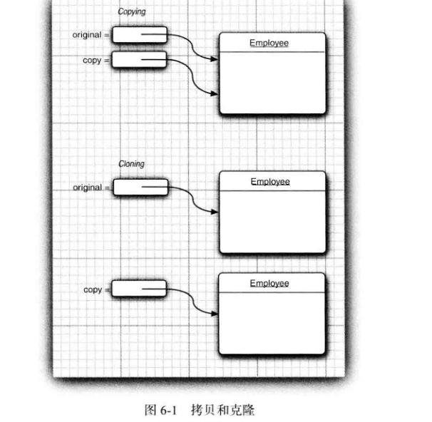
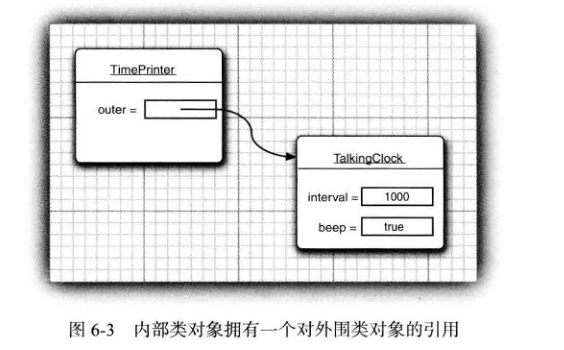

# 						Java核心技术基础知识

**回调** （ callback ) 是一种常见的程序设计模式。 在这种模式中 ， 可以指出某个特定事件发生时应该采取的动作。

### 克隆

- 默认的克隆操作是 “ 浅拷贝 ” ， 并没有克隆对象中引用的其他对象。

- clone 方法是 Object 的一个 protected （父类和子类中调用）方法 ， 这说明你的代码不能直接调用这个方法。
-  如果原对象和浅克隆对象共享的子对象是不可变的 ， 那么这种共享就是安全的。 
- 深拷贝 还需要对象的可变的域进行拷贝。

### 内部类

 （ inner class ) 是定义在另一个类中的类。 为什么需要使用内部类呢 

- 内部类方法可以访问该类定义所在的作用域中的数据 ， 包括私有的数据。
- 内部类可以对同一个包中的其他类隐藏起来。
- 当想要定义一个回调函数且不想编写大量代码时 ， 使用匿名（ anonymous ) 内部类比较便捷。

- 外围类的引用在构造器中设置 。 编译器修改了所有的内部类的构造器 ， 添加一个外围类引用的参数。 

- 只有内部类可以是私有类 ， 而常规类只可以具有包可见性 ， 或公有可见性 
- 内部类中声明的所有静态域都必须是 final 。
- 内部类不能有 static 方法。

-  内部类是一种编译器现象 ， 与虚拟机无关。编译器将会把内部类翻译成用 $( 美元符号 ） 分隔外部类名与内部类名的常规类文件， 而虚拟机则对此一无所知。
-  在 对象中不需要引用任何其他的对象 ，为此，可以将这个内部类声明为 static 。 静态内部类的对象除了没有对生成它的外围类对象的引用特权外 ， 与其他所有内部类完全一样。
- 在内部类不需要访问外围类对象的时候 ， 应该使用静态内部类 。与常规内部类不同 ， 静态内部类可以有静态域和方法 。声明在接口中的内部类自动成为 static 和 public 类。

### 代理类的特性

- 代理类是在程序运行过程中创建的. 然而 ,一旦被创建，就变成了常规类 ,与虚拟机中的任何其他类没有什么区别。
- 所有的代理类都扩展于 Proxy 类。一个代理类只有一个实例域—调用处理器 ， 它定义在 Proxy 的超类中。为了履行代理对象的职责， 所需要的任何附加数据都必须存储在调用处理器中 。
- 所有的代理类都覆盖了 Object 类中的方法 `toString`、 equals 和`hashCode`。 如同所有的代理方法一样， 这些方法仅仅调用了调用处理器的invoke。Object 类中的其他方法（ 如clone和 `getClass `) 没有被重新定义.
- 没有定义代理类的名字， Sun 虚拟机中的 Proxy 类将生成一个以字符串 `$Proxy` 开头的类名 。对于特定的类加载器和预设的一组接口来说， 只能有一个代理类 。
- 代理类一定是 public 和 final 。
- 可以通过调用 Proxy 类中的` isProxyClass`方法检测一个特定的 Class 对象是否代表一个代理类。

### 异常

- 如果出现 `RuntimeException` 异常 ， 那么就一定是你的问题。
- Java 语 言 规 范 将 派 生 于 Error 类 或 `RuntimeException` 类的所有异常称为非受查( unchecked ) 异常， 所有其他的异常称为受查 （ checked )异常。
- 当捕获到异常`se- Throwable` 时， 就可以使用下面这条语句重新得到原始异常 ：`Throwable e = se.getCause()` ;强烈建议使用这种包装技术。 这样可以让用户抛出子系统中的高级异常 ， 而不会丢失原始异常的细节。
- 因此使用异常的基本规则是 ： 只在异常情况下使用异常机制 。
- 不要过分地细化异常
- 不要只抛出` RuntimeException`异常。 应该寻找更加适当的子类或创建自己的异常类 。