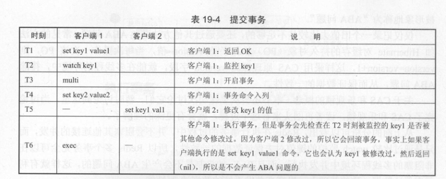
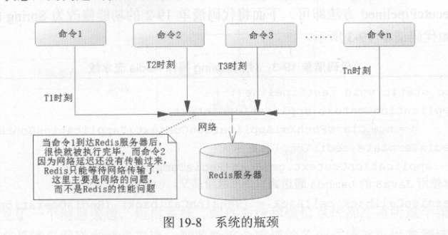
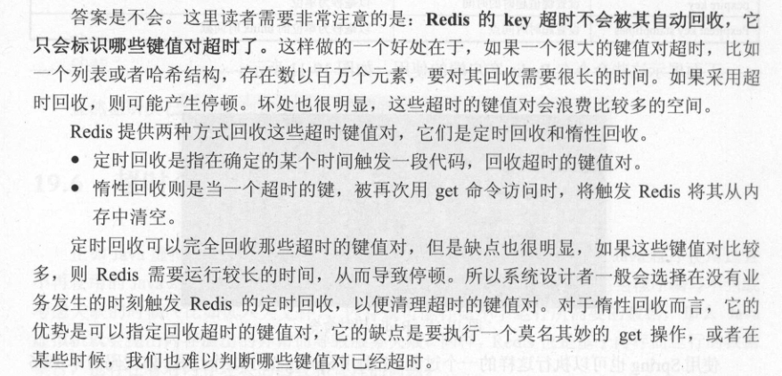

#                   Redis 常用技术

### redis 基础事务


- spring 提供的SessionCallback接口

```java
public class SessionCallbackTest {
    public static void main(String[] args) {
        ApplicationContext context = new ClassPathXmlApplicationContext("spring-redis.xml");
        RedisTemplate redisTemplate = context.getBean(RedisTemplate.class);
//        SessionCallback callback = (SessionCallback)(RedisOperations ops) -> {
//            ops.multi();
//            ops.boundValueOps("key1").set("value1");
//            String value  = (String)ops.boundValueOps("key1").get();
//            System.out.println("事务执行中，命令进入队列，没有被执行吗，所以value 为空"+ value);
//            List list = ops.exec();
//            value = (String)redisTemplate.opsForValue().get("key1");
//            return value;
//        };
        SessionCallback callback = new SessionCallback(){

            @Override
            public Object execute(RedisOperations ops) throws DataAccessException {
                ops.multi();
                ops.boundValueOps("key1").set("value1");
                String value = (String) ops.boundValueOps("key1").get();
                System.out.println("事务执行中，命令进入队列，没有被执行吗，所以value 为空" + value);
                List list = ops.exec();
                value = (String) redisTemplate.opsForValue().get("key1");
                return value;
            }
        };
        String value  = (String) redisTemplate.execute(callback);
        System.out.println(value);
    }
}
```

- **redis事务回滚**
  - 命令错误，整个事务前后命令都回滚
  - 操作数据结构错误。（运行时错误）事务不会回滚，前后命令都执行。
    - 误把sadd命令写成了zadd命令
    - string 类型  使用   incr  key  等

- **watch 命令监控事务**
  - 参考CAS --乐观锁   存在ABA问题。




### 流水线（Pipeline）



```java
public class PipelineTest {
    public static void main(String[] args) {
        JedisPool  pool = new JedisPool("127.0.0.1",6379);
        Jedis jedis =pool.getResource();
        long start = System.currentTimeMillis();
        Pipeline pipelined = jedis.pipelined();
        
        // 测试 10 万读写
        for (int i = 0; i < 100000; i++) {
            int j = i+1;
            pipelined.set("pipelined_key_"+j,"pipelined_value_"+j);
            pipelined.get("pipelined_key_"+j);
        }
        List<Object> list = pipelined.syncAndReturnAll();
        long end = System.currentTimeMillis();
        // 耗时463毫秒
        System.out.println("耗时"+(end - start)+ "毫秒");
    }
}

// 当你执行很多命令并返回结果时，需要考虑list 对象的大小，因为它会“吃掉” 服务器上很多的内存空间，严重时会倒是内存不足，引发JVM溢出异常。需要注意。
```


**原生批量命令与Pipeline对比**

- 原生批量命令是原子的，Pipeline是非原子的。
- 原生批量命令是一个命令对应多个key，Pipeline支持多个命令
- 原生批量命令是Redis服务端支持实现的，而Pipeline需要服务端和客户端的共同实现。

**最佳实践**

- Pipeline虽然好用，但是每次Pipeline组装的命令个数不能没有节制，否则一次组装Pipeline数据量过大，一方面会增加客户端的等待时间，另一方面会造成一定的网络阻塞，可以将一次包含大量命令的Pipeline拆分成多次较小的Pipeline来完成。
- Pipeline只能操作一个Redis实例，但是即使在分布式Redis场景中，也可以作为批量操作的重要优化手段。

### 发布订阅


- 命令方式

  - 1.发布消息

    `publish channel message`

    `publish channel:sports "Tim won the championship"`

  - 2.订阅消息

    `subscribe channel [channel ...]`

    `subscribe channel:sports`

  - 有关订阅命令有两点需要注意：
    - ​	客户端在执行订阅命令之后进入了订阅状态，只能接收subscribe、psubscribe、unsubscribe、punsubscribe的四个命令。
    - 新开启的订阅客户端，无法收到该频道之前的消息，因为Redis不会对发布的消息进行持久化。

- 代码方式（spring） 待写

```

```

### 超时命令

- redis基于内存，也会有对内存的回收和管理


- 面试常问，如果redis 的key 超时了，redis会回收可以的存储空间吗？



### 使用lua 脚本

- 在Redis中执行Lua脚本有两种方法：eval和evalsha。

- eval

  - 如果Lua脚本较长，还可以使用redis-cli--eval直接执行文件。

     

  

```
eval 'return "hello " .. KEYS[1] .. ARGV[1]' 1 redis world 
输出： "hello redisworld"
此时KEYS[1]="redis"，ARGV[1]="world"，所以最终的返回结果是"hello redisworld"。
```

- evalsha

  - evalsha命令使用SHA1作为参数可以直接执行对应Lua脚本，避免每次发送Lua脚本的开销。

    - script load 

      script load script

      此命令用于将Lua脚本加载到Redis内存中，

    - script exists

       scripts exists sha1 [sha1  … ] 此命令用于判断sha1是否已经加载到Redis内存中

    - script flush

      此命令用于清除Redis内存已经加载的所有Lua脚本

    - script kill

      此命令用于杀掉正在执行的Lua脚本。如果Lua脚本比较耗时，甚至Lua脚本存在问题，那么此时Lua脚本的执行会阻塞Redis，直到脚本执行完毕或者外部进行干预将其结束。


### redis备份（持久化）

> 内存数据持久化的两种常见方法：
>
> 1.将内存数据定期dump(备份文件系统)到磁盘
>
> 优点：效率高，操作简便
>
> 缺点：会损失部分数据
>
> 2.利用类似于mysql的binlog日志的方式，记录更新操作，需要时回放数据
>
> 优点：可保证数据完整性
>
> 缺点：会损失部分性能，实现稍微复杂点
>
> redis实现了这两种方式

- **RDB**

  RDB持久化是把当前进程数据生成快照保存到硬盘的过程，触发RDB持久化过程分为手动触发和自动触发。

  - save命令：阻塞当前Redis服务器，直到RDB过程完成为止。

    

  - bgsave命令：Redis进程执行fork操作创建子进程，RDB持久化过程由子进程负责，完成后自动结束。阻塞只发生在fork阶段，一般时间很短。

    bgsave是主流的触发RDB持久化方式。

  

- **AOF**

  AOF（append only file）持久化：以独立日志的方式记录每次写命令，重启时再重新执行AOF文件中的命令达到恢复数据的目的。

  AOF的主要作用是解决了数据持久化的实时性，目前已经是Redis持久化的主流方式。

  - 开启AOF功能需要设置配置：appendonly yes，默认不开启。
  - AOF文件名通过appendfilename配置设置，默认文件名是appendonly.aof。

  

- 文件同步

  

- 重写机制

  AOF文件重写是把Redis进程内的数据转化为写命令同步到新AOF文件的过程。


- 持久化加载过程

  

- RDB的优缺点

  - RDB的优点：
    - RDB是一个紧凑压缩的二进制文件，代表Redis在某个时间点上的数据快照。非常适用于备份，全量复制等场景。比如每6小时执行bgsave备份，并把RDB文件拷贝到远程机器或者文件系统中（如hdfs），用于灾难恢复。
    - Redis加载RDB恢复数据远远快于AOF的方式。

  - RDB的缺点：
    - RDB方式数据没办法做到实时持久化/秒级持久化。因为bgsave每次运行都要执行fork操作创建子进程，属于重量级操作，频繁执行成本过高。
    - RDB文件使用特定二进制格式保存，Redis版本演进过程中有多个格式的RDB版本，存在老版本Redis服务无法兼容新版RDB格式的问题。

### redis内存回收策略

- maxmemory-policy

  

### 复制

命令配置:  ` slaveof{masterHost}{masterPort}`  -->`slaveof 127.0.0.1 6379`

- 默认情况下，从节点使用slave-read-only=yes配置为只读模式

拓扑结构

- 一主一从结构

  

- 一主多从结构

  

- 树状主从结构

  

- redis主从同步过程


1. 保存主节点（master）信息。
2. 从节点（slave）内部通过每秒运行的定时任务维护复制相关逻辑，当定时任务发现存在新的主节点后，会尝试与该节点建立网络连接。
3. 发送ping命令。
   - 检测主从之间网络套接字是否可用。
   - 检测主节点当前是否可接受处理命令。

4. 权限验证。如果主节点设置了requirepass参数，则需要密码验证，从节点必须配置masterauth参数保证与主节点相同的密码才能通过验证；如果验证失败复制将终止，从节点重新发起复制流程。
5. 同步数据集。主从复制连接正常通信后，对于首次建立复制的场景，主节点会把持有的数据全部发送给从节点，这部分操作是耗时最长的步骤。 触发全量复制的命令是sync （版本< 2.8）和psync(版本 >= 2.8)
6. 命令持续复制。当主节点把当前的数据同步给从节点后，便完成了复制的建立流程。接下来主节点会持续地把写命令发送给从节点，保证主从数据一致性。

### 哨兵

**Redis主从复制的缺点：没有办法对master进行动态选举，需要使用Sentinel机制完成动态选举**

通过redis-sentinel启动哨兵服务 ： `./redis-sentinel sentinel.conf`

- 哨兵进程的作用

> **1.** **监控(Monitoring):** 哨兵(sentinel) 会不断地检查你的Master和Slave是否运作正常。
>
> **2.提醒(Notification)**： 当被监控的某个Redis节点出现问题时, 哨兵(sentinel) 可以通过 API 向管理员或者其他应用程序发送通知。
>
> **3.** **自动故障迁移(Automatic failover)**：当**一个Master不能正常工作**时，哨兵(sentinel) 会开始**一次自动故障迁移操作**。
>
> \* 它会将失效Master的其中一个Slave升级为新的Master, 并让失效Master的其他Slave改为复制新的Master；
>
> \* 当客户端试图连接失效的Master时，集群也会向客户端返回新Master的地址，使得集群可以使用现在的Master替换失效Master。
>
> \* Master和Slave服务器切换后，Master的redis.conf、Slave的redis.conf和sentinel.conf的配置文件的内容都会发生相应的改变，即，Master主服务器的redis.conf配置文件中会多一行slaveof的配置，sentinel.conf的监控目标会随之调换。

- 实现原理

> **三个定时监控任务**
>
> 1. 每隔10秒，每个Sentinel节点会向主节点和从节点发送info命令获取最新的拓扑结构
> 2. 每隔2秒，每个Sentinel节点会向Redis数据节点的__sentinel__：hello频道上发送该Sentinel节点对于主节点的判断以及当前Sentinel节点的信息同时每个Sentinel节点也会订阅该频道，来了解其他Sentinel节点以及它们对主节点的判断.
> 3. 每隔1秒，每个Sentinel节点会向主节点、从节点、其余Sentinel节点发送一条ping命令做一次心跳检测，来确认这些节点当前是否可达。
>
> **主观下线和客观下线**
>
> 1. 主观下线：每个Sentinel节点会每隔1秒对主节点、从节点、其他Sentinel节点发送ping命令做心跳检测，当这些节点超过down-after-milliseconds没有进行有效回复，Sentinel节点就会对该节点做失败
>    判定，这个行为叫做主观下线。
> 2. 客观下线： 当**有足够数量的 Sentinel（哨兵）**进程（大于等于配置文件指定的值）在指定的时间范围内确认Master主服务器进入了主观下线状态（SDOWN）， 则Master主服务器会被标记为**客观下线（ODOWN）**。
> 3. 当Sentinel主观下线的节点是主节点时，该Sentinel节点会通过sentinel is-master-down-by-addr命令向其他Sentinel节点询问对主节点的判断，当超过<quorum>个数，Sentinel节点认为主节点确实有问题，这时该Sentinel节点会做出客观下线的决定
>
> <quorum> 这个是啥意思
>
> 1. quorum是用来识别故障的，真正执行故障转移的时候，还是要在哨兵集群执行选举，选举一个哨兵进程出来执行故障转移操作
> 2. 假设有5个哨兵，quorum设置了2，那么如果5个哨兵中的2个都认为master挂掉了; 2个哨兵中的一个就会做一个选举，选举一个哨兵出来，执行故障转移; 如果5个哨兵中有3个哨兵都是运行的，那么故障转移就会被允许执行
>
> **领导者Sentinel节点选举**
>
> Sentinel节点对于主节点已经做了客观下线，所以Sentinel节点之间会做一个领导者选举的工作，选出
> 一个Sentinel节点作为领导者进行故障转移的工作。
>
> 如果该Sentinel节点发现自己的票数已经大于等于max（quorum，num（sentinels）/2+1），那么它将成为领导者
>
> **故障转移**
>
> 1. 过滤：“不健康”（主观下线、断线）、5秒内没有回复过Sentinel节点ping响应、与主节点失联超过down-after-milliseconds*10秒。
> 2. 选择slave-priority（从节点优先级）最高的从节点列表，如果存在则返回，不存在则继续。
> 3. 选择复制偏移量最大的从节点（复制的最完整），如果存在则返回，不存在则继续。
> 4. 选择runid最小的从节点。

### redis 高可用读写分离


但上述模型中，从节点不是高可用的，如果slave-1节点出现故障，首先客户端client-1将与其失联，其次Sentinel节点只会对该节点做主观下线，因为Redis Sentinel的故障转移是针对主节点的。

- Redis Sentinel读写分离设计思路


所以在设计Redis Sentinel的从节点高可用时，只要能够实时掌握所有从节点的状态，把所有从节点看做一个资源池（如图9-37所示），无论是上线还是下线从节点，客户端都能及时感知到（将其从资源池中添加或者删除），这样从节点的高可用目标就达到了。