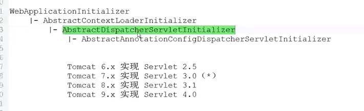
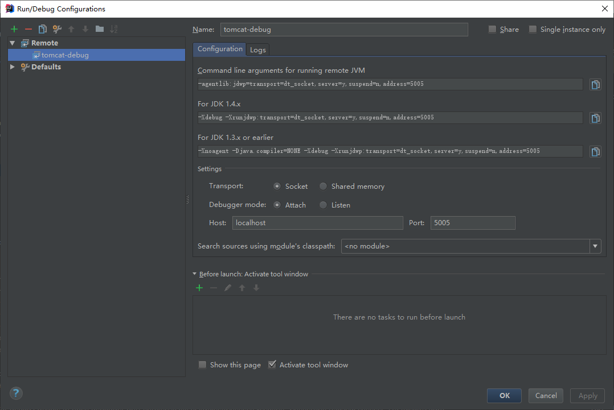

#               Spring Annotation 驱动开发

- ### Annotation 装配

  ```java
  @Configuration
  public class UserConfiguration {
      @Bean(name = "user")
      public User user(){
          User user = new User();
          user.setName("小马哥");
          return user;
      }
  }
  ```

- `AnnotationConfigBootstrap` 启动类

  ```java
  // annotation 启动类
  public class AnnotationConfigBootstrap {
      public static void main(String[] args) {
          // 构建一个 Spring Application 上下文
          AnnotationConfigApplicationContext applicationContext =
                  new AnnotationConfigApplicationContext();
          // 需要注册一个UserConfiguration 的Bean
          applicationContext.register(UserConfiguration.class);
           //启动容器
          applicationContext.refresh();
          User user = applicationContext.getBean("user", User.class);
          System.out.printf("user.getName() = %s \n",user.getName());        
      }
  }
  ```

- `XmlConfigBootstrap` 启动类。

  ```java
  // xml 启动类
  public class XmlConfigBootstrap {
      public static void main(String[] args) {
          // 构建一个 Spring Application 上下文
          ClassPathXmlApplicationContext applicationContext =
                  new ClassPathXmlApplicationContext();
          applicationContext.setConfigLocations(
                  "classpath:/META-INF/spring/context.xml");
          applicationContext.refresh();
          User user = applicationContext.getBean("user", User.class);
          System.out.printf("user.getName() = %s \n",user.getName());
      }
  }
  ```

- ### Spring Web 自动装配

  servlet 3.0+ 后

  ```java
  public interface ServletContainerInitializer {
      // 容器启动时调用
      void onStartup(Set<Class<?>> c, ServletContext ctx) throws ServletException;
  }
  ```

  以前通过 ContextLoaderListener  调用 contextInitialized 启动容器

  ```xml
   <!-- Spring监听器 -->
      <listener>
          <listenerclass>
              org.springframework.web.context.ContextLoaderListener
          </listener-class>
      </listener>
  ```

  

- Spring Web 自动装配

  ```java
  public class AutoConfigDispatcherServletInitializer extends AbstractAnnotationConfigDispatcherServletInitializer {
      @Nullable
      protected Class<?>[] getRootConfigClasses() {
          return new Class[0];
      }
      @Nullable
      protected Class<?>[] getServletConfigClasses() {
          return new Class[]{SpringWebMvcConfiguration.class};
      }
      protected String[] getServletMappings() {
          return new String[]{"/*"};
      }
  }
  // 继承抽象类  为啥要继承 源码分析
  // AbstractAnnotationConfigDispatcherServletInitializer是注解当这个
  // WebApplicationInitializer子类  
  ```

  ```java
  // HandlesTypes注解当这个WebApplicationInitializer.class 存在的时候才能处理
  @HandlesTypes(WebApplicationInitializer.class)
  public class SpringServletContainerInitializer implements ServletContainerInitializer {
  	@Override
  	public void onStartup(@Nullable Set<Class<?>> webAppInitializerClasses, ServletContext servletContext)
  			throws ServletException {
  
  		List<WebApplicationInitializer> initializers = new LinkedList<>();
  
  		if (webAppInitializerClasses != null) {
              // 遍历这个 webAppInitializer集合
  			for (Class<?> waiClass : webAppInitializerClasses) {
                  //不是接口和抽象类 并是WebApplicationInitializer的子类 
                  //才能进入，需自定义实现。
  				if (!waiClass.isInterface() &&               !Modifier.isAbstract(waiClass.getModifiers()) &&
  						WebApplicationInitializer.class.isAssignableFrom(waiClass)) {
  					try {
                          //加入容器中
  						initializers.add((WebApplicationInitializer)								ReflectionUtils.accessibleConstructor(waiClass).newInstance());
  					}
  					catch (Throwable ex) {
  						throw new ServletException("Failed to instantiate WebApplicationInitializer class", ex);
  					}
  				}
  			}
  		}
  
         // 校验 initializers
  		if (initializers.isEmpty()) {
  			servletContext.log("No Spring WebApplicationInitializer types detected on classpath");
  			return;
  		}
  
  		servletContext.log(initializers.size() + " Spring WebApplicationInitializers detected on classpath");
  		AnnotationAwareOrderComparator.sort(initializers);
           // 遍历 启动web容器。
  		for (WebApplicationInitializer initializer : initializers) {
  			initializer.onStartup(servletContext);
  		}
  	}
  
  }
  ```

  

  - 组件bean 配置

  ```java
  @Configuration
  @ComponentScan(basePackages = "com.gupao.spring.webmvc.auto")
  public class SpringWebMvcConfiguration {
      @ConditionalOnClass(String.class)
      @Bean("helloWorld")
      public String helloWorld(){
          return "helloWorld";
      }
  }
  
  ```

  - 条件装配实现

  ```java
  @Target({ElementType.METHOD})
  @Retention(RetentionPolicy.RUNTIME)
  @Documented
  @Conditional(OnClassCondition.class)
  public @interface ConditionalOnClass {
  
      Class<?>[] value();
  
  }
  ```

  ```java
  /**
   * 当指定的某个类存在时，满足条件
   **/
  public class OnClassCondition implements Condition {
  
      public boolean matches(ConditionContext context, AnnotatedTypeMetadata metadata) {
          boolean matched = false;
  
          /**
           * 获取所有的 ConditionalOnClass 中的属性方法
           */
          MultiValueMap<String, Object> attributes = metadata.getAllAnnotationAttributes(ConditionalOnClass.class.getName());
          //获取 value() 方法中的配置值
          List<Object> classes = (List<Object>)attributes.get("value");
          try {
              for (Object klass : classes) {
                  Class<?>[] type = (Class<?>[]) klass; // 如果异常的话，说明class 不存在的
                  matched = true;
              }
          }catch (Throwable error){
              matched = false;
          }
          System.out.println("OnClassCondition 是否匹配 :" + matched);
          return matched;
      }
  }
  ```

  - web访问

  ```java 
  @RestController
  public class DemoController {
  
      // 有可能 helloWorld Bean获取不到
      @Autowired(required = false)
      @Qualifier("helloWorld")
      private String helloWorld;
  
      @GetMapping
      public String index(){
          return helloWorld;
      }
  } 
  // 通过 Tomcat 插件打成war  cmd 通过jar执行，  idea remote debug
  ```

  ```
  远程debug 
  清class文件，打包构建，跳过测试
  mvn clean package -Dmaven.test.skip=true -P product
  
  -P maven 会激活项目下的pom.xml配置的<profiles>标签下id为product
   
  java -jar -agentlib:jdwp=transport=dt_socket,server=y,suspend=y,address=5005 target\spring-webmvc-autoconfig-1.0-SNAPSHOT-war-exec.jar
  
  端口阻塞在5005 
  
  idea 配置如下图
  ```
  
  - 分析命令 ：`agentlib:jdwp=transport=dt_socket,server=y,suspend=y,address=5005 ` 
  
    - agentlib:jdwp  此选项加载JDWP的JPDA参考实现。 该库驻留在目标VM中，并使用JVMDI和JNI与其进行交互。 它使用传输和JDWP协议与单独的调试器应用程序进行通信
  
    - t_socket：使用的通信方式
    - server：是主动连接调试器还是作为服务器等待调试器连接
    - suspend：是否在启动JVM时就暂停，并等待调试器连接
    - address：地址和端口，地址可以省略，两者用冒号分隔



 启动debug 即可