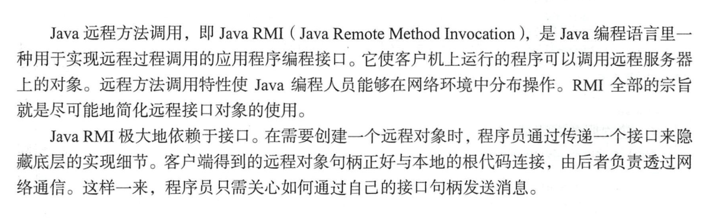

#                  Spring RMI 源码分析



 原理图：


两个核心类`RmiServiceExporter`, `RmiProxyFactoryBean`


### RmiServiceExporter 源码分析

- `InitializingBean#afterPropertiesSet`

```java
@Override
public void afterPropertiesSet() throws RemoteException {
	prepare();
}
```

```java
public void prepare() throws RemoteException {
		// 检查验证service 属性不为空
		checkService();

		// 必须要求属性
		if (this.serviceName == null) {
			throw new IllegalArgumentException("Property 'serviceName' is required");
		}

		// Check socket factories for exported object.检查套接字工厂是否已导出对象

		if (this.clientSocketFactory instanceof RMIServerSocketFactory) {
			this.serverSocketFactory = (RMIServerSocketFactory) this.clientSocketFactory;
		}
		// 两者clientSocketFactory  serverSocketFactory 同出现。
		if ((this.clientSocketFactory != null && this.serverSocketFactory == null) ||
				(this.clientSocketFactory == null && this.serverSocketFactory != null)) {
			throw new IllegalArgumentException(
					"Both RMIClientSocketFactory and RMIServerSocketFactory or none required");
		}

		// Check socket factories for RMI registry.检查套接字工厂是否有RMI注册表
		// registryClientSocketFactory  也实现了 RMIServerSocketFactory
		// 则registryServerSocketFactory 使用 registryClientSocketFactory
		if (this.registryClientSocketFactory instanceof RMIServerSocketFactory) {
			this.registryServerSocketFactory = (RMIServerSocketFactory) this.registryClientSocketFactory;
		}
		// 不允许出现 registryServerSocketFactory 而没有配置registryClientSocketFactory
		if (this.registryClientSocketFactory == null && this.registryServerSocketFactory != null) {
			throw new IllegalArgumentException(
					"RMIServerSocketFactory without RMIClientSocketFactory for registry not supported");
		}

		this.createdRegistry = false;

		// Determine RMI registry to use. 确定要使用的RMI注册表。

		if (this.registry == null) {
			//1 。注册  获取registry
			this.registry = getRegistry(this.registryHost, this.registryPort,
				this.registryClientSocketFactory, this.registryServerSocketFactory);
			this.createdRegistry = true;
		}

		// Initialize and cache exported object.
		// 初始化并缓存导出的对象。
		//此时使用RmiInvocationWrapper 封装的jdk代理类，切面为 RemoteInvocationTraceInterceptor
		// 2. 获取代理对象。-- 此时被RmiInvocationWrapper包装--》实现了Remote接口
		this.exportedObject = getObjectToExport();

		if (logger.isInfoEnabled()) {
			logger.info("Binding service '" + this.serviceName + "' to RMI registry: " + this.registry);
		}

		// Export RMI object. 导出RMI对象。
		if (this.clientSocketFactory != null) {
			//使用给定的套接字工厂指定传输方式导出远程对象，以便能接受传入的调用。
			//clientSocketFactory进行远程对象调用的客户端套接字工厂，
			//serverSocketFactory进行远程对象调用的服务端套接字工厂，
			UnicastRemoteObject.exportObject(
					this.exportedObject, this.servicePort, this.clientSocketFactory, this.serverSocketFactory);
		}
		else {
			// 导出远程对象,以便它能特定端口的调用。
			UnicastRemoteObject.exportObject(this.exportedObject, this.servicePort);
		}

		// Bind RMI object to registry.将RMI对象绑定到注册表。 以便调用。
		// 3. registry.bind 绑定对象。
		try {
			if (this.replaceExistingBinding) {
				this.registry.rebind(this.serviceName, this.exportedObject);
			}
			else {
				this.registry.bind(this.serviceName, this.exportedObject);
			}
		}
		catch (AlreadyBoundException ex) {
			// Already an RMI object bound for the specified service name...
			unexportObjectSilently();
			throw new IllegalStateException(
					"Already an RMI object bound for name '"  + this.serviceName + "': " + ex.toString());
		}
		catch (RemoteException ex) {
			// Registry binding failed: let's unexport the RMI object as well.
			unexportObjectSilently();
			throw ex;
		}
	}
```

1.注册  获取registry

```java
protected Registry getRegistry(String registryHost, int registryPort,
			@Nullable RMIClientSocketFactory clientSocketFactory, @Nullable RMIServerSocketFactory serverSocketFactory)
			throws RemoteException {

		if (registryHost != null) {
			// Host explicitly specified: only lookup possible.
			// 远程连接测试
			if (logger.isInfoEnabled()) {
				logger.info("Looking for RMI registry at port '" + registryPort + "' of host [" + registryHost + "]");
			}
			// 如果registryHost 不为空，则尝试获取对应主机的Registry 返回代理对象
			Registry reg = LocateRegistry.getRegistry(registryHost, registryPort, clientSocketFactory);
			testRegistry(reg);
			return reg;
		}

		else {
			// 获取本机的Registry
			return getRegistry(registryPort, clientSocketFactory, serverSocketFactory);
		}
	}
```

2.获取代理对象。-- 此时被RmiInvocationWrapper包装--》实现了Remote接口

```java
protected Remote getObjectToExport() {
		// determine remote object
		// 如果配置的service 属性对应的类实现了Remote接口，且没有配置
		// serviceInterface
		if (getService() instanceof Remote &&
				(getServiceInterface() == null || Remote.class.isAssignableFrom(getServiceInterface()))) {
			// conventional RMI service --》常规 rmi 服务。
			return (Remote) getService();
		}
		else {
			// RMI invoker
			if (logger.isDebugEnabled()) {
				logger.debug("RMI service [" + getService() + "] is an RMI invoker");
			}
			// service 封装，RmiInvocationWrapper 对象封装一个jdk代理类
			return new RmiInvocationWrapper(getProxyForService(), this);
		}
	}
```

3. registry.bind 绑定对象。

```java 
// 3. registry.bind 绑定对象。
		try {
			if (this.replaceExistingBinding) {
				this.registry.rebind(this.serviceName, this.exportedObject);
			}
			else {
				this.registry.bind(this.serviceName, this.exportedObject);
			}
		}
```

4. 服务激活调用 `RmiInvocationWrapper#invoke`

```java
public Object invoke(RemoteInvocation invocation)
		throws RemoteException, NoSuchMethodException, IllegalAccessException, InvocationTargetException {

		return this.rmiExporter.invoke(invocation, this.wrappedObject);
	}
```

一直往里面跟

```java
protected Object invoke(RemoteInvocation invocation, Object targetObject)
			throws NoSuchMethodException, IllegalAccessException, InvocationTargetException {

		if (logger.isTraceEnabled()) {
			logger.trace("Executing " + invocation);
		}
		try {
            // RemoteInvocationExecutor 执行
			return getRemoteInvocationExecutor().invoke(invocation, targetObject);
		}
		catch (NoSuchMethodException ex) {
			if (logger.isDebugEnabled()) {
				logger.warn("Could not find target method for " + invocation, ex);
			}
			throw ex;
		}
		catch (IllegalAccessException ex) {
			if (logger.isDebugEnabled()) {
				logger.warn("Could not access target method for " + invocation, ex);
			}
			throw ex;
		}
		catch (InvocationTargetException ex) {
			if (logger.isDebugEnabled()) {
				logger.debug("Target method failed for " + invocation, ex.getTargetException());
			}
			throw ex;
		}
	}
```

### RmiProxyFactoryBean源码分析


- 实现了BeanFactory

  - 那么获取bean时，不是直接获取bean，而是通过bean.getObject方法

  - `org.springframework.remoting.rmi.RmiProxyFactoryBean#getObject`

    ```java
    public Object getObject() {
    		return this.serviceProxy;
    }
    ```

- 实现了InitializingBean 

```java
// 入口
@Override
public void afterPropertiesSet() {
    // 验证serviceUrl 不为空 调用了prepare 方法
    super.afterPropertiesSet();
    Class<?> ifc = getServiceInterface();
    Assert.notNull(ifc, "Property 'serviceInterface' is required");
    // 创建代理
    this.serviceProxy = new ProxyFactory(ifc, this).getProxy(getBeanClassLoader());
}
```

```java
public void prepare() throws RemoteLookupFailureException {
		// Cache RMI stub on initialization?  stub 存根 --》也就是被包装的代理对象。
        // 也就是被包装的代理对象。--》RmiInvocationWrapper（只是一种可能.）
		if (this.lookupStubOnStartup) {
			Remote remoteObj = lookupStub();
			if (logger.isDebugEnabled()) {
				if (remoteObj instanceof RmiInvocationHandler) {
					logger.debug("RMI stub [" + getServiceUrl() + "] is an RMI invoker");
				}
				else if (getServiceInterface() != null) {
					boolean isImpl = getServiceInterface().isInstance(remoteObj);
					logger.debug("Using service interface [" + getServiceInterface().getName() +
						"] for RMI stub [" + getServiceUrl() + "] - " +
						(!isImpl ? "not " : "") + "directly implemented");
				}
			}
			if (this.cacheStub) {
				// 将获取的stub 缓存
				this.cachedStub = remoteObj;
			}
		}
	}
```

- 实现了 MethodIntercept，当方法调用的时候调用增强方法.

```java
@Override
	public Object invoke(MethodInvocation invocation) throws Throwable {
		// 获取服务器中对应的注册的remote对象。通过序列化传输。
		// 获取 registry bind 的对象。
		Remote stub = getStub();
		try {
			return doInvoke(invocation, stub);
		}
		catch (RemoteConnectFailureException ex) {
			return handleRemoteConnectFailure(invocation, ex);
		}
		catch (RemoteException ex) {
			if (isConnectFailure(ex)) {
				return handleRemoteConnectFailure(invocation, ex);
			}
			else {
				throw ex;
			}
		}
	}
```

```java
protected Remote getStub() throws RemoteLookupFailureException {
		if (!this.cacheStub || (this.lookupStubOnStartup && !this.refreshStubOnConnectFailure)) {
			return (this.cachedStub != null ? this.cachedStub : lookupStub());
		}
		else {
			synchronized (this.stubMonitor) {
				if (this.cachedStub == null) {
					this.cachedStub = lookupStub();
				}
				return this.cachedStub;
			}
		}
	}
```

```java
protected Remote lookupStub() throws RemoteLookupFailureException {
		try {
			Remote stub = null;
			if (this.registryClientSocketFactory != null) {
				// RMIClientSocketFactory specified for registry access.
				// Unfortunately, due to RMI API limitations, this means
				// that we need to parse the RMI URL ourselves and perform
				// straight LocateRegistry.getRegistry/Registry.lookup calls.
				URL url = new URL(null, getServiceUrl(), new DummyURLStreamHandler());
				String protocol = url.getProtocol();
				//验证传输协议
				if (protocol != null && !"rmi".equals(protocol)) {
					throw new MalformedURLException("Invalid URL scheme '" + protocol + "'");
				}
				String host = url.getHost();
				int port = url.getPort();
				// 服务名
				String name = url.getPath();
				if (name != null && name.startsWith("/")) {
					name = name.substring(1);
				}
				Registry registry = LocateRegistry.getRegistry(host, port, this.registryClientSocketFactory);
				stub = registry.lookup(name);
			}
			else {
				// Can proceed with standard RMI lookup API... 可以继续使用标准RMI查找API ...
				stub = Naming.lookup(getServiceUrl());
			}
			if (logger.isDebugEnabled()) {
				logger.debug("Located RMI stub with URL [" + getServiceUrl() + "]");
			}
			return stub;
		}
		catch (MalformedURLException ex) {
			throw new RemoteLookupFailureException("Service URL [" + getServiceUrl() + "] is invalid", ex);
		}
		catch (NotBoundException ex) {
			throw new RemoteLookupFailureException(
					"Could not find RMI service [" + getServiceUrl() + "] in RMI registry", ex);
		}
		catch (RemoteException ex) {
			throw new RemoteLookupFailureException("Lookup of RMI stub failed", ex);
		}
	}
```

### java Naming RMI 实现 (待写)

**服务端：**

```java
public class NamingService {
    public static void main(String[] args) {
        try {
            // 本地主机上的远程对象注册表Registry的实例
            LocateRegistry.createRegistry(1100);
            // 创建一个远程对象
            HelloNamingFacade hello = new HelloNamingFacadeImpl();
            // 把远程对象注册到RMI注册服务器上，并命名为Hello 
            //绑定的URL标准格式为：rmi://host:port/name
            Naming.bind("rmi://localhost:1100/HelloNaming", hello);
            System.out.println("======= 启动RMI服务成功! =======");
        } catch (RemoteException | MalformedURLException | AlreadyBoundException e) {
            e.printStackTrace();
        }
    }
}
```

**客户端:**

```java
public class NamingClient {
    public static void main(String[] args) {
        try {
            String remoteAddr="rmi://localhost:1100/HelloNaming";
            HelloNamingFacade hello = (HelloNamingFacade) Naming.lookup(remoteAddr);
            String response = hello.helloWorld("ZhenJin");
            System.out.println("=======> " + response + " <=======");
        } catch (NotBoundException | RemoteException | MalformedURLException e) {
            e.printStackTrace();
        }
    }
}
```

源码分析.

### SpringBoot实现rmi

**服务端:**

```java
@Configuration
public class RmiServiceConfig {
    @Bean
    public RmiServiceExporter registerService(UserFacade userFacade) {
        RmiServiceExporter rmiServiceExporter = new RmiServiceExporter();
        rmiServiceExporter.setServiceName("UserInfo");
        rmiServiceExporter.setService(userFacade);
        rmiServiceExporter.setServiceInterface(UserFacade.class);
        rmiServiceExporter.setRegistryPort(1101);
        return rmiServiceExporter;
    }
}
```

**客户端:**

```java
@Configuration
public class RmiClientConfig {
    @Bean
    public UserFacade userInfo() {
        RmiProxyFactoryBean rmiProxyFactoryBean = new RmiProxyFactoryBean();
        rmiProxyFactoryBean.setServiceUrl("rmi://localhost:1101/UserInfo");
        rmiProxyFactoryBean.setServiceInterface(UserFacade.class);
        rmiProxyFactoryBean.afterPropertiesSet();
        return (UserFacade) rmiProxyFactoryBean.getObject();
    }
}
```

测试类

```java
@Autowired
private UserFacade userFacade;
    
@Test
public void userBySexTest() {
    try {
        List<User> userList = userFacade.getBySex("男");
        userList.forEach(System.out::println);
    } catch (RemoteException e) {
        e.printStackTrace();
    }
}
```

