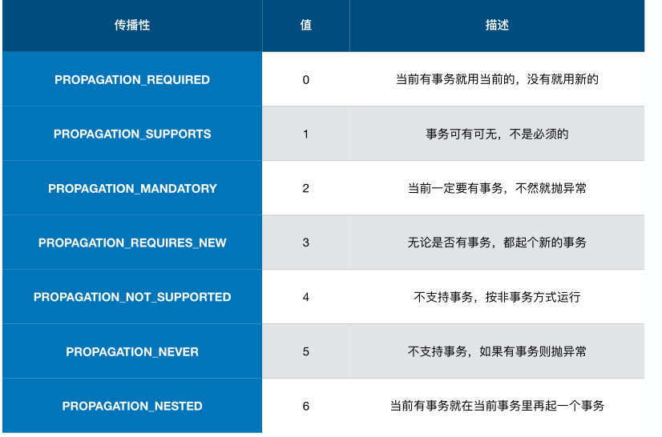
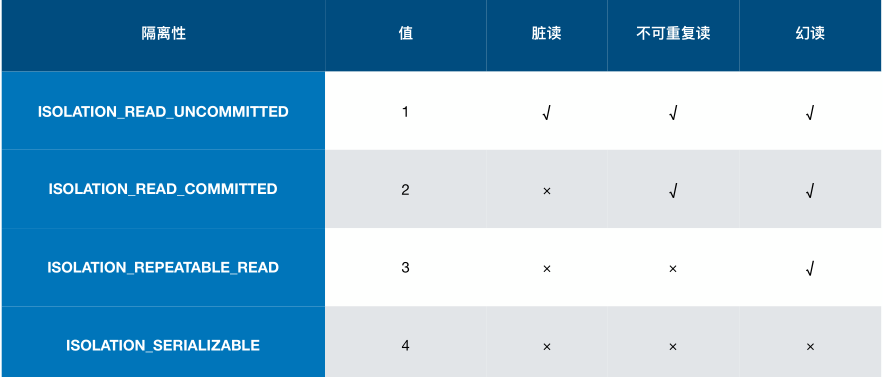
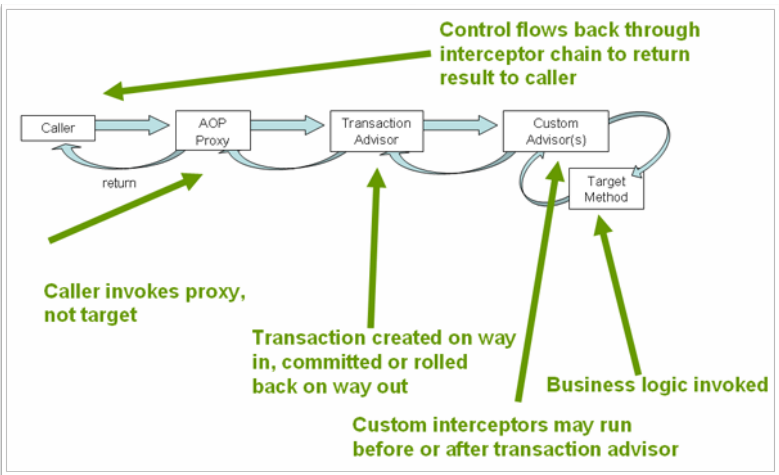

#                     Spring boot 和 JDBC

#### spring 注解方式 数据源的配置 

```java
@Configuration // 配置类
@EnableTransactionManagement // 注解驱动启动事务管理
public class DataSourceDemo {
    @Autowired
    private DataSource dataSource;

    public static void main(String[] args) throws SQLException {
        ApplicationContext applicationContext =
                new ClassPathXmlApplicationContext("applicationContext*.xml");
        showBeans(applicationContext);
        dataSourceDemo(applicationContext);
    }
//  h2 为内存数据库
    @Bean // 注入数据源 
    public DataSource dataSource() throws Exception {
        Properties properties = new Properties();
        properties.setProperty("driverClassName", "org.h2.Driver");
        properties.setProperty("url", "jdbc:h2:mem:testdb");
        properties.setProperty("username", "sa");
        return BasicDataSourceFactory.createDataSource(properties);
    }

    // 注入PlatformTransactionManager。
    @Bean
    public PlatformTransactionManager transactionManager() throws Exception {
        return new DataSourceTransactionManager(dataSource());
    }

}
```

`Spring Boot` 对jdbc做了哪些配置

`DataSourceAutoConfiguration`

- 配置 `ataSource`

`ataSourceTransactionManagerAutoConfiguration`

- 配置 `DataSourceTransactionManager`

`JdbcTemplateAutoConfiguration`

- 配置` JdbcTemplate`

符合条件时才进⾏行行配置

```properties
 #通用配置
 spring.datasource.url=jdbc:mysql://localhost/test
 spring.datasource.username=dbuser
 spring.datasource.password=dbpass
 spring.datasource.driver-class-name=com.mysql.jdbc.Driver（可选）
 #初始化内嵌数据库
 spring.datasource.initialization-mode=embedded|always|never
 spring.datasource.schema与spring.datasource.data确定初始化SQL⽂文件
 spring.datasource.platform=hsqldb | h2 | oracle | mysql | postgresql（与前者对应）
```

#### Spring Boot多数据源的配置

方式一： 可以通过 配置@Primary类型的Bean 加载指定数据源配置。

方式二：

```java
@SpringBootApplication(exclude = { DataSourceAutoConfiguration.class,
        DataSourceTransactionManagerAutoConfiguration.class,
        JdbcTemplateAutoConfiguration.class})  // 排除相关类
@Slf4j
public class MultiDataSourceDemoApplication {

    public static void main(String[] args) {
        SpringApplication.run(MultiDataSourceDemoApplication.class, args);
    }

    @Bean
    @ConfigurationProperties("foo.datasource")
    public DataSourceProperties fooDataSourceProperties() {
        return new DataSourceProperties();
    }

    @Bean
    public DataSource fooDataSource() {
        DataSourceProperties dataSourceProperties = fooDataSourceProperties();
        log.info("foo datasource: {}", dataSourceProperties.getUrl());
        return dataSourceProperties.initializeDataSourceBuilder().build(); // 理解为建造者模式
    }

    @Bean
    @Resource
    public PlatformTransactionManager fooTxManager(DataSource fooDataSource) {
        return new DataSourceTransactionManager(fooDataSource);
    }

    @Bean
    @ConfigurationProperties("bar.datasource")  //读取前缀 bar.datasource 内容到DataSourceProperties
    public DataSourceProperties barDataSourceProperties() {
        return new DataSourceProperties();
    }

    @Bean
    public DataSource barDataSource() {
        DataSourceProperties dataSourceProperties = barDataSourceProperties();
        log.info("bar datasource: {}", dataSourceProperties.getUrl());
        return dataSourceProperties.initializeDataSourceBuilder().build();
    }

    @Bean
    @Resource//  为什么要这个注解自动注入？ 要将 DataSource 实例注入 ？ 去掉也不报错。
    public PlatformTransactionManager barTxManager(DataSource barDataSource) {
        return new DataSourceTransactionManager(barDataSource);
    }
}
```


```properties
foo.datasource.url=jdbc:h2:mem:foo
foo.datasource.username=sa
foo.datasource.password=

bar.datasource.url=jdbc:h2:mem:bar
bar.datasource.username=sa
bar.datasource.password=
```

#### 那些好用的连接池（HikariCP、Druid）

- HikariCP

  HikariCP 为什什么快

  1. 字节码级别优化（很多⽅方法通过 JavaAssist ⽣生成）
  2. 大量小改进
     - 用 FastStatementList 代替 ArrayList
     - ⽆无锁集合 ConcurrentBag
     - 代理理类的优化（⽐比如，⽤用 invokestatic 代替了了 invokevirtual）

在springboot 中配置

```properties
spring.datasource.hikari.maximumPoolSize=10
spring.datasource.hikari.minimumIdle=10
spring.datasource.hikari.idleTimeout=600000
spring.datasource.hikari.connectionTimeout=30000
spring.datasource.hikari.maxLifetime=1800000
```

[官网参考]( https://github.com/brettwooldridge/HikariCP)

- Druid
  - 详细的监控（真的是全⾯面）
  - ExceptionSorter，针对主流数据库的返回码都有⽀支持
  - SQL 防注入
  - 内置加密配置
  - 众多扩展点，方便进行定制

参考配置

```properties
spring.datasource.url=jdbc:h2:mem:foo
spring.datasource.username=sa
spring.datasource.password=n/z7PyA5cvcXvs8px8FVmBVpaRyNsvJb3X7YfS38DJrIg25EbZaZGvH4aHcnc97Om0islpCAPc3MqsGvsrxVJw==

spring.datasource.druid.initial-size=5
spring.datasource.druid.max-active=5
spring.datasource.druid.min-idle=5
spring.datasource.druid.filters=conn,config,stat,slf4j

spring.datasource.druid.connection-properties=config.decrypt=true;config.decrypt.key=${public-key}
spring.datasource.druid.filter.config.enabled=true

spring.datasource.druid.test-on-borrow=true
spring.datasource.druid.test-on-return=true
spring.datasource.druid.test-while-idle=true

public-key=MFwwDQYJKoZIhvcNAQEBBQADSwAwSAJBALS8ng1XvgHrdOgm4pxrnUdt3sXtu/E8My9KzX8sXlz+mXRZQCop7NVQLne25pXHtZoDYuMh3bzoGj6v5HvvAQ8CAwEAAQ==

```

关于扩展点

- 可以继承 FilterEventAdapter 以便便⽅方便便地实现 Filter
- 修改 META-INF/druid-filter.properties 增加 Filter 配置

```java
@Slf4j
public class ConnectionLogFilter extends FilterEventAdapter {
    @Override
    public void connection_connectBefore(FilterChain chain, Properties info) {
        log.info("BEFORE CONNECTION!");
    }
    @Override
    public void connection_connectAfter(ConnectionProxy connection) {
        log.info("AFTER CONNECTION!");
    }
}
```

```properties
druid.filters.conn=geektime.spring.data.druiddemo.ConnectionLogFilter
```


#### 通过 Spring JDBC 访问数据库

- `SimpleJdbcInsert`
  - 可以获取插入数据自动生成的主键
- `JdbcTemplate`

代码示例

```java
    // 使用返回主键前需要配置
    @Bean
    @Autowired
    public SimpleJdbcInsert simpleJdbcInsert(JdbcTemplate jdbcTemplate) {
        return new SimpleJdbcInsert(jdbcTemplate)
                .withTableName("FOO").usingGeneratedKeyColumns("ID");
    }

public void insertData() {
        Arrays.asList("b", "c").forEach(bar -> {
            jdbcTemplate.update("INSERT INTO FOO (BAR) VALUES (?)", bar);
        });
        HashMap<String, String> row = new HashMap<>();
        row.put("BAR", "d");
        Number id = simpleJdbcInsert.executeAndReturnKey(row);// 返回主键
        log.info("ID of d: {}", id.longValue());
    }

    public void listData() {
        log.info("Count: {}",
                jdbcTemplate.queryForObject("SELECT COUNT(*) FROM FOO", Long.class));

        List<String> list = jdbcTemplate.queryForList("SELECT BAR FROM FOO", String.class);
        list.forEach(s -> log.info("Bar: {}", s));

        List<Foo> fooList = jdbcTemplate.query("SELECT * FROM FOO", new RowMapper<Foo>() {
            @Override// 自定义RowMapper
            public Foo mapRow(ResultSet rs, int rowNum) throws SQLException { 
                return Foo.builder()
                        .id(rs.getLong(1))
                        .bar(rs.getString(2))
                        .build();  // lombok 语法 pojo
            }
        });
        fooList.forEach(f -> log.info("Foo: {}", f));
    }
```


#### 了解 Spring 的抽象

- **事务抽象**

  事务抽象的核心接口

  `PlatformTransactionManager`

  - `DataSourceTransactionManager`
  - `HibernateTransactionManager`
  - `JtaTransactionManager`

   `TransactionDefinition`  该接口属性有 `Propagation` 、`Isolation` 、`Timeout` ...       

- **事务传播特性**



- **事务隔离特性**



- **编程式事务(springboot)**

  `TransactionTemplate`  关键接口

  - `TransactionCallback`
  - `TransactionCallbackWithoutResult`

- **声明式事务**

  

- **基于注解事务的配置方式**

  开启事务注解的两种方式

  - `@EnableTransactionManagement`
    - proxyTargetClass
    - mode
    - order
  - <tx:annotation-driven/>

  - `@Transactional `
    - `transactionManager`
    - `propagation`
    - `isolation`
    - `timeout`
    - `readOnly`

```java
@Component
public class FooServiceImpl implements FooService {
    @Autowired
    private JdbcTemplate jdbcTemplate;

    @Override
    @Transactional
    public void insertRecord() {
        jdbcTemplate.execute("INSERT INTO FOO (BAR) VALUES ('AAA')");
    }

    @Override
    @Transactional(rollbackFor = RollbackException.class)
    public void insertThenRollback() throws RollbackException {
        jdbcTemplate.execute("INSERT INTO FOO (BAR) VALUES ('BBB')");
        throw new RollbackException();
    }

    @Override // 这里不会触发事务（代理对象执行）可以说事务在aop增强中执行。
    public void invokeInsertThenRollback() throws RollbackException {
        insertThenRollback();
    }
}
```

- **JDBC 异常抽象**

   1. Spring 会将数据操作的异常都转换为 `DataAccessException`

   2. 通过 `SQLErrorCodeSQLExceptionTranslator `解析错误码

   3. ErrorCode 定义

      - `org/springframework/jdbc/support/sql-error-codes.xml`

      - Classpath 下的 sql-error-codes.xml (自定义会覆盖上面)

        ```xml
        <?xml version="1.0" encoding="UTF-8"?>
        <!DOCTYPE beans PUBLIC "-//SPRING//DTD BEAN 2.0//EN" "http://www.springframework.org/dtd/spring-beans-2.0.dtd">
        <beans>
            <bean id="H2" class="org.springframework.jdbc.support.SQLErrorCodes">
                <property name="badSqlGrammarCodes">
                    <value>42000,42001,42101,42102,42111,42112,42121,42122,42132</value>
                </property>
                <property name="duplicateKeyCodes">
                    <value>23001,23505</value>
                </property>
                <property name="dataIntegrityViolationCodes">
                    <value>22001,22003,22012,22018,22025,23000,23002,23003,23502,23503,23506,23507,23513</value>
                </property>
                <property name="dataAccessResourceFailureCodes">
                    <value>90046,90100,90117,90121,90126</value>
                </property>
                <property name="cannotAcquireLockCodes">
                    <value>50200</value>
                </property>
                <property name="customTranslations">
                    <bean class="org.springframework.jdbc.support.CustomSQLErrorCodesTranslation">
                        <property name="errorCodes" value="23001,23505" />
                        <property name="exceptionClass"
                                  value="geektime.spring.data.errorcodedemo.CustomDuplicatedKeyException" />
                    </bean>
                </property>
            </bean>
        
        </beans>
        
        ```

        

​     