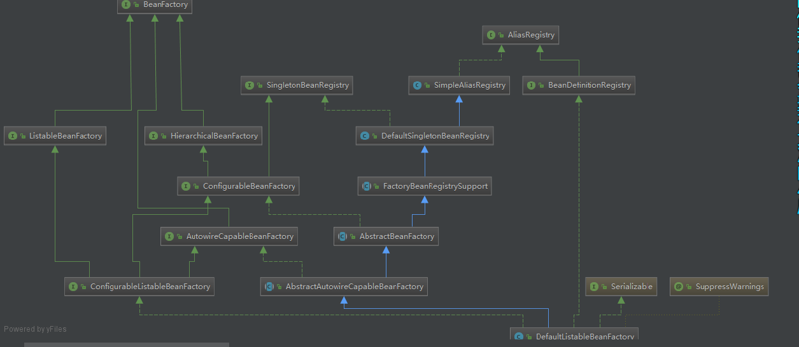
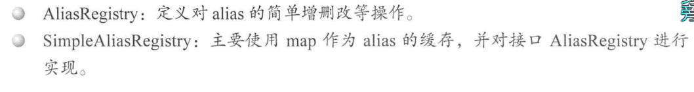
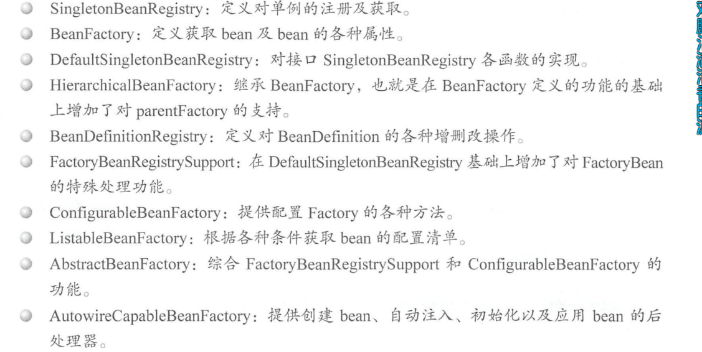
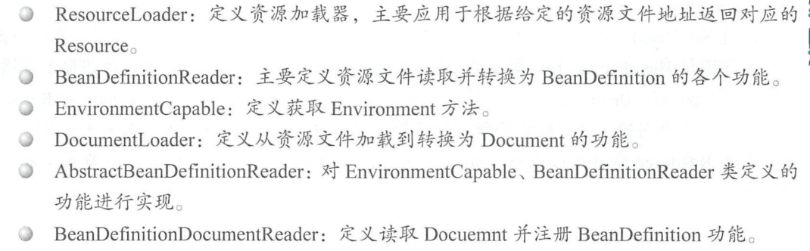
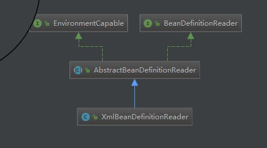

#                       Spring 两个核心类



### DefaultlistableBeanFactory  是加载 `bean`核心部分






### XmlBeanDefinitionReader 梳理对xml资源的读取，解析和注册






delegate -- **委托，委派**

-  当A中有属性B，那么当spring 获取A的bean时，如果属性B还没有被初始化，那么spring自动初始化B。这也是spring一个重要特性。

### XmlBeanFactory 加载容器为例  解析xml配置文件源码分析

**xml 具体解析由`BeanDefinitionParserDelegate`完成**

```java 
public XmlBeanFactory(Resource resource) throws BeansException {
		this(resource, null);
}

//  下一步

public XmlBeanFactory(Resource resource, BeanFactory parentBeanFactory) throws BeansException {
		super(parentBeanFactory);
		this.reader.loadBeanDefinitions(resource);
}
super(parentBeanFactory); ===》
public AbstractAutowireCapableBeanFactory() {
    super();
    // 忽视给定的接口自动装配功能
    ignoreDependencyInterface(BeanNameAware.class);
    ignoreDependencyInterface(BeanFactoryAware.class);
    ignoreDependencyInterface(BeanClassLoaderAware.class);
}

this.reader ==>private final XmlBeanDefinitionReader reader = new XmlBeanDefinitionReader(this);
// next 

@Override
public int loadBeanDefinitions(Resource resource) throws BeanDefinitionStoreException {
		return loadBeanDefinitions(new EncodedResource(resource));
}
// next 核心
```

```java
	//这里是载入XML形式Bean定义资源文件方法
	public int loadBeanDefinitions(EncodedResource encodedResource) throws BeanDefinitionStoreException {
		Assert.notNull(encodedResource, "EncodedResource must not be null");
		if (logger.isInfoEnabled()) {
			logger.info("Loading XML bean definitions from " + encodedResource.getResource());
		}

		Set<EncodedResource> currentResources = this.resourcesCurrentlyBeingLoaded.get();
		if (currentResources == null) {
			currentResources = new HashSet<>(4);
			this.resourcesCurrentlyBeingLoaded.set(currentResources);
		}
		if (!currentResources.add(encodedResource)) {
			throw new BeanDefinitionStoreException(
					"Detected cyclic loading of " + encodedResource + " - check your import definitions!");
		}
		try {
			//将资源文件转为InputStream的IO流
			InputStream inputStream = encodedResource.getResource().getInputStream();
			try {
				//从InputStream中得到XML的解析源
				InputSource inputSource = new InputSource(inputStream);
				if (encodedResource.getEncoding() != null) {
					inputSource.setEncoding(encodedResource.getEncoding());
				}
				//这里是具体的读取过程
				return doLoadBeanDefinitions(inputSource, encodedResource.getResource());
			}
			finally {
				//关闭从Resource中得到的IO流
				inputStream.close();
			}
		}
		catch (IOException ex) {
			throw new BeanDefinitionStoreException(
					"IOException parsing XML document from " + encodedResource.getResource(), ex);
		}
		finally {
			currentResources.remove(encodedResource);
			if (currentResources.isEmpty()) {
				this.resourcesCurrentlyBeingLoaded.remove();
			}
		}
	}
```

```java
//从特定XML文件中实际载入Bean定义资源的方法
	protected int doLoadBeanDefinitions(InputSource inputSource, Resource resource)
			throws BeanDefinitionStoreException {
		try {
			//将XML文件转换为DOM对象，解析过程由documentLoader实现
			Document doc = doLoadDocument(inputSource, resource);
			//这里是启动对Bean定义解析的详细过程，该解析过程会用到Spring的Bean配置规则
			return registerBeanDefinitions(doc, resource);
		}
		catch (BeanDefinitionStoreException ex) {
			throw ex;
		}
		catch (SAXParseException ex) {
			throw new XmlBeanDefinitionStoreException(resource.getDescription(),
					"Line " + ex.getLineNumber() + " in XML document from " + resource + " is invalid", ex);
		}
		catch (SAXException ex) {
			throw new XmlBeanDefinitionStoreException(resource.getDescription(),
					"XML document from " + resource + " is invalid", ex);
		}
		catch (ParserConfigurationException ex) {
			throw new BeanDefinitionStoreException(resource.getDescription(),
					"Parser configuration exception parsing XML from " + resource, ex);
		}
		catch (IOException ex) {
			throw new BeanDefinitionStoreException(resource.getDescription(),
					"IOException parsing XML document from " + resource, ex);
		}
		catch (Throwable ex) {
			throw new BeanDefinitionStoreException(resource.getDescription(),
					"Unexpected exception parsing XML document from " + resource, ex);
		}
	}
```

```java
//使用标准的JAXP将载入的Bean定义资源转换成document对象
	@Override
	public Document loadDocument(InputSource inputSource, EntityResolver entityResolver,
			ErrorHandler errorHandler, int validationMode, boolean namespaceAware) throws Exception {

		//创建文件解析器工厂
		DocumentBuilderFactory factory = createDocumentBuilderFactory(validationMode, namespaceAware);
		if (logger.isDebugEnabled()) {
			logger.debug("Using JAXP provider [" + factory.getClass().getName() + "]");
		}
		//创建文档解析器
		DocumentBuilder builder = createDocumentBuilder(factory, entityResolver, errorHandler);
		//解析Spring的Bean定义资源
		return builder.parse(inputSource);
	}
```

```java
//按照Spring的Bean语义要求将Bean定义资源解析并转换为容器内部数据结构
	public int registerBeanDefinitions(Document doc, Resource resource) throws BeanDefinitionStoreException {
		//得到BeanDefinitionDocumentReader来对xml格式的BeanDefinition解析
		BeanDefinitionDocumentReader documentReader = createBeanDefinitionDocumentReader();
		//获得容器中注册的Bean数量
		int countBefore = getRegistry().getBeanDefinitionCount();
		//解析过程入口，这里使用了委派模式，BeanDefinitionDocumentReader只是个接口,
		//具体的解析实现过程有实现类DefaultBeanDefinitionDocumentReader完成
		documentReader.registerBeanDefinitions(doc, createReaderContext(resource));
		//统计解析的Bean数量
		return getRegistry().getBeanDefinitionCount() - countBefore;
	}
```

```java
//根据Spring DTD对Bean的定义规则解析Bean定义Document对象
	@Override
	public void registerBeanDefinitions(Document doc, XmlReaderContext readerContext) {
		//获得XML描述符
		this.readerContext = readerContext;
		logger.debug("Loading bean definitions");
		//获得Document的根元素
		Element root = doc.getDocumentElement();
		doRegisterBeanDefinitions(root);
	}
```

```java
protected void doRegisterBeanDefinitions(Element root) {
		// Any nested <beans> elements will cause recursion in this method. In
		// order to propagate and preserve <beans> default-* attributes correctly,
		// keep track of the current (parent) delegate, which may be null. Create
		// the new (child) delegate with a reference to the parent for fallback purposes,
		// then ultimately reset this.delegate back to its original (parent) reference.
		// this behavior emulates a stack of delegates without actually necessitating one.

		//具体的解析过程由BeanDefinitionParserDelegate实现，
		//BeanDefinitionParserDelegate中定义了Spring Bean定义XML文件的各种元素
		BeanDefinitionParserDelegate parent = this.delegate;
		this.delegate = createDelegate(getReaderContext(), root, parent);

		if (this.delegate.isDefaultNamespace(root)) {
            // 处理profile文件
			String profileSpec = root.getAttribute(PROFILE_ATTRIBUTE);
			if (StringUtils.hasText(profileSpec)) {
				String[] specifiedProfiles = StringUtils.tokenizeToStringArray(
						profileSpec, BeanDefinitionParserDelegate.MULTI_VALUE_ATTRIBUTE_DELIMITERS);
				if (!getReaderContext().getEnvironment().acceptsProfiles(specifiedProfiles)) {
					if (logger.isInfoEnabled()) {
						logger.info("Skipped XML bean definition file due to specified profiles [" + profileSpec +
								"] not matching: " + getReaderContext().getResource());
					}
					return;
				}
			}
		}

		//在解析Bean定义之前，进行自定义的解析，增强解析过程的可扩展性，留给子类。
		preProcessXml(root);
		//从Document的根元素开始进行Bean定义的Document对象
		parseBeanDefinitions(root, this.delegate);
		//在解析Bean定义之后，进行自定义的解析，增加解析过程的可扩展性，留给子类。
		postProcessXml(root);

		this.delegate = parent;
	}


```

```java
//使用Spring的Bean规则从Document的根元素开始进行Bean定义的Document对象
// <bean id=”test” class =”testestBean”/>
	protected void parseBeanDefinitions(Element root, BeanDefinitionParserDelegate delegate) {
		//Bean定义的Document对象使用了Spring默认的XML命名空间
		if (delegate.isDefaultNamespace(root)) {
			//获取Bean定义的Document对象根元素的所有子节点
			NodeList nl = root.getChildNodes();
			for (int i = 0; i < nl.getLength(); i++) {
				Node node = nl.item(i);
				//获得Document节点是XML元素节点
				if (node instanceof Element) {
					Element ele = (Element) node;
					//Bean定义的Document的元素节点使用的是Spring默认的XML命名空间
					if (delegate.isDefaultNamespace(ele)) {
						//使用Spring的Bean规则解析元素节点
						parseDefaultElement(ele, delegate);
					}
					else {
						//没有使用Spring默认的XML命名空间，则使用用户自定义的解//析规则解析元素节点
						delegate.parseCustomElement(ele);
					}
				}
			}
		}
		else {
            // 自定义： <tx:annotation-driven/>
			//Document的根节点没有使用Spring默认的命名空间，则使用用户自定义的
			//解析规则解析Document根节点
			delegate.parseCustomElement(root);
		}
	}
```

```java
@Nullable
	public BeanDefinition parseCustomElement(Element ele, @Nullable BeanDefinition containingBd) {
		// 获取当前节点的namespaceUri 为解析特点标签做准备。
        // xmlns="http://www.springframework.org/schema/beans"
		String namespaceUri = getNamespaceURI(ele);
		if (namespaceUri == null) {
			return null;
		}
		NamespaceHandler handler = this.readerContext.getNamespaceHandlerResolver().resolve(namespaceUri);
		if (handler == null) {
			error("Unable to locate Spring NamespaceHandler for XML schema namespace [" + namespaceUri + "]", ele);
			return null;
		}
		 // 解析标签
		return handler.parse(ele, new ParserContext(this.readerContext, this, containingBd));
	}
```

```java
//使用Spring的Bean规则解析Document元素节点
	private void parseDefaultElement(Element ele, BeanDefinitionParserDelegate delegate) {
		//如果元素节点是<Import>导入元素，进行导入解析
		if (delegate.nodeNameEquals(ele, IMPORT_ELEMENT)) {
			importBeanDefinitionResource(ele);
		}
		//如果元素节点是<Alias>别名元素，进行别名解析
		else if (delegate.nodeNameEquals(ele, ALIAS_ELEMENT)) {
			processAliasRegistration(ele);
		}
		//元素节点既不是导入元素，也不是别名元素，即普通的<Bean>元素，
		//按照Spring的Bean规则解析元素
		else if (delegate.nodeNameEquals(ele, BEAN_ELEMENT)) {
			processBeanDefinition(ele, delegate);
		}
		else if (delegate.nodeNameEquals(ele, NESTED_BEANS_ELEMENT)) {
			// recurse
			doRegisterBeanDefinitions(ele);
		}
	}
```

```java
 //按照Spring的Bean规则解析元素

//解析Bean定义资源Document对象的普通元素
	protected void processBeanDefinition(Element ele, BeanDefinitionParserDelegate delegate) {
		BeanDefinitionHolder bdHolder = delegate.parseBeanDefinitionElement(ele);
		// BeanDefinitionHolder是对BeanDefinition的封装，即Bean定义的封装类
		//对Document对象中<Bean>元素的解析由BeanDefinitionParserDelegate实现
		// BeanDefinitionHolder bdHolder = delegate.parseBeanDefinitionElement(ele);
		if (bdHolder != null) {
			bdHolder = delegate.decorateBeanDefinitionIfRequired(ele, bdHolder);
			try {
				// Register the final decorated instance.
				//向Spring IOC容器注册解析得到的Bean定义，这是Bean定义向IOC容器注册的入口
				BeanDefinitionReaderUtils.registerBeanDefinition(bdHolder, getReaderContext().getRegistry());
			}
			catch (BeanDefinitionStoreException ex) {
				getReaderContext().error("Failed to register bean definition with name '" +
						bdHolder.getBeanName() + "'", ele, ex);
			}
			// Send registration event.
			//在完成向Spring IOC容器注册解析得到的Bean定义之后，发送注册事件
			getReaderContext().fireComponentRegistered(new BeanComponentDefinition(bdHolder));
		}
	}
```

```java
//解析Bean定义资源文件中的<Bean>元素，这个方法中主要处理<Bean>元素的id，name和别名属性
	@Nullable
	public BeanDefinitionHolder parseBeanDefinitionElement(Element ele, @Nullable BeanDefinition containingBean) {
		//获取<Bean>元素中的id属性值
		String id = ele.getAttribute(ID_ATTRIBUTE);
		//获取<Bean>元素中的name属性值
		String nameAttr = ele.getAttribute(NAME_ATTRIBUTE);

		//获取<Bean>元素中的alias属性值
		List<String> aliases = new ArrayList<>();

		//将<Bean>元素中的所有name属性值存放到别名中
		if (StringUtils.hasLength(nameAttr)) {
			String[] nameArr = StringUtils.tokenizeToStringArray(nameAttr, MULTI_VALUE_ATTRIBUTE_DELIMITERS);
			aliases.addAll(Arrays.asList(nameArr));
		}

		String beanName = id;
		//如果<Bean>元素中没有配置id属性时，将别名中的第一个值赋值给beanName
		if (!StringUtils.hasText(beanName) && !aliases.isEmpty()) {
			beanName = aliases.remove(0);
			if (logger.isDebugEnabled()) {
				logger.debug("No XML 'id' specified - using '" + beanName +
						"' as bean name and " + aliases + " as aliases");
			}
		}

		//检查<Bean>元素所配置的id或者name的唯一性，containingBean标识<Bean>
		//元素中是否包含子<Bean>元素
		if (containingBean == null) {
			//检查<Bean>元素所配置的id、name或者别名是否重复
			checkNameUniqueness(beanName, aliases, ele);
		}

		//详细对<Bean>元素中配置的Bean定义进行解析的地方
		AbstractBeanDefinition beanDefinition = parseBeanDefinitionElement(ele, beanName, containingBean);
		if (beanDefinition != null) {
			if (!StringUtils.hasText(beanName)) {
				try {
					if (containingBean != null) {
						//如果<Bean>元素中没有配置id、别名或者name，且没有包含子元素
						//<Bean>元素，为解析的Bean生成一个唯一beanName并注册
						beanName = BeanDefinitionReaderUtils.generateBeanName(
								beanDefinition, this.readerContext.getRegistry(), true);
					}
					else {
						//如果<Bean>元素中没有配置id、别名或者name，且包含了子元素
						//<Bean>元素，为解析的Bean使用别名向IOC容器注册
						beanName = this.readerContext.generateBeanName(beanDefinition);
						// Register an alias for the plain bean class name, if still possible,
						// if the generator returned the class name plus a suffix.
						// This is expected for Spring 1.2/2.0 backwards compatibility.
						//为解析的Bean使用别名注册时，为了向后兼容
						//Spring1.2/2.0，给别名添加类名后缀
						String beanClassName = beanDefinition.getBeanClassName();
						if (beanClassName != null &&
								beanName.startsWith(beanClassName) && beanName.length() > beanClassName.length() &&
								!this.readerContext.getRegistry().isBeanNameInUse(beanClassName)) {
							aliases.add(beanClassName);
						}
					}
					if (logger.isDebugEnabled()) {
						logger.debug("Neither XML 'id' nor 'name' specified - " +
								"using generated bean name [" + beanName + "]");
					}
				}
				catch (Exception ex) {
					error(ex.getMessage(), ele);
					return null;
				}
			}
			String[] aliasesArray = StringUtils.toStringArray(aliases);
			return new BeanDefinitionHolder(beanDefinition, beanName, aliasesArray);
		}
		//当解析出错时，返回null
		return null;
	}
```

```java
   //详细对<Bean>元素中配置的Bean定义其他属性进行解析
	//由于上面的方法中已经对Bean的id、name和别名等属性进行了处理
	//该方法中主要处理除这三个以外的其他属性数据
	@Nullable
	public AbstractBeanDefinition parseBeanDefinitionElement(
			Element ele, String beanName, @Nullable BeanDefinition containingBean) {
		//记录解析的<Bean>
		this.parseState.push(new BeanEntry(beanName));

		//这里只读取<Bean>元素中配置的class名字，然后载入到BeanDefinition中去
		//只是记录配置的class名字，不做实例化，对象的实例化在依赖注入时完成
		String className = null;

		//如果<Bean>元素中配置了parent属性，则获取parent属性的值
		if (ele.hasAttribute(CLASS_ATTRIBUTE)) {
			className = ele.getAttribute(CLASS_ATTRIBUTE).trim();
		}
		String parent = null;
		if (ele.hasAttribute(PARENT_ATTRIBUTE)) {
			parent = ele.getAttribute(PARENT_ATTRIBUTE);
		}

		try {
			//根据<Bean>元素配置的class名称和parent属性值创建BeanDefinition
			//为载入Bean定义信息做准备
			AbstractBeanDefinition bd = createBeanDefinition(className, parent);

			//对当前的<Bean>元素中配置的一些属性进行解析和设置，如配置的单态(singleton)属性等
			parseBeanDefinitionAttributes(ele, beanName, containingBean, bd);
			//为<Bean>元素解析的Bean设置description信息
			bd.setDescription(DomUtils.getChildElementValueByTagName(ele, DESCRIPTION_ELEMENT));

			//对<Bean>元素的meta(元信息)属性解析
			parseMetaElements(ele, bd);
			//对<Bean>元素的lookup-method属性解析
			parseLookupOverrideSubElements(ele, bd.getMethodOverrides());
			//对<Bean>元素的replaced-method属性解析
			parseReplacedMethodSubElements(ele, bd.getMethodOverrides());

			//解析<Bean>元素的构造方法设置
			parseConstructorArgElements(ele, bd);
			//解析<Bean>元素的<property>设置
			parsePropertyElements(ele, bd);
			//解析<Bean>元素的qualifier属性
			parseQualifierElements(ele, bd);

			//为当前解析的Bean设置所需的资源和依赖对象
			bd.setResource(this.readerContext.getResource());
			bd.setSource(extractSource(ele));

			return bd;
		}
		catch (ClassNotFoundException ex) {
			error("Bean class [" + className + "] not found", ele, ex);
		}
		catch (NoClassDefFoundError err) {
			error("Class that bean class [" + className + "] depends on not found", ele, err);
		}
		catch (Throwable ex) {
			error("Unexpected failure during bean definition parsing", ele, ex);
		}
		finally {
			this.parseState.pop();
		}

		//解析<Bean>元素出错时，返回null
		return null;
	}
```

```java
//创建 AbstractBeanDefinition
public static  AbstractBeanDefinition createBeanDefinition(
			@Nullable String parentName, @Nullable String className, @Nullable ClassLoader classLoader) throws ClassNotFoundException {

		GenericBeanDefinition bd = new GenericBeanDefinition();
        // parentName 可能为空
		bd.setParentName(parentName);      
		if (className != null) {
          //如果classLoader 不为空，通过传入的classLoader 一同JVM加载类对象否则只是记录className。 
			if (classLoader != null) {
				bd.setBeanClass(ClassUtils.forName(className, classLoader));
			}
			else {
				bd.setBeanClassName(className);
			}
		}
		return bd;
	}
```

```java
// 解析bean元素属性
public AbstractBeanDefinition parseBeanDefinitionAttributes(Element ele, String beanName,
			@Nullable BeanDefinition containingBean, AbstractBeanDefinition bd) {

		// 解析 singleton
		if (ele.hasAttribute(SINGLETON_ATTRIBUTE)) {
			error("Old 1.x 'singleton' attribute in use - upgrade to 'scope' declaration", ele);
		} // 解析 scope
		else if (ele.hasAttribute(SCOPE_ATTRIBUTE)) {
			bd.setScope(ele.getAttribute(SCOPE_ATTRIBUTE));
		}
		else if (containingBean != null) {
			// Take default from containing bean in case of an inner bean definition.
			// 在内部bean定义的情况下，从containingBean中取默认值。
			bd.setScope(containingBean.getScope());
		}

		//解析 abstract
		if (ele.hasAttribute(ABSTRACT_ATTRIBUTE)) {
			bd.setAbstract(TRUE_VALUE.equals(ele.getAttribute(ABSTRACT_ATTRIBUTE)));
		}

		// 解析lazy-init
		String lazyInit = ele.getAttribute(LAZY_INIT_ATTRIBUTE);
		if (DEFAULT_VALUE.equals(lazyInit)) {
			lazyInit = this.defaults.getLazyInit();
		}
		bd.setLazyInit(TRUE_VALUE.equals(lazyInit));

		//解析autowire
		String autowire = ele.getAttribute(AUTOWIRE_ATTRIBUTE);
		bd.setAutowireMode(getAutowireMode(autowire));

		// 解析depends-on属性
		if (ele.hasAttribute(DEPENDS_ON_ATTRIBUTE)) {
			String dependsOn = ele.getAttribute(DEPENDS_ON_ATTRIBUTE);
			bd.setDependsOn(StringUtils.tokenizeToStringArray(dependsOn, MULTI_VALUE_ATTRIBUTE_DELIMITERS));
		}

		// 解析utowire-candidate 属性
		String autowireCandidate = ele.getAttribute(AUTOWIRE_CANDIDATE_ATTRIBUTE);
		if ("".equals(autowireCandidate) || DEFAULT_VALUE.equals(autowireCandidate)) {
			String candidatePattern = this.defaults.getAutowireCandidates();
			if (candidatePattern != null) {
				String[] patterns = StringUtils.commaDelimitedListToStringArray(candidatePattern);
				bd.setAutowireCandidate(PatternMatchUtils.simpleMatch(patterns, beanName));
			}
		}
		else {
			bd.setAutowireCandidate(TRUE_VALUE.equals(autowireCandidate));
		}

		// 解析primary 属性
		if (ele.hasAttribute(PRIMARY_ATTRIBUTE)) {
			bd.setPrimary(TRUE_VALUE.equals(ele.getAttribute(PRIMARY_ATTRIBUTE)));
		}

		// 解析init-method 属性
		if (ele.hasAttribute(INIT_METHOD_ATTRIBUTE)) {
			String initMethodName = ele.getAttribute(INIT_METHOD_ATTRIBUTE);
			bd.setInitMethodName(initMethodName);
		}
		else if (this.defaults.getInitMethod() != null) {
			bd.setInitMethodName(this.defaults.getInitMethod());
			bd.setEnforceInitMethod(false);
		}

		// 解析 destroy-method 属性
		if (ele.hasAttribute(DESTROY_METHOD_ATTRIBUTE)) {
			String destroyMethodName = ele.getAttribute(DESTROY_METHOD_ATTRIBUTE);
			bd.setDestroyMethodName(destroyMethodName);
		}
		else if (this.defaults.getDestroyMethod() != null) {
			bd.setDestroyMethodName(this.defaults.getDestroyMethod());
			bd.setEnforceDestroyMethod(false);
		}
		// 解析 factory-method 属性
		if (ele.hasAttribute(FACTORY_METHOD_ATTRIBUTE)) {
			bd.setFactoryMethodName(ele.getAttribute(FACTORY_METHOD_ATTRIBUTE));
		}
		if (ele.hasAttribute(FACTORY_BEAN_ATTRIBUTE)) {
			bd.setFactoryBeanName(ele.getAttribute(FACTORY_BEAN_ATTRIBUTE));
		}

		return bd;
	}
```

```java
// <meta  key ="testStr"  value =" aaaaaaaa "/>
// 解析 meta 元素  <meta /> 在<bean> ... <bean/>
	public void parseMetaElements(Element ele, BeanMetadataAttributeAccessor attributeAccessor) {
		// 获取当前节点所有子元素
		NodeList nl = ele.getChildNodes();
		for (int i = 0; i < nl.getLength(); i++) {
			Node node = nl.item(i);
			// 提取meta
			if (isCandidateElement(node) && nodeNameEquals(node, META_ELEMENT)) {
				Element metaElement = (Element) node;
				String key = metaElement.getAttribute(KEY_ATTRIBUTE);
				String value = metaElement.getAttribute(VALUE_ATTRIBUTE);
				// 构造BeanMetadataAttribute对象
				BeanMetadataAttribute attribute = new BeanMetadataAttribute(key, value);
				attribute.setSource(extractSource(metaElement));
				// 记录信息
				attributeAccessor.addMetadataAttribute(attribute);
			}
		}
	}
```

```java
/**
	 * Parse lookup-override sub-elements of the given bean element.
	 * 解析给定bean元素的查找覆盖子元素。
	 */
	public void parseLookupOverrideSubElements(Element beanEle, MethodOverrides overrides) {
		NodeList nl = beanEle.getChildNodes();
		for (int i = 0; i < nl.getLength(); i++) {
			Node node = nl.item(i);
			// 仅当spring 默认bean 子元素下，且为<lookup-method 有效
			if (isCandidateElement(node) && nodeNameEquals(node, LOOKUP_METHOD_ELEMENT)) {
				Element ele = (Element) node;
				// 获取方法名字
				String methodName = ele.getAttribute(NAME_ATTRIBUTE);
				// 获取配置 的bean ref
				String beanRef = ele.getAttribute(BEAN_ELEMENT);
				LookupOverride override = new LookupOverride(methodName, beanRef);
				override.setSource(extractSource(ele));
				overrides.addOverride(override);
			}
		}
	}
```

```java
/**
	 * Parse replaced-method sub-elements of the given bean element.
	 */
	public void parseReplacedMethodSubElements(Element beanEle, MethodOverrides overrides) {
		NodeList nl = beanEle.getChildNodes();
		for (int i = 0; i < nl.getLength(); i++) {
			Node node = nl.item(i);
			// 仅当spring 默认bean 子元素下，且为<replaced-method 有效
			if (isCandidateElement(node) && nodeNameEquals(node, REPLACED_METHOD_ELEMENT)) {
				Element replacedMethodEle = (Element) node;
				// 提取要替换旧的方法
				String name = replacedMethodEle.getAttribute(NAME_ATTRIBUTE);
				//提取对应新的替换方法
				String callback = replacedMethodEle.getAttribute(REPLACER_ATTRIBUTE);
				ReplaceOverride replaceOverride = new ReplaceOverride(name, callback);
				// Look for arg-type match elements.
				List<Element> argTypeEles = DomUtils.getChildElementsByTagName(replacedMethodEle, ARG_TYPE_ELEMENT);
				for (Element argTypeEle : argTypeEles) {
					// 记录参数
					String match = argTypeEle.getAttribute(ARG_TYPE_MATCH_ATTRIBUTE);
					match = (StringUtils.hasText(match) ? match : DomUtils.getTextValue(argTypeEle));
					if (StringUtils.hasText(match)) {
						replaceOverride.addTypeIdentifier(match);
					}
				}
				replaceOverride.setSource(extractSource(replacedMethodEle));
				overrides.addOverride(replaceOverride);
			}
		}
	}
```

```java 
/**
	 * Parse constructor-arg sub-elements of the given bean element.
	 */
	public void parseConstructorArgElements(Element beanEle, BeanDefinition bd) {
		NodeList nl = beanEle.getChildNodes();
		for (int i = 0; i < nl.getLength(); i++) {
			Node node = nl.item(i);
			if (isCandidateElement(node) && nodeNameEquals(node, CONSTRUCTOR_ARG_ELEMENT)) {
				// 解析 constructor-arg
				parseConstructorArgElement((Element) node, bd);
			}
		}
	}
	
	/**
	 * Parse a constructor-arg element.
	 */
	public void parseConstructorArgElement(Element ele, BeanDefinition bd) {
		// 提取 index 属性
		String indexAttr = ele.getAttribute(INDEX_ATTRIBUTE);
		// 提取 type 属性
		String typeAttr = ele.getAttribute(TYPE_ATTRIBUTE);
		// 提取 name 属性
		String nameAttr = ele.getAttribute(NAME_ATTRIBUTE);
		if (StringUtils.hasLength(indexAttr)) {
			try {
				int index = Integer.parseInt(indexAttr);
				if (index < 0) {
					error("'index' cannot be lower than 0", ele);
				}
				else {
					try {
						this.parseState.push(new ConstructorArgumentEntry(index));
						// 解析ele 对应的属性元素 Property 属性
						Object value = parsePropertyValue(ele, bd, null);
						ConstructorArgumentValues.ValueHolder valueHolder = new ConstructorArgumentValues.ValueHolder(value);
						if (StringUtils.hasLength(typeAttr)) {
							valueHolder.setType(typeAttr);
						}
						if (StringUtils.hasLength(nameAttr)) {
							valueHolder.setName(nameAttr);
						}
						valueHolder.setSource(extractSource(ele));
						// 不允许重复指定相同参数
						if (bd.getConstructorArgumentValues().hasIndexedArgumentValue(index)) {
							error("Ambiguous constructor-arg entries for index " + index, ele);
						}
						else {
							bd.getConstructorArgumentValues().addIndexedArgumentValue(index, valueHolder);
						}
					}
					finally {
						this.parseState.pop();
					}
				}
			}
			catch (NumberFormatException ex) {
				error("Attribute 'index' of tag 'constructor-arg' must be an integer", ele);
			}
		}
		else {
			//没有index属性则忽略
			try {
				this.parseState.push(new ConstructorArgumentEntry());
				Object value = parsePropertyValue(ele, bd, null);
				ConstructorArgumentValues.ValueHolder valueHolder = new ConstructorArgumentValues.ValueHolder(value);
				if (StringUtils.hasLength(typeAttr)) {
					valueHolder.setType(typeAttr);
				}
				if (StringUtils.hasLength(nameAttr)) {
					valueHolder.setName(nameAttr);
				}
				valueHolder.setSource(extractSource(ele));
				bd.getConstructorArgumentValues().addGenericArgumentValue(valueHolder);
			}
			finally {
				this.parseState.pop();
			}
		}
	}


```

```java
//解析获取property值
	@Nullable
	public Object parsePropertyValue(Element ele, BeanDefinition bd, @Nullable String propertyName) {
		String elementName = (propertyName != null) ?
						"<property> element for property '" + propertyName + "'" :
						"<constructor-arg> element";

		// Should only have one child element: ref, value, list, etc.
		//获取<property>的所有子元素，只能是其中一种类型:ref,value,list,etc等
		NodeList nl = ele.getChildNodes();
		Element subElement = null;
		for (int i = 0; i < nl.getLength(); i++) {
			Node node = nl.item(i);
			//子元素不是description和meta属性
			if (node instanceof Element && !nodeNameEquals(node, DESCRIPTION_ELEMENT) &&
					!nodeNameEquals(node, META_ELEMENT)) {
				// Child element is what we're looking for.
				if (subElement != null) {
					error(elementName + " must not contain more than one sub-element", ele);
				}
				else {
					//当前<property>元素包含有子元素
					subElement = (Element) node;
				}
			}
		}

		//判断property的属性值是ref还是value，
		boolean hasRefAttribute = ele.hasAttribute(REF_ATTRIBUTE);
		boolean hasValueAttribute = ele.hasAttribute(VALUE_ATTRIBUTE);
		// 1. 不允许既是ref又是value
		// 2. 存在ref 或者value 属性且又有子元素
		// 上面两种不存在。
		if ((hasRefAttribute && hasValueAttribute) ||
				((hasRefAttribute || hasValueAttribute) && subElement != null)) {
			error(elementName +
					" is only allowed to contain either 'ref' attribute OR 'value' attribute OR sub-element", ele);
		}

		//如果属性是ref，创建一个ref的数据对象RuntimeBeanReference
		//这个对象封装了ref信息
		if (hasRefAttribute) {
			String refName = ele.getAttribute(REF_ATTRIBUTE);
			if (!StringUtils.hasText(refName)) {
				error(elementName + " contains empty 'ref' attribute", ele);
			}
			//一个指向运行时所依赖对象的引用
			RuntimeBeanReference ref = new RuntimeBeanReference(refName);
			//设置这个ref的数据对象是被当前的property对象所引用
			ref.setSource(extractSource(ele));
			return ref;
		}
		//如果属性是value，创建一个value的数据对象TypedStringValue
		//这个对象封装了value信息
		else if (hasValueAttribute) {
			//一个持有String类型值的对象
			TypedStringValue valueHolder = new TypedStringValue(ele.getAttribute(VALUE_ATTRIBUTE));
			//设置这个value数据对象是被当前的property对象所引用
			valueHolder.setSource(extractSource(ele));
			return valueHolder;
		}
		//如果当前<property>元素还有子元素
		else if (subElement != null) {
			//解析<property>的子元素
			return parsePropertySubElement(subElement, bd);
		}
		else {
			// Neither child element nor "ref" or "value" attribute found.
			//propery属性中既不是ref，也不是value属性，解析出错返回null
			error(elementName + " must specify a ref or value", ele);
			return null;
		}
	}
```

```java
//解析<property>元素中ref,value或者集合等子元素
	@Nullable
	public Object parsePropertySubElement(Element ele, @Nullable BeanDefinition bd, @Nullable String defaultValueType) {
		//如果<property>没有使用Spring默认的命名空间，则使用用户自定义的规则解析内嵌元素
		if (!isDefaultNamespace(ele)) {
			return parseNestedCustomElement(ele, bd);
		}
		//如果子元素是bean，则使用解析<Bean>元素的方法解析
		else if (nodeNameEquals(ele, BEAN_ELEMENT)) {
			BeanDefinitionHolder nestedBd = parseBeanDefinitionElement(ele, bd);
			if (nestedBd != null) {
				nestedBd = decorateBeanDefinitionIfRequired(ele, nestedBd, bd);
			}
			return nestedBd;
		}
		//如果子元素是ref，ref中只能有以下3个属性：bean、local、parent
		else if (nodeNameEquals(ele, REF_ELEMENT)) {
			// A generic reference to any name of any bean.
			//可以不再同一个Spring配置文件中，具体请参考Spring对ref的配置规则
			String refName = ele.getAttribute(BEAN_REF_ATTRIBUTE);
			boolean toParent = false;
			if (!StringUtils.hasLength(refName)) {
				// A reference to the id of another bean in a parent context.
				//获取<property>元素中parent属性值，引用父级容器中的Bean
				refName = ele.getAttribute(PARENT_REF_ATTRIBUTE);
				toParent = true;
				if (!StringUtils.hasLength(refName)) {
					error("'bean' or 'parent' is required for <ref> element", ele);
					return null;
				}
			}
			if (!StringUtils.hasText(refName)) {
				error("<ref> element contains empty target attribute", ele);
				return null;
			}
			//创建ref类型数据，指向被引用的对象
			RuntimeBeanReference ref = new RuntimeBeanReference(refName, toParent);
			//设置引用类型值是被当前子元素所引用
			ref.setSource(extractSource(ele));
			return ref;
		}
		//如果子元素是<idref>，使用解析ref元素的方法解析
		else if (nodeNameEquals(ele, IDREF_ELEMENT)) {
			return parseIdRefElement(ele);
		}
		//如果子元素是<value>，使用解析value元素的方法解析
		else if (nodeNameEquals(ele, VALUE_ELEMENT)) {
			return parseValueElement(ele, defaultValueType);
		}
		//如果子元素是null，为<property>设置一个封装null值的字符串数据
		else if (nodeNameEquals(ele, NULL_ELEMENT)) {
			// It's a distinguished null value. Let's wrap it in a TypedStringValue
			// object in order to preserve the source location.
			TypedStringValue nullHolder = new TypedStringValue(null);
			nullHolder.setSource(extractSource(ele));
			return nullHolder;
		}
		//如果子元素是<array>，使用解析array集合子元素的方法解析
		else if (nodeNameEquals(ele, ARRAY_ELEMENT)) {
			return parseArrayElement(ele, bd);
		}
		//如果子元素是<list>，使用解析list集合子元素的方法解析
		else if (nodeNameEquals(ele, LIST_ELEMENT)) {
			return parseListElement(ele, bd);
		}
		//如果子元素是<set>，使用解析set集合子元素的方法解析
		else if (nodeNameEquals(ele, SET_ELEMENT)) {
			return parseSetElement(ele, bd);
		}
		//如果子元素是<map>，使用解析map集合子元素的方法解析
		else if (nodeNameEquals(ele, MAP_ELEMENT)) {
			return parseMapElement(ele, bd);
		}
		//如果子元素是<props>，使用解析props集合子元素的方法解析
		else if (nodeNameEquals(ele, PROPS_ELEMENT)) {
			return parsePropsElement(ele);
		}
		//既不是ref，又不是value，也不是集合，则子元素配置错误，返回null
		else {
			error("Unknown property sub-element: [" + ele.getNodeName() + "]", ele);
			return null;
		}
	}
```

```java
//解析<Bean>元素中的<property>子元素
	public void parsePropertyElements(Element beanEle, BeanDefinition bd) {
		//获取<Bean>元素中所有的子元素
		NodeList nl = beanEle.getChildNodes();
		for (int i = 0; i < nl.getLength(); i++) {
			Node node = nl.item(i);
			//如果子元素是<property>子元素，则调用解析<property>子元素方法解析
			if (isCandidateElement(node) && nodeNameEquals(node, PROPERTY_ELEMENT)) {
				parsePropertyElement((Element) node, bd);
			}
		}
	}

  //解析<property>元素
	public void parsePropertyElement(Element ele, BeanDefinition bd) {
		//获取<property>元素的名字
		String propertyName = ele.getAttribute(NAME_ATTRIBUTE);
		if (!StringUtils.hasLength(propertyName)) {
			error("Tag 'property' must have a 'name' attribute", ele);
			return;
		}
		this.parseState.push(new PropertyEntry(propertyName));
		try {
			//如果一个Bean中已经有同名的property存在，则不进行解析，直接返回。
			//即如果在同一个Bean中配置同名的property，则只有第一个起作用
			if (bd.getPropertyValues().contains(propertyName)) {
				error("Multiple 'property' definitions for property '" + propertyName + "'", ele);
				return;
			}
			//解析获取property的值
			Object val = parsePropertyValue(ele, bd, propertyName);
			//根据property的名字和值创建property实例
			PropertyValue pv = new PropertyValue(propertyName, val);
			//解析<property>元素中的属性
			parseMetaElements(ele, pv);
			pv.setSource(extractSource(ele));
			bd.getPropertyValues().addPropertyValue(pv);
		}
		finally {
			this.parseState.pop();
		}
	}
```

bean 属性解析基本完事 .....

```java
// containingBd 父类的 bean definition 源码分析是为了获取父类的scope 以备子类没有scope没有属性时
//设置父类的属性。 如果是顶层配置，传递是null
public BeanDefinitionHolder decorateBeanDefinitionIfRequired(Element ele, BeanDefinitionHolder definitionHolder) {
		return decorateBeanDefinitionIfRequired(ele, definitionHolder, null);
}


	public BeanDefinitionHolder decorateBeanDefinitionIfRequired(
			Element ele, BeanDefinitionHolder definitionHolder, @Nullable BeanDefinition containingBd) {

		BeanDefinitionHolder finalDefinition = definitionHolder;

		// Decorate based on custom attributes first.
		NamedNodeMap attributes = ele.getAttributes();
		// 遍历属性 看是否有适用于装饰的属性
		for (int i = 0; i < attributes.getLength(); i++) {
			Node node = attributes.item(i);
			finalDefinition = decorateIfRequired(node, finalDefinition, containingBd);
		}

		// Decorate based on custom nested elements.
		NodeList children = ele.getChildNodes();
		// 遍历子节点 ，看是否有适用于装饰的子节点
		for (int i = 0; i < children.getLength(); i++) {
			Node node = children.item(i);
			if (node.getNodeType() == Node.ELEMENT_NODE) {
				finalDefinition = decorateIfRequired(node, finalDefinition, containingBd);
			}
		}
		return finalDefinition;
}

// 看是否有适用于装饰的
public BeanDefinitionHolder decorateIfRequired(
			Node node, BeanDefinitionHolder originalDef, @Nullable BeanDefinition containingBd) {

		// 获取自定义标签的命名空间
		String namespaceUri = getNamespaceURI(node);
		// 对非默认的标签进行修饰
		if (namespaceUri != null && !isDefaultNamespace(namespaceUri)) {
			// 根据命名空间找到对应的处理器。 TODO  handler resolve 解析
			NamespaceHandler handler = this.readerContext.getNamespaceHandlerResolver().resolve(namespaceUri);
			if (handler != null) {
				BeanDefinitionHolder decorated =
						handler.decorate(node, originalDef, new ParserContext(this.readerContext, this, containingBd));
				if (decorated != null) {
					return decorated;
				}
			}
			else if (namespaceUri.startsWith("http://www.springframework.org/")) {
				error("Unable to locate Spring NamespaceHandler for XML schema namespace [" + namespaceUri + "]", node);
			}
			else {
				// A custom namespace, not to be handled by Spring - maybe "xml:...".
				if (logger.isDebugEnabled()) {
					logger.debug("No Spring NamespaceHandler found for XML schema namespace [" + namespaceUri + "]");
				}
			}
		}
		return originalDef;
	}
```

BeanDefinition 注册

```java
//将解析的BeanDefinitionHold注册到容器中
	public static void registerBeanDefinition(
			BeanDefinitionHolder definitionHolder, BeanDefinitionRegistry registry)
			throws BeanDefinitionStoreException {

		// Register bean definition under primary name.
		//获取解析的BeanDefinition的名称
		String beanName = definitionHolder.getBeanName();
		//向IOC容器注册BeanDefinition
		registry.registerBeanDefinition(beanName, definitionHolder.getBeanDefinition());

		// Register aliases for bean name, if any.
		//如果解析的BeanDefinition有别名，向容器为其注册别名
		String[] aliases = definitionHolder.getAliases();
		if (aliases != null) {
			for (String alias : aliases) {
				registry.registerAlias(beanName, alias);
			}
		}
	}
```

```java
//向IOC容器注册解析的BeanDefiniton
	@Override
	public void registerBeanDefinition(String beanName, BeanDefinition beanDefinition)
			throws BeanDefinitionStoreException {

		Assert.hasText(beanName, "Bean name must not be empty");
		Assert.notNull(beanDefinition, "BeanDefinition must not be null");

		//校验解析的BeanDefiniton
		if (beanDefinition instanceof AbstractBeanDefinition) {
			try {
				//注册beanDefinition最后一次验证，对AbstractBeanDefinition 的methodOverrides 是否与工厂方法并存或者
				// methodOverrides 对应的方法不存在、
				((AbstractBeanDefinition) beanDefinition).validate();
			}
			catch (BeanDefinitionValidationException ex) {
				throw new BeanDefinitionStoreException(beanDefinition.getResourceDescription(), beanName,
						"Validation of bean definition failed", ex);
			}
		}

		BeanDefinition oldBeanDefinition;

		oldBeanDefinition = this.beanDefinitionMap.get(beanName);

		if (oldBeanDefinition != null) {
			//allowBeanDefinitionOverriding 允许覆盖--》 默认是true。
			if (!isAllowBeanDefinitionOverriding()) {
				throw new BeanDefinitionStoreException(beanDefinition.getResourceDescription(), beanName,
						"Cannot register bean definition [" + beanDefinition + "] for bean '" + beanName +
						"': There is already [" + oldBeanDefinition + "] bound.");
			}
			else if (oldBeanDefinition.getRole() < beanDefinition.getRole()) {
				// e.g. was ROLE_APPLICATION, now overriding with ROLE_SUPPORT or ROLE_INFRASTRUCTURE
				if (this.logger.isWarnEnabled()) {
					this.logger.warn("Overriding user-defined bean definition for bean '" + beanName +
							"' with a framework-generated bean definition: replacing [" +
							oldBeanDefinition + "] with [" + beanDefinition + "]");
				}
			}
			else if (!beanDefinition.equals(oldBeanDefinition)) {
				if (this.logger.isInfoEnabled()) {
					this.logger.info("Overriding bean definition for bean '" + beanName +
							"' with a different definition: replacing [" + oldBeanDefinition +
							"] with [" + beanDefinition + "]");
				}
			}
			else {
				if (this.logger.isDebugEnabled()) {
					this.logger.debug("Overriding bean definition for bean '" + beanName +
							"' with an equivalent definition: replacing [" + oldBeanDefinition +
							"] with [" + beanDefinition + "]");
				}
			}
			this.beanDefinitionMap.put(beanName, beanDefinition);
		}
		else {
			// 已经创建至少一次的bean的状态
			if (hasBeanCreationStarted()) {
				// Cannot modify startup-time collection elements anymore (for stable iteration)
				//注册的过程中需要线程同步，以保证数据的一致性
				synchronized (this.beanDefinitionMap) {
					this.beanDefinitionMap.put(beanName, beanDefinition);
					List<String> updatedDefinitions = new ArrayList<>(this.beanDefinitionNames.size() + 1);
					updatedDefinitions.addAll(this.beanDefinitionNames);
					updatedDefinitions.add(beanName);
					this.beanDefinitionNames = updatedDefinitions;
					if (this.manualSingletonNames.contains(beanName)) {
						Set<String> updatedSingletons = new LinkedHashSet<>(this.manualSingletonNames);
						updatedSingletons.remove(beanName);
						this.manualSingletonNames = updatedSingletons;
					}
				}
			}
			else {
				// Still in startup registration phase 仍在启动注册阶段
				this.beanDefinitionMap.put(beanName, beanDefinition);
				this.beanDefinitionNames.add(beanName);
				this.manualSingletonNames.remove(beanName);
			}
			this.frozenBeanDefinitionNames = null;
		}

		//检查是否有同名的BeanDefinition已经在IOC容器中注册
		if (oldBeanDefinition != null || containsSingleton(beanName)) {
			//重置所有已经注册过的BeanDefinition的缓存
			resetBeanDefinition(beanName);
		}
	}
```

```java
protected void processBeanDefinition(Element ele, BeanDefinitionParserDelegate delegate) {
    ...
//在完成向Spring IOC容器注册解析得到的Bean定义之后，发送注册事件
 getReaderContext().fireComponentRegistered(new BeanComponentDefinition(bdHolder));
    ...
}
```

如果元素节点是<Alias>别名元素，进行别名解析

```java
//解析<Alias>别名元素，为Bean向Spring IoC容器注册别名
	protected void processAliasRegistration(Element ele) {
		//获取<Alias>别名元素中name的属性值
		String name = ele.getAttribute(NAME_ATTRIBUTE);
		//获取<Alias>别名元素中alias的属性值
		String alias = ele.getAttribute(ALIAS_ATTRIBUTE);
		boolean valid = true;
		//<alias>别名元素的name属性值为空
		if (!StringUtils.hasText(name)) {
			getReaderContext().error("Name must not be empty", ele);
			valid = false;
		}
		//<alias>别名元素的alias属性值为空
		if (!StringUtils.hasText(alias)) {
			getReaderContext().error("Alias must not be empty", ele);
			valid = false;
		}
		if (valid) {
			try {
				//向容器的资源读入器注册别名
				getReaderContext().getRegistry().registerAlias(name, alias);
			}
			catch (Exception ex) {
				getReaderContext().error("Failed to register alias '" + alias +
						"' for bean with name '" + name + "'", ele, ex);
			}
			//在解析完<Alias>元素之后，发送容器别名处理完成事件
			getReaderContext().fireAliasRegistered(name, alias, extractSource(ele));
		}
	}
```

如果元素节点是<Import>导入元素，进行导入解析

```java
//解析<Import>导入元素，从给定的导入路径加载Bean定义资源到Spring IoC容器中
	protected void importBeanDefinitionResource(Element ele) {
		//获取给定的导入元素的location属性
		String location = ele.getAttribute(RESOURCE_ATTRIBUTE);
		//如果导入元素的location属性值为空，则没有导入任何资源，直接返回
		if (!StringUtils.hasText(location)) {
			getReaderContext().error("Resource location must not be empty", ele);
			return;
		}

		// Resolve system properties: e.g. "${user.dir}"
		//使用系统变量值解析location属性值
		location = getReaderContext().getEnvironment().resolveRequiredPlaceholders(location);

		Set<Resource> actualResources = new LinkedHashSet<>(4);

		// Discover whether the location is an absolute or relative URI
		//标识给定的导入元素的location是否是绝对路径
		boolean absoluteLocation = false;
		try {
			absoluteLocation = ResourcePatternUtils.isUrl(location) || ResourceUtils.toURI(location).isAbsolute();
		}
		catch (URISyntaxException ex) {
			// cannot convert to an URI, considering the location relative
			// unless it is the well-known Spring prefix "classpath*:"
			//给定的导入元素的location不是绝对路径
		}

		// Absolute or relative?
		//给定的导入元素的location是绝对路径
		if (absoluteLocation) {
			try {
				//使用资源读入器加载给定路径的Bean定义资源
				int importCount = getReaderContext().getReader().loadBeanDefinitions(location, actualResources);
				if (logger.isDebugEnabled()) {
					logger.debug("Imported " + importCount + " bean definitions from URL location [" + location + "]");
				}
			}
			catch (BeanDefinitionStoreException ex) {
				getReaderContext().error(
						"Failed to import bean definitions from URL location [" + location + "]", ele, ex);
			}
		}
		else {
			// No URL -> considering resource location as relative to the current file.
			//给定的导入元素的location是相对路径
			try {
				int importCount;
				//将给定导入元素的location封装为相对路径资源 每个resource 实现类 的createRelative不同，
				// 尝试用子类的方式解析。
				Resource relativeResource = getReaderContext().getResource().createRelative(location);
				//封装的相对路径资源存在
				if (relativeResource.exists()) {
					//使用资源读入器加载Bean定义资源
					importCount = getReaderContext().getReader().loadBeanDefinitions(relativeResource);
					actualResources.add(relativeResource);
				}
				//封装的相对路径资源不存在
				else {
					//获取Spring IOC容器资源读入器的基本路径
					String baseLocation = getReaderContext().getResource().getURL().toString();
					//根据Spring IOC容器资源读入器的基本路径加载给定导入路径的资源
					importCount = getReaderContext().getReader().loadBeanDefinitions(
							StringUtils.applyRelativePath(baseLocation, location), actualResources);
				}
				if (logger.isDebugEnabled()) {
					logger.debug("Imported " + importCount + " bean definitions from relative location [" + location + "]");
				}
			}
			catch (IOException ex) {
				getReaderContext().error("Failed to resolve current resource location", ele, ex);
			}
			catch (BeanDefinitionStoreException ex) {
				getReaderContext().error("Failed to import bean definitions from relative location [" + location + "]",
						ele, ex);
			}
		}
		Resource[] actResArray = actualResources.toArray(new Resource[actualResources.size()]);
		//在解析完<Import>元素之后，发送容器导入其他资源处理完成事件
		getReaderContext().fireImportProcessed(location, actResArray, extractSource(ele));
	}
```


- EntityResolver 接口---》 如果SAX应用程序叙事实现自定义处理外部实体,则必须实现此接口,并使用setEntityResolver方法向SAX 驱动器注册一个实例.

```java
public interface EntityResolver {

    /**
     * Allow the application to resolve external entities.
     *
     * <p>The parser will call this method before opening any external
     * entity except the top-level document entity.  Such entities include
     * the external DTD subset and external parameter entities referenced
     * within the DTD (in either case, only if the parser reads external
     * parameter entities), and external general entities referenced
     * within the document element (if the parser reads external general
     * entities).  The application may request that the parser locate
     * the entity itself, that it use an alternative URI, or that it
     * use data provided by the application (as a character or byte
     * input stream).</p>
     *
     * <p>Application writers can use this method to redirect external
     * system identifiers to secure and/or local URIs, to look up
     * public identifiers in a catalogue, or to read an entity from a
     * database or other input source (including, for example, a dialog
     * box).  Neither XML nor SAX specifies a preferred policy for using
     * public or system IDs to resolve resources.  However, SAX specifies
     * how to interpret any InputSource returned by this method, and that
     * if none is returned, then the system ID will be dereferenced as
     * a URL.  </p>
     *
     * <p>If the system identifier is a URL, the SAX parser must
     * resolve it fully before reporting it to the application.</p>
     *
     * @param publicId The public identifier of the external entity
     *        being referenced, or null if none was supplied.
     * @param systemId The system identifier of the external entity
     *        being referenced.
     * @return An InputSource object describing the new input source,
     *         or null to request that the parser open a regular
     *         URI connection to the system identifier.
     * @exception org.xml.sax.SAXException Any SAX exception, possibly
     *            wrapping another exception.
     * @exception java.io.IOException A Java-specific IO exception,
     *            possibly the result of creating a new InputStream
     *            or Reader for the InputSource.
     * @see org.xml.sax.InputSource
     */
    public abstract InputSource resolveEntity (String publicId,
                                               String systemId)
        throws SAXException, IOException;

}
```

- `DelegatingEntityResolver` 对`EntityResolver`的实现 

```java
/** Suffix for DTD files */
public static final String DTD_SUFFIX = ".dtd";

/** Suffix for schema definition files */
public static final String XSD_SUFFIX = ".xsd";

public InputSource resolveEntity(String publicId, @Nullable String systemId) throws SAXException, IOException {
		if (systemId != null) {
             // 解析DTD
			if (systemId.endsWith(DTD_SUFFIX)) {
				return this.dtdResolver.resolveEntity(publicId, systemId);
			}
			else if (systemId.endsWith(XSD_SUFFIX)) {
                 // 调用 META-INF/Spring.schemas 解析
				return this.schemaResolver.resolveEntity(publicId, systemId);
			}
		}
		return null;
	}
```

