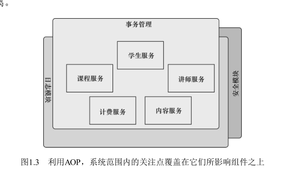
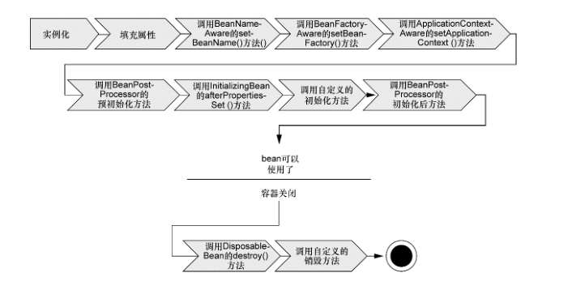
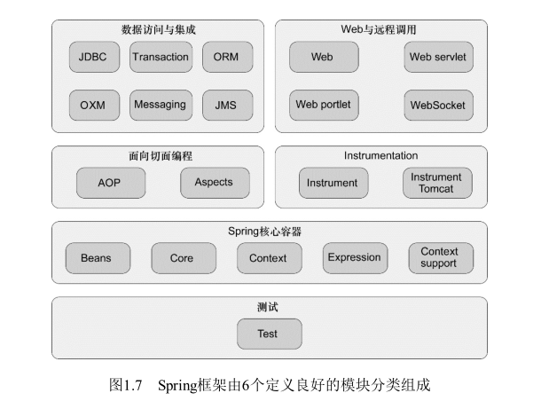

#  				Spring 实战 笔记

## spring 核心理念

### 激发POJO的潜能

在基于Spring构建的应用中，它的类通常没有任何痕迹表明你使用了Spring。最坏的场景是，一个类或许会使用Spring注解，但它依旧是POJO。

- 好处：基于POJO的轻量级和最小侵入性编程；

### 依赖注入

- DI

  构造器注入，构造器传递一个抽象接口参数，可以注入多种实现该接口的类。

- 如何装配对象

  Spring通过应用上下文（Application Context）装载bean的定义并把它们组装起来。Spring应用上下文全权负责对象的创建和组装。Spring自带了多种应用上下文的实现，它们之间主要的区别仅仅在于如何加载配置。    

  - 基于xml
  - 基于注解
  - 基于java配置

- 实现  --》  反射技术
- 好处：通过依赖注入和面向接口实现松耦合。

### 面向切面编程

面向切面编程（aspect-oriented programming，AOP）允许你把遍布应用各处的功能分离出来形成可重用的组件。

> 面向切面编程往往被定义为促使软件系统实现关注点的**分离**一项技术。**系统由许多不同的组件组成，每一个组件各负责一块特定功能。**除了实现自身核心的功能之外，这些组件还经常承担着额外的职责。诸如日志、事务管理和安全这样的系统服务经常融入到自身具有核心业务逻辑的组件中去，这些系统服务通常被称为**横切关注点**，因为它们会跨越系统的多个组件。
>
> 如果将这些关注点分散到多个组件中去，你的代码将会带来双重的复杂性。
>
> - 实现系统关注点功能的代码将会重复出现在多个组件中。这意味着如果你要改变这些关注点的逻辑，必须修改各个模块中的相关实现。即使你把这些关注点抽象为一个独立的模块，其他模块只是调用它的方法，但方法的调用还是会重复出现在各个模块中。
> - 组件会因为那些与自身核心业务无关的代码而变得混乱。一个向地址簿增加地址条目的方法应该只关注如何添加地址，而不应该关注它是不是安全的或者是否需要支持事务。

**总结：**

`AOP`能够使这些服务模块化，并以声明的方式将它们应用到它们需要影响的组件中去。所造成的结果就是这些组件会具有更高的内聚性并且会更加关注自身的业务，完全不需要了解涉及系统服务所带来复杂性。总之，AOP能够确保`POJO`的简单性。

aop  理解方式

- 如果把传统核心逻辑编程理解为纵向执行，所有逻辑竖线走向，那么AOP则是以一种横切的方式织入到纵向逻辑中
- 我们可以把切面想象为覆盖在很多组件之上的一个外壳。借助AOP，可以使用各种功能层去包裹核心业务层。

- 好处： 你的核心应用甚至根本不知道它们的存在。这是一个非常强大的理念，可以将安全、事务和日志关注点与核心业务逻辑相分离。

- 实现 --》代理模式

### 使用模板消除样板式代码

JDBC不是产生样板式代码的唯一场景。在许多编程场景中往往都会导致类似的样板式代码，JMS、JNDI和使用REST服务通常也涉及大量的重复代码。

Spring旨在通过模板封装来消除样板式代码。Spring的JdbcTemplate使得执行数据库操作时，避免传统的JDBC样板代码成为了可能。

- 实现 -- 》 `JdbcTemplate` 实现等。

- 好处：减少样板式代码。

## 容器

在基于Spring的应用中，你的应用对象生存于Spring容器（container）中。Spring容器负责创建对象，装配它们，配置它们并管理它们的整个生命周期，从生存到死亡（在这里，可能就是new到finalize()）。

**容器是Spring框架的核心**。Spring容器使用DI管理构成应用的组件，它会创建相互协作的组件之间的关联。毫无疑问，这些对象更简单干净，更易于理解，更易于重用并且更易于进行单元测试。

Spring容器并不是只有一个。Spring自带了多个容器实现，可以归为两种不同的类型。

- bean工厂（由`org.springframework. beans.factory.eanFactory`接口定义）是最简单的容器，提供基本的DI支持。
- 应用上下文（由`org.springframework.context.ApplicationContext`接口定义）基于`BeanFactory`构建，并提供应用框架级别的服务，例如从属性文件解析文本信息以及发布应用事件给感兴趣的事件监听者。

但bean工厂对大多数应用来说往往太低级了，因此，应用上下文要比bean工厂更受欢迎。

### 应用上下文

- `AnnotationConfigApplicationContext`：从一个或多个基于Java的配置类中加载Spring应用上下文。

- `AnnotationConfigWebApplicationContext`：从一个或多个基于Java的配置类中加载Spring Web应用上下文。
- `ClassPathXmlApplicationContext`：从类路径下的一个或多个XML配置文件中加载上下文定义，把应用上下文的定义文件作为类资源。
- `FileSystemXmlapplicationcontext`：从文件系统下的一个或多个XML配置文件中加载上下文定义。
- `XmlWebApplicationContext`：从Web应用下的一个或多个XML配置文件中加载上下文定义。

基本都提供了重载方法。

应用上下文准备就绪之后，我们就可以调用上下文的getBean()方法从Spring容器中获取bean。

### bean的生命周期

1．`Spring`对bean进行实例化；

2．`Spring`将值和bean的引用注入到bean对应的属性中；

3．如果bean实现了`BeanNameAware`接口，Spring将bean的ID传递给`setBeanName()`方法；

4．如果bean实现了`BeanFactoryAware`接口，Spring将调用`setBeanFactory()`方法，将`BeanFactory`容器实例传入；

5．如果bean实现了`ApplicationContextAware`接口，Spring将调用`setApplicationContext()`方法，将bean所在的应用上下文的引用传入进来；

6．如果bean实现了`BeanPostProcessor`接口，Spring将调用它们的`postProcessBeforeInitialization()`方法；

7．如果bean实现了`InitializingBean`接口，Spring将调用它们的`afterPropertiesSet()`方法。类似地，如果bean使用init-method声明了初始化方法，该方法也会被调用；

8．如果bean实现了`BeanPostProcessor`接口，Spring将调用它们的`postProcessAfterInitialization()`方法；

9．此时，bean已经准备就绪，可以被应用程序使用了，它们将一直驻留在应用上下文中，直到该应用上下文被销毁；

10．如果bean实现了`DisposableBean`接口，Spring将调用它的destroy()接口方法。同样，如果bean使用destroy-method声明了销毁方法，该方法也会被调用。

## Spring模块

Spring框架关注于通过DI、AOP和消除样板式代码来简化企业级Java开发。即使这是Spring所能做的全部事情，那Spring也值得一用。但是，Spring实际上的功能超乎你的想象。但在Spring框架之外还存在一个构建在核心框架之上的庞大生态圈，它将Spring扩展到不同的领域，例如Web服务、REST、移动开发以及NoSQL。

**Spring核心容器**

容器是Spring框架最核心的部分，它管理着Spring应用中bean的创建、配置和管理。在该模块中，包括了Spring bean工厂，它为Spring提供了DI的功能。基于bean工厂，我们还会发现有多种Spring应用上下文的实现，每一种都提供了配置Spring的不同方式。除了bean工厂和应用上下文，该模块也提供了许多企业服务，例如E-
mail、JNDI访问、EJB集成和调度。所有的Spring模块都构建于核心容器之上。当你配置应用时，其实你
隐式地使用了这些类。

**Spring的AOP模块**
在AOP模块中，Spring对面向切面编程提供了丰富的支持。这个模块是Spring应用系统中开发切面的基础。与DI一样，AOP可以帮助应用对象解耦。借助于AOP，可以将遍布系统的关注点（例如事务和安全）从它们所应用的对象中解耦出来。

**数据访问与集成**
		使用JDBC编写代码通常会导致大量的样板式代码，例如获得数据库连接、创建语句、处理结果集到最后关闭数据库连接。Spring的JDBC和DAO（Data Access Object）模块抽象了这些样板式代码，使我们的数据库代码变得简单明了，还可以避免因为关闭数据库资源失败而引发的问题。该模块在多种数据库服务的错误信息之上构建了一个语义丰富的异常层，以后我们再也不需要解释那些隐晦专有的SQL错误信息了！

​		对于那些更喜欢ORM（Object-Relational Mapping）工具而不愿意直接使用JDBC的开发者，Spring提供了ORM模块。Spring的ORM模块建立在对DAO的支持之上，并为多个ORM框架提供了一种构建DAO的简便方式。Spring没有尝试去创建自己的ORM解决方案，而是对许多流行的ORM框架进行了集成，包括Hibernate、Java Persisternce API、Java Data Object和iBATIS SQL Maps。Spring的事务管理支持所有的ORM框架以及JDBC。

​		本模块同样包含了在JMS（Java Message Service）之上构建的Spring抽象层，它会使用消息以异步的方式与其他应用集成。从Spring 3.0开始，本模块还包含对象到XML映射的特性，它最初是Spring WebService项目的一部分。

​		除此之外，本模块会使用Spring AOP模块为Spring应用中的对象提供事务管理服务。

**Web与远程调用**
		MVC（Model-View-Controller）模式是一种普遍被接受的构建Web应用的方法，它可以帮助用户将界面逻辑与应用逻辑分离。Java从来不缺少MVC框架，Apache的Struts、JSF、WebWork和Tapestry都是可选的最流行的MVC框架。

​		虽然Spring能够与多种流行的MVC框架进行集成，但它的Web和远程调用模块自带了一个强大的MVC框架，有助于在Web层提升应用的松耦合水平。

​		除了面向用户的Web应用，该模块还提供了多种构建与其他应用交互的远程调用方案。Spring远程调用功能集成了RMI（Remote MethodInvocation）、Hessian、Burlap、JAX-WS，同时Spring还自带了一个远程调用框架：HTTP invoker。Spring还提供了暴露和使用REST API的良好支持。

**测试**

鉴于开发者自测的重要性，Spring提供了测试模块以致力于Spring应用的测试。

通过该模块，你会发现Spring为使用JNDI、Servlet和Portlet编写单元测试提供了一系列的mock对象实现。对于集成测试，该模块为加载Spring应用上下文中的bean集合以及与Spring上下文中的bean进行交互提供了支持。

## Spring Portfolio

spring protfolio（spring 组合）几乎为每一个领域的java开发提供了编程模型：

 - Spring Web Flow

 - Spring Web Service

 - Spring Security

 - Spring Integretion

 - Spring Batch

 - Spring Data

 - Spring Social

 - Spring Mobile

 - Spring for Android

 - Spring boot
