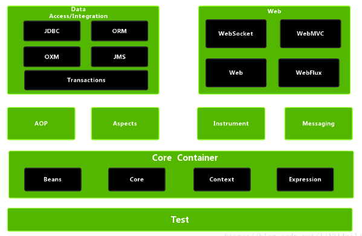

#                        Spring 整体架构

- 1.数据处理模块（Data Access）
  该模块由JDBC、Transactions、ORM、OXM和JMS等模块组成。
  -  JDBC模块提供了不需要编写冗长的JDBC代码和解析数据库厂商特有的错误代码的JDBC-抽象层。
  -  Transactions模块支持编程和声明式事务管理。
  - ORM模块提供了流行的Object-Relational Mapping（对象-关系映射）API集成层，包含JPA、JDO和Hibernate等ORM框架。Spring对ORM的支持和封装主要体现在三方面：一致的异常处理体系结构，对
    第三方ORM框架抛出的专有异常进行了包装；一致的DAO抽象的支持，为每个框架都提供了模板类来简化和封装常用操作，例如JdbcSupport、HibernateTemplate等；Spring的事务管理机制，为所有数据访问都提供了一致的事务管理。
  - OXM模块提供抽象层，用于支持Object/XML  mapping（对象/XML映射）的实现，例如JAXB、Castor、XMLBeans、JiBX和XStream等。
  - JMS模块（Java Messaging Service）包含生产和消费信息的功能。
- 2.Web模块
  该模块由Web、WebSocket、Servlet和Portlet等模块组成。
  -  Web模块提供了面向Web开发的集成功能。
  -  WebSocket模块提供了面向WebSocket开发的集成功能。
  - Servlet 模块（也被称为SpringMVC 模块）包含 Spring 的 Model-View-Controller（模型-视图-控制器，简称MVC）和REST Web Services实现的Web应用程序。Spring MVC框架使Domain Model（领域模型）代码和 Web  Form（网页）代码实现了完全分离，并且集成了SpringFramework的所有功能。
  - Portlet模块（也被称为Portlet MVC 模块）是基于Web和Servlet模块的MVC实现。Portlet和Servlet的最大区别是对请求的处理分为Action阶段和Render阶段。在处理一次 HTTP请求时，在 Action阶段处理业务
    逻辑响应并且当前逻辑处理只被执行一次；而在Render阶段随着业务的定制，当前处理逻辑会被执行多次，这样就保证了业务系统在处理同一个业务逻辑时能够进行定制性响应页面模版渲染。
- 3.AOP模块
         该模块是Spring的代理模块，也是Spring的核心模块，它巧妙地利用了JVM动态代理和CGLIB动态代理面向过程编程，来实现业务零侵入、低耦合的效果。为了确保Spring与其他AOP框架的互用性，SpingAOP模块支持基于AOP联盟定义的API，也就是Aspect模块，与SpringIoC模块相辅相成。其中，我们熟知且常用的事务管理就是利用SpringAOP模块实现的。Spring AOP模块及Spring良好的架构设计及扩展性，使Spring可以融合基本上所有的模块及其他框架，成为真正的集大成者。
- 4.Aspects模块
        该模块提供了与 AspectJ（一个功能强大并且成熟的面向切面编程的框架）的集成，它扩展了Java语言，定义了 AOP语法（俗称织入点语法），持有一个专门的编译器来生成遵守Java字节编码规范的Class文件，使用字节码生成技术来实现代理。Spring自带AOP模块，并且集成了AspectJ框架，使原AspectJ使用者可以快速掌握Spring框架，这同样体现了Spring高融合的特性。
- 5.Instrumentation模块
         该模块是 Spring 对其他容器的集成及对类加载器的扩展实现，其子模块 spring-instr ument-tomcat实现了Tomcat Instrumentation代理功能。
- 6.Messaging模块
        该模块是从Spring集成项目（例如  Message、MessageChannel、MessageHandler及其他基于消息应用的基础模块）中抽象出来的，类似于基于注解的Spring  MVC编程模块，包含一系列消息与方法的映射注解。
- 7.Core Container模块
  该模块（也叫Spring核心容器模块）是Spring的根基，由Beans、Core、Context、SpEL四个子模块组成，这四个子模块如下所述。
  - Beans模块和Core模块提供框架的基础部分，包含IoC（Inversionof Control，控制反转）和 DI（Dependency Injection，依赖注入）功能，使用  BeanFactory  基本概念来实现容器对Bean的管理，是所有Spring应用的核心。Spring本身的运行都是由这种Bean的核心模型进行加载和执行的，是Spring其他模块的核心支撑，是运行的根本保证。
  -  Context（包含 Spring-Context和 Spring-Context-Support两个子模块）模块建立在Core模块和  Beans模块的坚实基础之上，并且集成了Beans模块的特征，增加了对国际化的支持，也支持Java  EE特征。
    ApplicationContext接口是Context模块的焦点。Spring-Context-Support模块支持集成第三方常用库到Spring应用上下文中，例如缓存（EhCache、Guava）、调度Scheduling框架（CommonJ、Quartz）及模板引擎（FreeMarker、Velocity）。
  - SpEL模块（Spring-Expression Language）提供了强大的表达式语言来查询和操作运行时的对象。
- 8.Test 模块
  该模块支持通过组合JUnit或TestNG来进行单元测试和集成测试，并且提供了Mock  Object（模仿对象）方式进行测试。在该模块中定义了注释，例如@ContextConfiguration、@WebAppConfiguration、@ContextHierarchy、@ActiveProfiles，可以被用作元注释来创建自定义注解并避免整个测试套件的重复构造。

### 1.2 Spring的领域模型

**Spring的领域模型有三种，如下所述**。

- 容器领域模型（Context模型）：也叫作上下文模型，是Spring的掌控域，对 Spring核心领域模型进行生命周期管理。也可以将其称为Spring的服务域，因为它为整个应用服务。
- 核心领域模型（Bean模型）：体现了  Spring的一个核心理念，即“一切皆 Bean,Bean即一切”。Bean是应用运行时可执行的最小函数式单元，可以是一个属性单元，也可以是 Java 中的一个函数对象，更倾向于一种对象式的为某种特殊行为而生的可复用的概念，不受职责或者大小的限制。例如 Spring 上下文是一个 Bean，一个简单的描述型的对象也是一个Bean。Bean模型是Spring的核心服务实体域，是应用要操作的本身，是每个线程的真正执行者，也是整个会话生命周期的管理者，还是Spring对外暴露的核心实体。
- 代理领域模型（Advisor模型）:Spring代理的执行依赖于Bean模型，但是Spring代理的生成、执行及选择都依赖于 Spring自身定义的Advisor模型，只有符合 Advisor模型的定义，才能生成Spring代理。