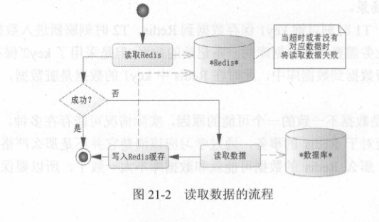
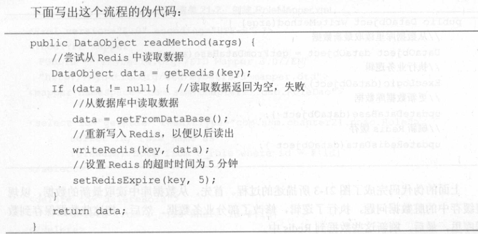
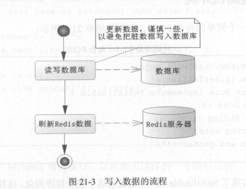
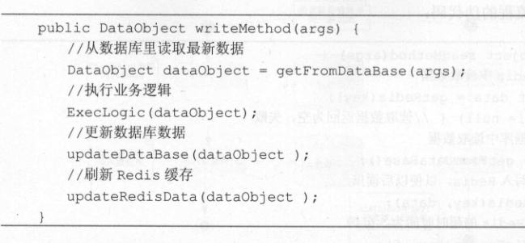
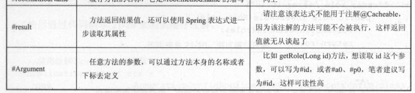

#                 Spring 缓存机制和Redis的结合

### Redis和数据库读操作





### Redis和数据库写操作





### Spring缓存机制整合Redis

```java
//代表这个类为一个配置类
@Configuration
//开启缓存机制
@EnableCaching
@SuppressWarnings({"rawtypes","unchecked"})
public class RedisConfig {
    @Bean(name="redisTemplate")
    public RedisTemplate initRedisTemplate() {
        JedisPoolConfig poolConfig = new JedisPoolConfig();
        //最大空闲数
        poolConfig.setMaxIdle(50);
        //最大连接数
        poolConfig.setMaxTotal(100);
        //最大等待毫秒数
        poolConfig.setMaxWaitMillis(20000);
        //创建Jedis连接工厂
        JedisConnectionFactory connectionFactory = new JedisConnectionFactory(poolConfig);
        connectionFactory.setHostName("localhost");
        connectionFactory.setPort(6379);
        //调用后初始化方法，没有它将抛出异常
        connectionFactory.afterPropertiesSet();
        //自定义redis序列化器
        RedisSerializer jdkSerializationRedisSerializer = new JdkSerializationRedisSerializer();
        RedisSerializer stringRedisSerializer = new StringRedisSerializer();
        //定义RedisTemplate，并设置连接工程
        RedisTemplate redisTemplate = new RedisTemplate<>();
        redisTemplate.setConnectionFactory(connectionFactory);
        //设置序列化器
        redisTemplate.setDefaultSerializer(stringRedisSerializer);
        redisTemplate.setKeySerializer(stringRedisSerializer);
        redisTemplate.setValueSerializer(jdkSerializationRedisSerializer);
        redisTemplate.setHashKeySerializer(stringRedisSerializer);
        redisTemplate.setHashValueSerializer(jdkSerializationRedisSerializer);
        return redisTemplate;
    }
    //定义缓存管理器
    @Bean(name="redisCacheManager")
    public RedisCacheManager initRedisCacheManager(@Autowired RedisTemplate redisTemplate) {
        
        RedisCacheManager cacheManager = new RedisCacheManager(redisTemplate);
        //设置超时时间为10分钟
        cacheManager.setDefaultExpiration(600L);
        //设置缓存名称
        Collection<String> cacheNames = new ArrayList<String>();
        cacheNames.add("redisCacheManager");
        cacheManager.setCacheNames(cacheNames);
        return cacheManager;
        
    }
}
```

```java
// 给出实现
@Service
public class RoleServiceImpl implements RoleService {

    @Autowired
    private RoleDao roleDao = null;
    /*
     * 使用@Cacheable定义缓存策略
     * 当缓存中有值，则返回缓存数据，否则访问方法得到数据
     * 通过value引用缓存管理器，通过key定义键
     * @param id 角色编号
     * @return 角色
     */
    @Override
    @Transactional(isolation = Isolation.READ_COMMITTED,propagation = Propagation.REQUIRED)
    @Cacheable(value="redisCacheManager",key="'redis_role'+#id")
    public Role getRole(Long id) {
        return roleDao.getRole(id);
    }
    /*
     * 使用@CachePut则表示无论如何都会执行该方法，最后将方法的返回值再保存到缓存中
     * 使用在插入数据的地方，则表示保存到数据库后，会同期插入Redis缓存中
     * @param role角色对象
     * @return 角色对象
     */
    @Override
    @Transactional(isolation = Isolation.READ_COMMITTED,propagation = Propagation.REQUIRED)
    @CachePut(value="redisCacheManager",key="'redis_role'+#result.id")
    public Role insert(Role role) {
        roleDao.insertRole(role);
        return role;
    }
    /*
     * 使用@CachePut，表示更新数据库的同时，也会同步更新缓存
     * @param role 角色对象
     * @return 角色对象
     */
    @Override
    @Transactional(isolation = Isolation.READ_COMMITTED,propagation = Propagation.REQUIRED)
    @CachePut(value="redisCacheManager",key="'redis_role'+#result.id")
    public Role updateRole(Role role) {
        roleDao.updateRole(role);
        return role;
    }
    /*
     * 使用@CacheEvict删除缓存对应的key
     * @param id 角色编号
     * @return 返回删除的记录数
     */
    @Override
    @Transactional(isolation = Isolation.READ_COMMITTED,propagation = Propagation.REQUIRED)
    @CacheEvict(value="redisCacheManager",key="'redis_role'+#id")
    public int deleteRole(Long id) {
        return roleDao.deleteRole(id);
    }

    @Override
    public List<Role> findRoles(String roleName, String note) {
        return roleDao.findRoles(roleName, note);
    }

}
 
```

```java
//获取IoC容器
ApplicationContext ctx = new AnnotationConfigApplicationContext(RootConfig.class,RedisConfig.class) 
        //从容器中获取service实现类
        RoleService roleService = ctx.getBean(RoleService.class);
        //创建实体对象
        Role role = new Role();
        role.setRoleName("程序error ");
        role.setNote(" ....！");
        //插入到数据库
        roleService.insert(role);
        //从数据库中获取刚刚插入的对象
        Role getRole = roleService.getRole(7l);
        //打印
        System.out.println(getRole.getRoleName()+":"+getRole.getNote());

```

### 缓存注解

- `@Cacheable`：通常在查询方法上使用，如果缓存中有值，则直接返回缓存中的值，如果没有，则去数据库中取值，取出后存入缓存。这里@Cacheable有两个属性，value和key，value表示使用的缓存管理器的名称（之前配置的），key表示要存入缓存中的key值，其中#id表示接受方法中的参数以此组成key值。
- `@CachePut`：通常在插入和更新方法中使用，此注解无论如何都会更新数据库，更新数据库后会同步更新到缓存。同样有value和key两个属性，value为缓存管理器的名称，key表示要存入缓存中的key值。
- `@CacheEvict`：通常在删除方法中使用，value为缓存管理器的名称，key为缓存中要删除的数据的key值。
- `@Cache`:这是一个分解注解，它能够同时运用其他缓存的注解。

注解中`key` 表达式 的使用

