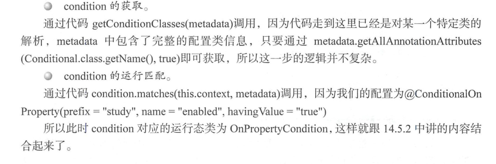

#       Springboot 装配之Condition模式浅析

注意两个核心类

- `ConfigurationClassParser`
  - 解析{@link Configuration}类定义，填充{@link Configuration Class}对象的集合（解析单个Configuration类可能会导致任意数量的Configuration Class对象，因为一个Configuration类可以使用{@link Import 导入另一个}）
- `ClassPathBeanDefinitionScanner`
  - 一个bean定义扫描程序，用于检测类路径上的bean候选者，使用给定的注册表（{@code BeanFactory} *或{@code ApplicationContext}）注册相应的bean定义。

`org.springframework.context.annotation.ConfigurationClassParser#processConfigurationClass`

```java
if (this.conditionEvaluator.shouldSkip(configClass.getMetadata(), ConfigurationPhase.PARSE_CONFIGURATION)) {
			return;
}
```

```java
public boolean shouldSkip(@Nullable AnnotatedTypeMetadata metadata, @Nullable ConfigurationPhase phase) {
		if (metadata == null || !metadata.isAnnotated(Conditional.class.getName())) {
			return false;
		}

		if (phase == null) {
			if (metadata instanceof AnnotationMetadata &&
					ConfigurationClassUtils.isConfigurationCandidate((AnnotationMetadata) metadata)) {
				return shouldSkip(metadata, ConfigurationPhase.PARSE_CONFIGURATION);
			}
			return shouldSkip(metadata, ConfigurationPhase.REGISTER_BEAN);
		}

		List<Condition> conditions = new ArrayList<>();
		for (String[] conditionClasses : getConditionClasses(metadata)) {
			for (String conditionClass : conditionClasses) {
				Condition condition = getCondition(conditionClass, this.context.getClassLoader());
				conditions.add(condition);
			}
		}

		AnnotationAwareOrderComparator.sort(conditions);

		for (Condition condition : conditions) {
			ConfigurationPhase requiredPhase = null;
			if (condition instanceof ConfigurationCondition) {
				requiredPhase = ((ConfigurationCondition) condition).getConfigurationPhase();
			}
			if ((requiredPhase == null || requiredPhase == phase) && !condition.matches(this.context, metadata)) {
				return true;
			}
		}

		return false;
	}
```

- `getConditionClasses(metadata)`
- `condition.matches(this.context, metadata)`



