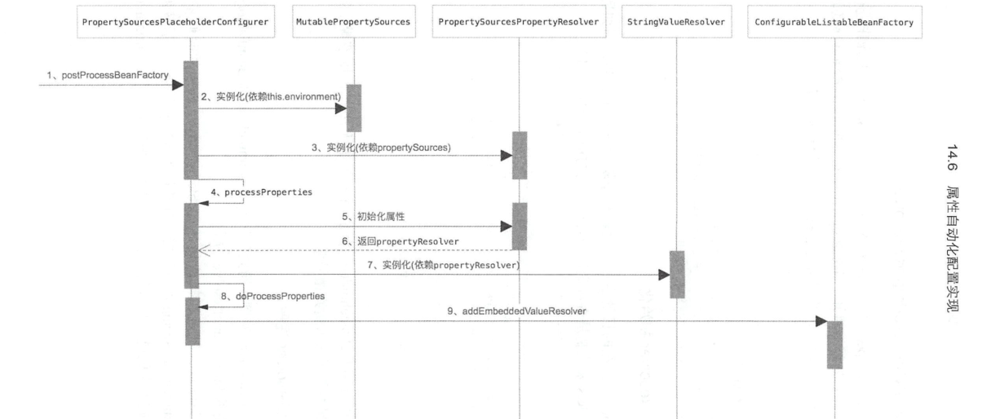
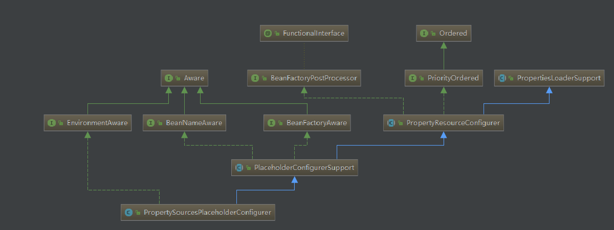

#                Springboot属性自动化实现




### `核心类：PropertySourcesPlaceholderConfigurer` 



- 基础
- 实现了`eanFactoryPostProcessor`----》 入口
  - BeanFactoryPostProcessor 为spring在容器初始化时对外对外暴露的扩展点，Spring IoC容器允许BeanFactoryPostProcessor在容器加载注册BeanDefinition完成之后读取BeanDefinition(配置元数据)，并可以修改它。

```java
public void postProcessBeanFactory(ConfigurableListableBeanFactory beanFactory) throws BeansException {
		if (this.propertySources == null) {
            // 创建了一个MutablePropertySources
			this.propertySources = new MutablePropertySources();
            // this.environment 这个是基础
			if (this.environment != null) {
				this.propertySources.addLast(
					new PropertySource<Environment>(ENVIRONMENT_PROPERTIES_PROPERTY_SOURCE_NAME, this.environment) {
						@Override
						@Nullable
						public String getProperty(String key) {
							return this.source.getProperty(key);
						}
					}
				);
			}
			try {
				PropertySource<?> localPropertySource =
						new PropertiesPropertySource(LOCAL_PROPERTIES_PROPERTY_SOURCE_NAME, mergeProperties());
				if (this.localOverride) {
					this.propertySources.addFirst(localPropertySource);
				}
				else {
					this.propertySources.addLast(localPropertySource);
				}
			}
			catch (IOException ex) {
				throw new BeanInitializationException("Could not load properties", ex);
			}
		}

     // 处理 properties 
      processProperties(beanFactory, new PropertySourcesPropertyResolver(this.propertySources));
    
		this.appliedPropertySources = this.propertySources;
	}
```

```java
protected void processProperties(ConfigurableListableBeanFactory beanFactoryToProcess,
			final ConfigurablePropertyResolver propertyResolver) throws BeansException {

       //this.placeholderPrefix --->"${"
		propertyResolver.setPlaceholderPrefix(this.placeholderPrefix);
       // this.placeholderSuffix --->"}"
		propertyResolver.setPlaceholderSuffix(this.placeholderSuffix);
        // this.valueSeparator ---> ":"
		propertyResolver.setValueSeparator(this.valueSeparator);

    
        // StringValueResolver 的实例化.  java lombdo 表达式
		StringValueResolver valueResolver = strVal -> {
            // ignoreUnresolvablePlaceholders 判断是否有占位符.
			String resolved = (this.ignoreUnresolvablePlaceholders ?
					propertyResolver.resolvePlaceholders(strVal) :
					propertyResolver.resolveRequiredPlaceholders(strVal));
			if (this.trimValues) {
                // 去掉空格
				resolved = resolved.trim();
			}
            // 拿到值返回了.
			return (resolved.equals(this.nullValue) ? null : resolved);
		};

        // 执行.
		doProcessProperties(beanFactoryToProcess, valueResolver);
	}
```

```java
protected void doProcessProperties(ConfigurableListableBeanFactory beanFactoryToProcess,
			StringValueResolver valueResolver) {

		BeanDefinitionVisitor visitor = new BeanDefinitionVisitor(valueResolver);

		String[] beanNames = beanFactoryToProcess.getBeanDefinitionNames();
		for (String curName : beanNames) {
			// 检查我们是不是在解析我们自己的bean定义，
			// 避免在属性文件位置中无法解析的占位符失败。
			if (!(curName.equals(this.beanName) && beanFactoryToProcess.equals(this.beanFactory))) {
				BeanDefinition bd = beanFactoryToProcess.getBeanDefinition(curName);
				try {
					visitor.visitBeanDefinition(bd);
				}
				catch (Exception ex) {
					throw new BeanDefinitionStoreException(bd.getResourceDescription(), curName, ex.getMessage(), ex);
				}
			}
		}

		//Spring 2.5中的新功能：解析别名目标名称和别名中的占位符。
		beanFactoryToProcess.resolveAliases(valueResolver);

		//Spring 3.0中的新功能：解析嵌入值（如注释属性）中的占位符。
       //  还有需要解析的占位符
		beanFactoryToProcess.addEmbeddedValueResolver(valueResolver);
	}
```

### `@Value`注解的读取

核心类： `QualifierAnnotationAutowireCandidateResolver`

找到

```java 
private Class<? extends Annotation> valueAnnotationType = Value.class;
```

```java
@Nullable
	protected Object findValue(Annotation[] annotationsToSearch) {
		if (annotationsToSearch.length > 0) { // qualifier annotations have to be local
            AnnotationAttributes attr = 
                AnnotatedElementUtils.getMergedAnnotationAttributes(
					AnnotatedElementUtils.forAnnotations(annotationsToSearch), this.valueAnnotationType);
			if (attr != null) {
                // 提取 value 注解的值 比如：${value.demo}
				return extractValue(attr);
			}
		}
		return null;
	}
```

```java
protected Object extractValue(AnnotationAttributes attr) {
        // AnnotationUtils.VALUE  -- > value
		Object value = attr.get(AnnotationUtils.VALUE);
		if (value == null) {
			throw new IllegalStateException("Value annotation must have a value attribute");
		}
		return value;
	}
```

```java
public Object getSuggestedValue(DependencyDescriptor descriptor) {
		Object value = findValue(descriptor.getAnnotations());
		if (value == null) {
			MethodParameter methodParam = descriptor.getMethodParameter();
			if (methodParam != null) {
				value = findValue(methodParam.getMethodAnnotations());
			}
		}
		return value;
	}
```

来到这个方法`DefaultListableBeanFactory#doResolveDependency`.

```java
   // 调用完返回到这里       
Object value = getAutowireCandidateResolver().getSuggestedValue(descriptor);
			if (value != null) {
				if (value instanceof String) {
                    // 解析。
					String strVal = resolveEmbeddedValue((String) value);
					BeanDefinition bd = (beanName != null && containsBean(beanName) ?
							getMergedBeanDefinition(beanName) : null);
					value = evaluateBeanDefinitionString(strVal, bd);
				}
				TypeConverter converter = (typeConverter != null ? typeConverter : getTypeConverter());
				try {
					return converter.convertIfNecessary(value, type, descriptor.getTypeDescriptor());
				}
				catch (UnsupportedOperationException ex) {
					// A custom TypeConverter which does not support TypeDescriptor resolution...
					return (descriptor.getField() != null ?
							converter.convertIfNecessary(value, type, descriptor.getField()) :
							converter.convertIfNecessary(value, type, descriptor.getMethodParameter()));
				}
			}
```

进入`org.springframework.beans.factory.support.AbstractBeanFactory#resolveEmbeddedValue`

```java
public String resolveEmbeddedValue(@Nullable String value) {
		if (value == null) {
			return null;
		}
		String result = value;
		for (StringValueResolver resolver : this.embeddedValueResolvers) {
			result = resolver.resolveStringValue(result);
			if (result == null) {
				return null;
			}
		}
		return result;
	}
```

从` resolver.resolveStringValue(result)`进去 来到` PropertySourcesPlaceholderConfigurer#processProperties(ConfigurableListableBeanFactory, ConfigurablePropertyResolver)`

```
StringValueResolver valueResolver = strVal -> {
			String resolved = (this.ignoreUnresolvablePlaceholders ?
					propertyResolver.resolvePlaceholders(strVal) :
					propertyResolver.resolveRequiredPlaceholders(strVal));
			if (this.trimValues) {
				resolved = resolved.trim();
			}
			// 解析完 . 返回值。
			return (resolved.equals(this.nullValue) ? null : resolved);
		};
```

**`@Value`读取值的完整流程处理完了.**