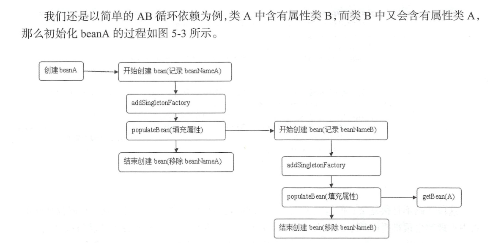
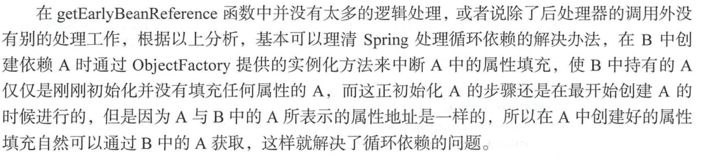
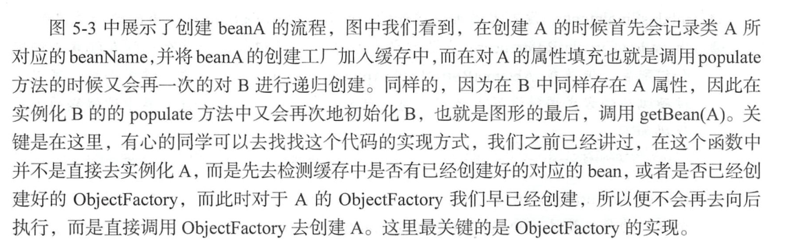

#                         Spring循环依赖




```java
// Eagerly cache singletons to be able to resolve circular references
		// even when triggered by lifecycle interfaces like BeanFactoryAware.
		//向容器中缓存单例模式的Bean对象，以防循环引用 --》是否需要提早曝光。
		boolean earlySingletonExposure = (mbd.isSingleton() && this.allowCircularReferences &&
				isSingletonCurrentlyInCreation(beanName));
		if (earlySingletonExposure) {
			if (logger.isDebugEnabled()) {
				logger.debug("Eagerly caching bean '" + beanName +
						"' to allow for resolving potential circular references");
			}
			//这里是一个匿名内部类，为了防止循环引用，尽早持有对象的引用
			// 	为避免后期的循环依赖，可以在初始化完成前将创建实例的ObjectFactory加入工厂。
			addSingletonFactory(beanName, () -> getEarlyBeanReference(beanName, mbd, bean));
		}
```

```java
protected Object getEarlyBeanReference(String beanName, RootBeanDefinition mbd, Object bean) {
		Object exposedObject = bean;
		//对bean 在一次依赖引用，应用于SmartInstantiationAwareBeanPostProcessor
		// 其中我们熟知的aop 在这里将advice 动态织入bean中，若没有直接返回，不做任何处理。
		if (!mbd.isSynthetic() && hasInstantiationAwareBeanPostProcessors()) {
			for (BeanPostProcessor bp : getBeanPostProcessors()) {
				if (bp instanceof SmartInstantiationAwareBeanPostProcessor) {
					SmartInstantiationAwareBeanPostProcessor ibp = (SmartInstantiationAwareBeanPostProcessor) bp;
					exposedObject = ibp.getEarlyBeanReference(exposedObject, beanName);
				}
			}
		}
		return exposedObject;
	}
```





