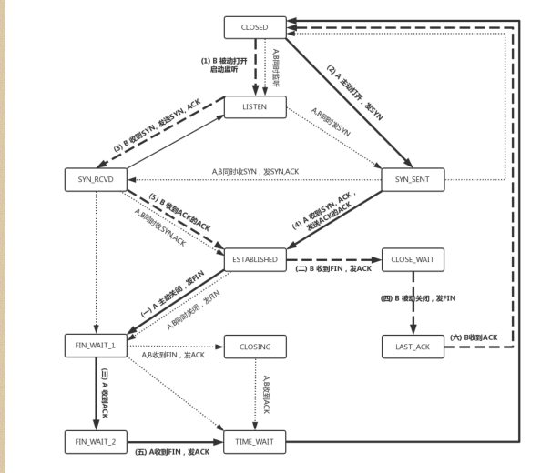

#                      TCP 协议笔记

### 通过序列号和确认应答提高可靠性

- 顺序问题与丢包问题

  

  > - 顺序问题
  >
  > 在发送端来看，1、2、3 已经发送并确认；4、5、6、7、8、9 都是发送了还没确认；
  > 10、11、12 是还没发出的；13、14、15 是接收方没有空间，不准备发的。
  >
  > - 丢包问题
  >
  > 假设 4 的确认到了，不幸的是，5 的 ACK 丢了，6、7 的数据包丢了，这该怎么办呢？
  >
  > ​        一种方法就是**超时重试**，也即对每一个发送了，但是没有 ACK 的包，都有设一个定时器，超过了一定的时间，就重新尝试。但是这个超时的时间如何评估呢？这个时间不宜过短，时间必须大于往返时间RTT，否则会引起不必要的重传。也不宜过长，这样超时时间变长，访问就变慢了。估计往返时间，需要 TCP 通过采样 RTT 的时间，然后进行加权平均，算出一个值，而且这个值还是要不断变化的，因为网络状况不断的变化。除了采样 RTT，还要采样 RTT 的波动范围，计算出一个估计的超时时间。由于重传时间是不断变化的，我们称为自适应重传算法（Adaptive Retransmission
  > Algorithm）。
  > ​       如果过一段时间，5、6、7 都超时了，就会重新发送。接收方发现 5 原来接收过，于是丢弃 5；6 收到了，发送 ACK，要求下一个是 7，7 不幸又丢了。当 7 再次超时的时候，有需要重传的时候，TCP 的策略是超时间隔加倍。每当遇到一次超时重传的时候，都会将下一次超时时间间隔设为先前值的两倍。两次超时，就说明网络环境差，不宜频繁反复发送。
  >
  > 超时触发重传存在的问题是，超时周期可能相对较长。那是不是可以有更快的方式呢？
  >
  > ​        有一个可以**快速重传**的机制，当接收方收到一个序号大于下一个所期望的报文段时，就检测到了数据流中的一个间格，于是发送三个冗余的 ACK，客户端收到后，就在定时器过期之前，重传丢失的报文段。
  > 例如，接收方发现 6、8、9 都已经接收了，就是 7 没来，那肯定是丢了，于是发送三个 6 的 ACK，要求下一个是 7。客户端收到 3 个，就会发现 7 的确又丢了，不等超时，马上重发。
  >
  > ​     还有一种方式称为**Selective Acknowledgment （SACK）**。这种方式需要在 TCP 头里加一个 SACK的东西，可以将缓存的地图发送给发送方。例如可以发送 ACK6、SACK8、SACK9，有了地图，发送方一下子就能看出来是 7 丢了。

### 连接维护问题

- 三次握手

  

- 四次挥手

- TCP转态机

> 在这个图中，加黑加粗的部分，是上面说到的主要流程，其中阿拉伯数字的序号，是连接过程中的顺
> 序，而大写中文数字的序号，是连接断开过程中的顺序。加粗的实线是客户端 A 的状态变迁，加粗的虚
> 线是服务端 B 的状态变迁。

### 利用窗口控制提高速度

### 流量控制

​	

> 发送方会定时发送窗口探测数据包，此数据段仅包含一个字节用于获取最新的窗口大小的信息，看是否有机会调整窗口的大小。
>
> 设想一种极端情况： （如顶上图）： 假设发送端发送过猛，会将第三部分的 11、12、13 全部发送完毕，之后就停止发送了，未发送可发送部分为 0。
>
> ​      如果接收方实在处理的太慢，导致缓存中没有空间了，可以通过确认信息修改窗口的大小，甚至可以设
> 置为 0，则发送方将暂时停止发送。
>
> ​      我们假设一个极端情况，接收端的应用一直不读取缓存中的数据，当数据包 4确认后，窗口大小就不能
> 再是 9 了，就要缩小一个变为 8。你会发现窗口没有平行右移，而是仅仅左面的边右移了，窗口的大小从 9 改成了 8。如果接收端还是一直不处理数据，则随着确认的包越来越多，窗口越来越小，直到为 0。

### 拥塞控制

> 滑动窗口 rwnd 是怕发送方把接收方缓存塞满，而拥塞窗口 cwnd，是怕把网络塞满。
>
> 水管有粗细，网络有带宽，也即每秒钟能够发送多少数据；水管有长度，端到端有时延。在理想状态
> 下，水管里面水的量 = 水管粗细 x 水管长度。对于到网络上，通道的容量 = 带宽 × 往返延迟。
> 如果我们设置发送窗口，使得发送但未确认的包为为通道的容量，就能够撑满整个管道。

> 拥塞的一种表现形式是丢包，需要超时重传，这个时候，将 sshresh 设为 cwnd/2，将 cwnd 设为 1，
> 重新开始慢启动。这真是一旦超时重传，马上回到解放前。**但是这种方式太激进了，将一个高速的传输**
> **速度一下子停了下来，会造成网络卡顿。**
> 快速重传算法。当接收端发现丢了一个中间包的时候，发送三次前一个包的 ACK，于是发
> 送端就会快速的重传，不必等待超时再重传。TCP 认为这种情况不严重，因为大部分没丢，只丢了一小
> 部分，cwnd 减半为 cwnd/2，然后 sshthresh = cwnd，当三个包返回的时候，cwnd = sshthresh +
> 3，也**就是没有一夜回到解放前，而是还在比较高的值，呈线性增长**。
>
> 第一个问题是丢包并不代表着通道满了，也可能是管子本来就漏水。例如公网上带宽不满也会丢包，这
> 个时候就认为拥塞了，退缩了，其实是不对的。
> 第二个问题是 TCP 的拥塞控制要等到将中间设备都填充满了，才发生丢包，从而降低速度，这时候已经
> 晚了。其实 TCP 只要填满管道就可以了，不应该接着填，直到连缓存也填满。
> 为了优化这两个问题，后来有了TCP BBR 拥塞算法。它企图找到一个平衡点，就是通过不断的加快发送
> 速度，将管道填满，但是不要填满中间设备的缓存，因为这样时延会增加，在这个平衡点可以很好的达
> 到高带宽和低时延的平衡。

