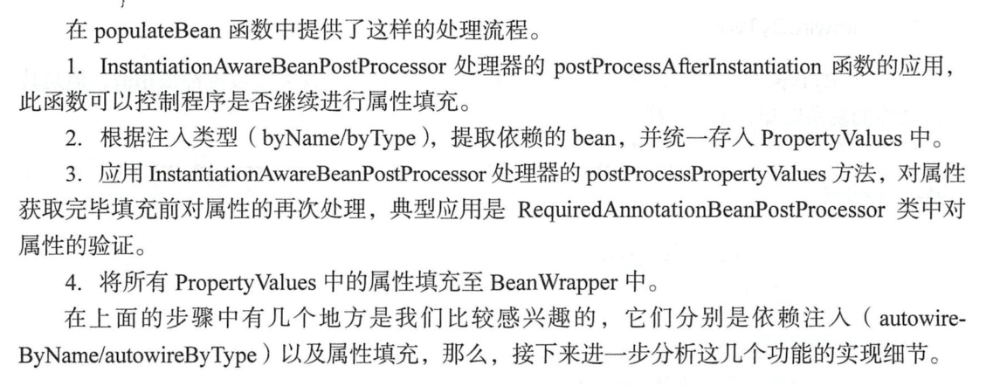

#    bean的生命周期源码分析

###  `AbstractAutowireCapableBeanFactory#doCreateBean`

### initializeBean(beanName, exposedObject, mbd);分析

```java
 protected Object doCreateBean(final String beanName, final RootBeanDefinition mbd, final @Nullable Object[] args)
			throws BeanCreationException {  
     ...
 // Initialize the bean instance.
		Object exposedObject = bean;
		try {
		    // 填充属性
			populateBean(beanName, mbd, instanceWrapper);
			// bean实例初始化
			exposedObject = initializeBean(beanName, exposedObject, mbd);
		}
     
     ...
 }
```

```java
protected Object initializeBean(final String beanName, final Object bean, @Nullable RootBeanDefinition mbd) {
        //JDK的安全机制验证权限，  获取系统安全接口
		if (System.getSecurityManager() != null) {
            //实现PrivilegedAction接口的匿名内部类
			AccessController.doPrivileged((PrivilegedAction<Object>) () -> {
                // 调用 xxx aware接口方法
				invokeAwareMethods(beanName, bean);
				return null;
			}, getAccessControlContext());
		}
		else {
            // 调用 实现了xxx aware接口方法
			invokeAwareMethods(beanName, bean);
		}

		Object wrappedBean = bean;
		if (mbd == null || !mbd.isSynthetic()) {
            // 调用实现了 BeanPostProcessor.postProcessBeforeInitialization（）方法
            // 回调方法的调用，为Bean实例初始化前做一些处理
			wrappedBean = applyBeanPostProcessorsBeforeInitialization(wrappedBean, beanName);
		}

		try {
            // 调用实现了是否InitializingBean接口的实现 和 文件中通过init-method属性指定的
			invokeInitMethods(beanName, wrappedBean, mbd);
		}
		catch (Throwable ex) {
			throw new BeanCreationException(
					(mbd != null ? mbd.getResourceDescription() : null),
					beanName, "Invocation of init method failed", ex);
		}
		if (mbd == null || !mbd.isSynthetic()) {
            // BeanPostProcessor.postProcessAfterInitialization()；
            // 回调方法的调用，为Bean实例初始化之后做一些处理
			wrappedBean = applyBeanPostProcessorsAfterInitialization(wrappedBean, beanName);
		}

       // 返回bean 实例
		return wrappedBean;
	}
```


```java
private void invokeAwareMethods(final String beanName, final Object bean) {
       // 是否是 Aware 接口
		if (bean instanceof Aware) {
            // 执行顺序 BeanNameAware  --》 BeanClassLoaderAware ——》 BeanFactoryAware
			if (bean instanceof BeanNameAware) {
				((BeanNameAware) bean).setBeanName(beanName);
			}
			if (bean instanceof BeanClassLoaderAware) {
				ClassLoader bcl = getBeanClassLoader();
				if (bcl != null) {
					((BeanClassLoaderAware) bean).setBeanClassLoader(bcl);
				}
			}
			if (bean instanceof BeanFactoryAware) {
				((BeanFactoryAware) bean).setBeanFactory(AbstractAutowireCapableBeanFactory.this);
			}
		}
	}
```


```java
public Object applyBeanPostProcessorsBeforeInitialization(Object existingBean, String beanName)
			throws BeansException {

		Object result = existingBean;
        // 遍历后置处理器
		for (BeanPostProcessor processor : getBeanPostProcessors()) {
            // 执行 postProcessBeforeInitialization 方法
            // 初始化之前做一些自定义的处理操作
			Object current = processor.postProcessBeforeInitialization(result, beanName);
			if (current == null) {
				return result;
			}
			result = current;
		}
		return result;
	}
```

```java
	protected void invokeInitMethods(String beanName, final Object bean, @Nullable RootBeanDefinition mbd)
			throws Throwable {

        // 判断是否是InitializingBean 接口
		boolean isInitializingBean = (bean instanceof InitializingBean);
        
		if (isInitializingBean && (mbd == null || !mbd.isExternallyManagedInitMethod("afterPropertiesSet"))) {
			if (logger.isTraceEnabled()) {
				logger.trace("Invoking afterPropertiesSet() on bean with name '" + beanName + "'");
			}
            //JDK的安全机制验证权限， 获取系统安全接口
			if (System.getSecurityManager() != null) {
				try {
					AccessController.doPrivileged((PrivilegedExceptionAction<Object>) () -> {
                        // 调用 接口的afterPropertiesSet方法
						((InitializingBean) bean).afterPropertiesSet();
						return null;
					}, getAccessControlContext());
				}
				catch (PrivilegedActionException pae) {
					throw pae.getException();
				}
			}
			else {
                  // 调用 InitializingBean 接口的afterPropertiesSet方法
				((InitializingBean) bean).afterPropertiesSet();
			}
		}

		if (mbd != null && bean.getClass() != NullBean.class) {
            // 判断是否定义了 initMethodName 方法  --- init-method
			String initMethodName = mbd.getInitMethodName();
			if (StringUtils.hasLength(initMethodName) &&
					!(isInitializingBean && "afterPropertiesSet".equals(initMethodName)) &&
					!mbd.isExternallyManagedInitMethod(initMethodName)) {
                // 执行自定义init 方法
				invokeCustomInitMethod(beanName, bean, mbd);
			}
		}
	}
```

```java
@Override
	public Object applyBeanPostProcessorsAfterInitialization(Object existingBean, String beanName)
			throws BeansException {

		Object result = existingBean;
         // 遍历后置处理器
		for (BeanPostProcessor processor : getBeanPostProcessors()) {
             // 执行 postProcessAfterInitialization 方法
			Object current = processor.postProcessAfterInitialization(result, beanName);
			if (current == null) {
				return result;
			}
			result = current;
		}
		return result;
	}
```

- 类 `PropertyValue`

  - 用于保存单个bean属性的信息和值的对象。
  - 在这里使用一个对象，而不是仅仅将所有属性存储在由属性名称和键入的map中，这样可以提供更大的灵活性，并且能够以优化的方式处理索引属性等。
  - 请注意，该值不必是最终所需的类型：

- `BeanWrapper`

  - Spring的 `low-level JavaBeans` 基础结构的中央接口。

  - 继承体系

    `BeanWrapper`还有两个顶级类接口，分别是`PropertyAccessor`和`PropertyEditorRegistry`。`PropertyAccessor`接口定义了各种访问Bean属性的方法，如`setPropertyValue(String,Object)`、`setPropertyValues(PropertyValues pvs)`等；而`PropertyEditorRegistry`是属性编辑器的注册表。所以`BeanWrapper`实现类`BeanWrapperImpl`具有三重身份：

    - Bean包裹器；
    - 属性访问器；
    - 属性编辑器注册表。

    一个`BeanWrapperImpl`实例内部封装了两类组件：被封装的待处理的`Bean`，以及一套用于设置Bean属性的属性编辑器。

  - 要顺利地填充`Bean`属性，除了目标Bean实例和属性编辑器外。

    还需要获取Bean对应的`BeanDefinition`，它从Spring容器的`BeanDefinitionRegistry`中直接获取。

    Spring主控程序从`BeanDefinition`中获取Bean属性的配置信息`PropertyValue`，并使用属性编辑器对`PropertyValue`进行转换以得到Bean的属性值。

    对Bean的其他属性重复这样的步骤，就可以完成Bean所有属性的注入工作。

    `BeanWrapperImpl`在内部使用Spring的`BeanUtils`工具类对`Bean`进行反射操作，设置属性。

### populateBean(beanName, mbd, instanceWrapper) 分析 

- 细节还有待揣摩。

```java
//将Bean属性设置到生成的实例对象上
	protected void populateBean(String beanName, RootBeanDefinition mbd, @Nullable BeanWrapper bw) {
		if (bw == null) {
			if (mbd.hasPropertyValues()) {
				throw new BeanCreationException(
						mbd.getResourceDescription(), beanName, "Cannot apply property values to null instance");
			}
			else {
				// Skip property population phase for null instance.
				return;
			}
		}

		// Give any InstantiationAwareBeanPostProcessors the opportunity to modify the
		// state of the bean before properties are set. This can be used, for example,
		// to support styles of field injection.
		boolean continueWithPropertyPopulation = true;

		if (!mbd.isSynthetic() && hasInstantiationAwareBeanPostProcessors()) {
			for (BeanPostProcessor bp : getBeanPostProcessors()) {
				if (bp instanceof InstantiationAwareBeanPostProcessor) {
					InstantiationAwareBeanPostProcessor ibp = (InstantiationAwareBeanPostProcessor) bp;
					if (!ibp.postProcessAfterInstantiation(bw.getWrappedInstance(), beanName)) {
						continueWithPropertyPopulation = false;
						break;
					}
				}
			}
		}

		if (!continueWithPropertyPopulation) {
			return;
		}
		//获取容器在解析Bean定义资源时为BeanDefiniton中设置的属性值
		PropertyValues pvs = (mbd.hasPropertyValues() ? mbd.getPropertyValues() : null);

		//对依赖注入处理，首先处理autowiring自动装配的依赖注入
		if (mbd.getResolvedAutowireMode() == RootBeanDefinition.AUTOWIRE_BY_NAME ||
				mbd.getResolvedAutowireMode() == RootBeanDefinition.AUTOWIRE_BY_TYPE) {
			MutablePropertyValues newPvs = new MutablePropertyValues(pvs);

			// Add property values based on autowire by name if applicable.
			//根据Bean名称进行autowiring自动装配处理
			if (mbd.getResolvedAutowireMode() == RootBeanDefinition.AUTOWIRE_BY_NAME) {
				autowireByName(beanName, mbd, bw, newPvs);
			}

			// Add property values based on autowire by type if applicable.
			//根据Bean类型进行autowiring自动装配处理
			if (mbd.getResolvedAutowireMode() == RootBeanDefinition.AUTOWIRE_BY_TYPE) {
				autowireByType(beanName, mbd, bw, newPvs);
			}

			pvs = newPvs;
		}

		//对非autowiring的属性进行依赖注入处理
		boolean hasInstAwareBpps = hasInstantiationAwareBeanPostProcessors();
		boolean needsDepCheck = (mbd.getDependencyCheck() != RootBeanDefinition.DEPENDENCY_CHECK_NONE);

		if (hasInstAwareBpps || needsDepCheck) {
			if (pvs == null) {
				pvs = mbd.getPropertyValues();
			}
			PropertyDescriptor[] filteredPds = filterPropertyDescriptorsForDependencyCheck(bw, mbd.allowCaching);
			if (hasInstAwareBpps) {
				for (BeanPostProcessor bp : getBeanPostProcessors()) {
					if (bp instanceof InstantiationAwareBeanPostProcessor) {
						InstantiationAwareBeanPostProcessor ibp = (InstantiationAwareBeanPostProcessor) bp;
						pvs = ibp.postProcessPropertyValues(pvs, filteredPds, bw.getWrappedInstance(), beanName);
						if (pvs == null) {
							return;
						}
					}
				}
			}
			if (needsDepCheck) {
				checkDependencies(beanName, mbd, filteredPds, pvs);
			}
		}

		if (pvs != null) {
			//对属性进行注入
			applyPropertyValues(beanName, mbd, bw, pvs);
		}
	}
```



