# mybatis  笔记

### 缓存

一级缓存  `session` 级别默认开启。

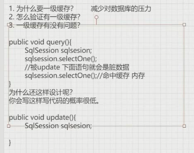

- 优点大于缺点

二级缓存默认是关闭的，不建议使用 ，用redis第三方等代替。

mapper级别   类似 二级缓存的 key。

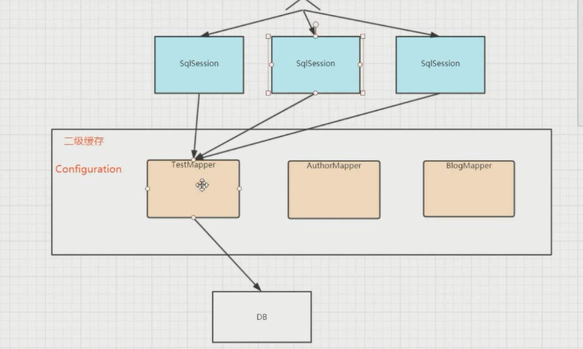

1. `socpe`  -- >  `namespace` 级别 

2. 怎么验证二级缓存的存在    多个`sqlSession` 验证

3. 二级缓存有什么问题？ 

   a. 脏数据问题  （`blogMapper` 关联查询时候 包含 Author 对象（两边Author对象没有关系），当AuthorMapper 更新Author对象时，出现脏数据。）

   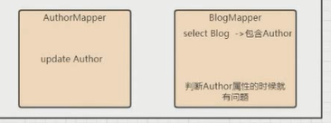

   b.全部失效（执行 update 操作后， 缓存全部失效）不合理。

   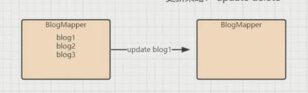

### 分页

- 逻辑分页

  `org.apache.ibatis.executor.resultset.DefaultResultSetHandler#handleRowValues`

  `this.skipRows(rsw.getResultSet(), rowBounds);`

  ```java
   private void skipRows(ResultSet rs, RowBounds rowBounds) throws SQLException {
          if (rs.getType() != 1003) {
              if (rowBounds.getOffset() != 0) {
                  rs.absolute(rowBounds.getOffset());
              }
          } else {
              for(int i = 0; i < rowBounds.getOffset(); ++i) {
                  rs.next();
              }        }
  
      }
  ```

  内存里面分页。通过 `ResultSet`  结果集 分页。

- 物理分页

  - select  ....    limit 1,10;

  - 分页插件 `com.github.pagehelper.PageHelper`   基于 plugins 来做的

    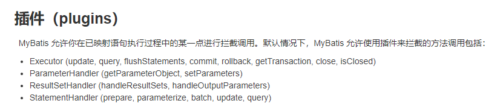

###  批量操作

- for循环  一个一个插入，效率低。

- for each（拼SQL），性能高，一次发送一条SQL。传入list限制大小， MySQL限制 

  

- ExeutorType.BAYCH,创建一个BATCH 的Sqlsession，底层是 jdbc，一次发送多条SQL。效率高。

  使用如下

  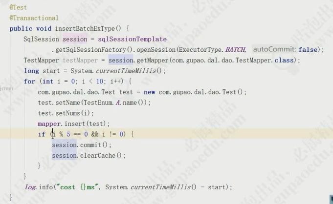

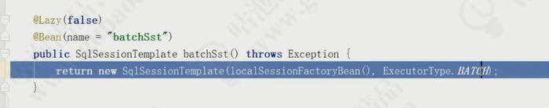

### 联合查询

- 嵌套结果

  1:1    其实多表join 对结果进行嵌套。

  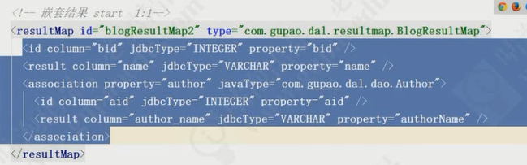

  1:n

  

- **嵌套查询**

  1：1     其实执行 两条SQL

  `<association property="user" javaType="User" column="userid" select="selectUser"/>  `

  1：n   ----》存在n+1问题

  > N+1问题来源于数据库中常见的级联技术，即N个数据库表形成关联关系，当再增加一个关联表时，也就是N+1个级联关系**，由于某些时候，我们并不需要加载数据库的所有数据，而是某一个数据库表中数据，这时Mybatis会自动加载所有表的数据，多执行几条无关sql语句，会造成数据库资源的浪费以及系统性能的下降，这就是级联表的缺点**。

  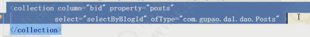
  
   图示： n+1。 1 次查询 ， n次查询。 

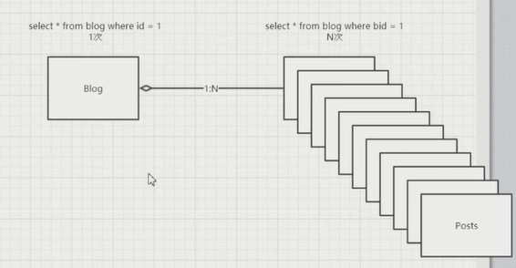

> - 你执行了一个单独的 SQL 语句来获取结果列表(就是“+1”)。
> - 对返回的每条记录,你执行了一个查询语句来为每个加载细节(就是“N”)
>
> 案例:
>
> 在本系列所使用的示例场景下，当需要查询教师及其所指导的学生（一个教师可指导多个学生）信息时，我们会这么做：先用一条SQL语句（“N+1问题”中的1）查询教师的信息，即
>
> select * from teacher 
>
> 此时可查询出n条教师记录。为了进一步查询出教师指导的学生的信息，需要针对每一条教师记录，生成一条SQL语句，即
>
> select * from student where supervisor_id=? 
>
> 以 上SQL语句中的“?”就代表了每个教师的id。显而易见，这样的语句被生成了N条（“N+1问题”中的N）。这样在整个过程中，就总共执行了N+1条 SQL语句，即N+1次数据库查询。而数据库查询通常是应用程序性能的瓶颈，一般应尽量减少数据库查询的次数，那么这种方式就会大大降低系统的性能。

如何解决N+1问题

**嵌套查询**，用到时候才会去查，打开懒加载。   

方式二：直接用join 连接查询.

Mybatis本身给出解决方案，就是延迟加载。

```
<setting name="lazyLoadingEnabled" value="true"/>
```

### 概述

总结 mybatis 源码模块。

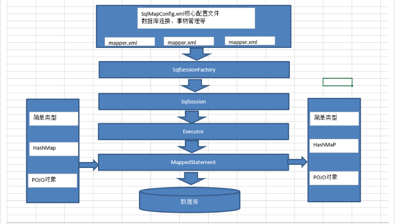

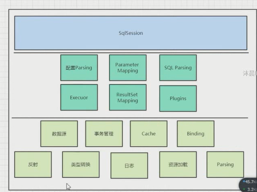


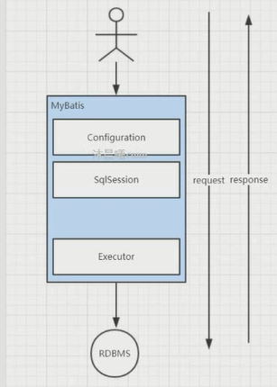


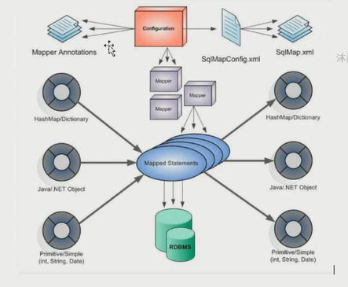

看源码

- 猜想
- 验证

mybatis 的动态代理 （下面）和传统动态代理（上面）

阉割版 因为Mapper 接口没有实现类。

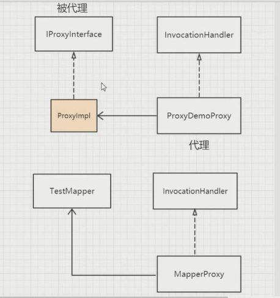


```java
	
SqlSession sqlSession = sqlSessionFactory.openSession();
// 代理对象（ MapperProxy接口代理对象，MapperProxy$23132）
AccountMapper mapper = sqlSession.getMapper(AccountMapper.class);
// 1.找到sql
// 2.参数设置
// 3.执行
// 4.结果映射
```

`org.apache.ibatis.binding.MapperProxy#MapperProxy`

```java
 @Override
  public Object invoke(Object proxy, Method method, Object[] args) throws Throwable {
    try {
      // 如果代理代理调用  object方法会进入。
      if (Object.class.equals(method.getDeclaringClass())) {
        return method.invoke(this, args);
      } else if (isDefaultMethod(method)) {
        return invokeDefaultMethod(proxy, method, args);
      }
    } catch (Throwable t) {
      throw ExceptionUtil.unwrapThrowable(t);
    }
     //防止method 属性
    final MapperMethod mapperMethod = cachedMapperMethod(method);
    return mapperMethod.execute(sqlSession, args);
  }
```


执行时序图。

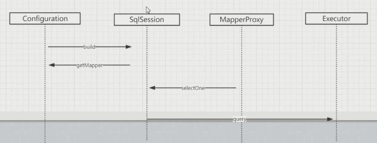

Executor 体系结构

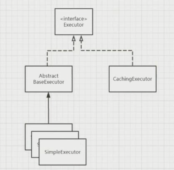

抽象类接口实现接口  ----- 模板方法。 共性往上抽象。抽取通用实现，子类实现具体。

> 开闭原则
>
> 支付案例：对接多方。
>
> 不同抽象模板类隔离。 
>
> 策略完成 不同分类。
>
> 模板，策略，工厂

```java
 private <E> List<E> queryFromDatabase(MappedStatement ms, Object parameter, RowBounds rowBounds, ResultHandler resultHandler, CacheKey key, BoundSql boundSql) throws SQLException {
    List<E> list;
     //使用这个 localCache.putObject(key, EXECUTION_PLACEHOLDER); 使用作用
    localCache.putObject(key, EXECUTION_PLACEHOLDER);
    try {
      list = doQuery(ms, parameter, rowBounds, resultHandler, boundSql);
    } finally {
      localCache.removeObject(key);
    }
    localCache.putObject(key, list);
    if (ms.getStatementType() == StatementType.CALLABLE) {
      localOutputParameterCache.putObject(key, parameter);
    }
    return list;
  }
```

### plugin

主要是扩展下面四个接口中的方法

- Executor (update, query, flushStatements, commit, rollback, getTransaction, close, isClosed)
- ParameterHandler (getParameterObject, setParameters)
- ResultSetHandler (handleResultSets, handleOutputParameters)
- StatementHandler (prepare, parameterize, batch, update, query)

从而定制自己的实现。

核心原理： 核心类和接口

- `InterceptorChain`   执行链
- `Interceptor`   执行
- `Invocation`
- `Plugin`   生成代理的类。

理解一：

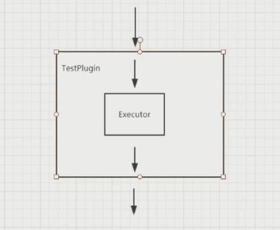


代理能不能在被代理 ？

可以啊，责任链模式。

包装多层。