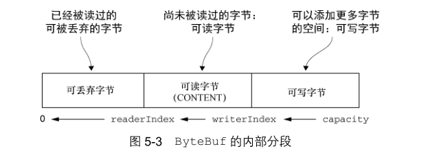

#                        netty 实战笔记

### Netty ——异步和事件驱动

- 异步
- 事件驱动

> 本质上，一个既是异步的又是事件驱动的系统会表现出一种特殊的、对我们来说极具价值的行为：它可以以任意的顺序响应在任意的时间点产生的事件。

**netty 核心组件**

> 1. Channel 
>
> Channel 是 Java NIO 的一个基本构造。
>
> 它代表一个到实体（如一个硬件设备、一个文件、一个网络套接字或者一个能够执行一个或者多个不同的I/O操作的程序组件）的开放连接，如读操作和写操作。
>
> 可以把 Channel 看作是传入（入站）或者传出（出站）数据的载体。
>
> 2. 回调
>
> 一个回调其实就是一个方法，一个指向已经被提供给另外一个方法的方法的引用。**这使得后者可以在适当的时候调用前者**。回调在广泛的编程场景中都有应用，而且也是在操作完成后通知相关方最常见的方式之一。
>
> Netty 在内部使用了回调来处理事件；当一个回调被触发时，相关的事件可以被一个`interface-
> ChannelHandler` 的实现处理。
>
> 3. Future
>
> Future 提供了另一种在操作完成时通知应用程序的方式。这个对象可以看作是一个异步操作的结果的占位符；它将在未来的某个时刻完成，并提供对其结果的访问。
>
> JDK 预置了 interface java.util.concurrent.Future，但是其所提供的实现，只允许手动检查对应的操作是否已经完成，或者一直阻塞直到它完成。这是非常繁琐的，所以 Netty提供了它自己的实现---`ChannelFuture`，用于在执行异步操作的时候使用。
>
> **事实上，回调和 Future 是相互补充的机制；它们相互结合，构成了 Netty 本身的关键构件块之一.**
>
> 4. 事件和 ChannelHandler
>
> Netty 使用不同的事件来通知我们状态的改变或者是操作的状态。
>
> 这使得我们能够基于已经发生的事件来触发适当的动作。这些动作可能是：
>
> - 记录日志；
> - 数据转换；
> - 流控制；
> - 应用程序逻辑。
>
> Netty 是一个网络编程框架，所以事件是按照它们与入站或出站数据流的相关性进行分类的。
>
> 可能由入站数据或者相关的状态更改而触发的事件包括：
>
> - 连接已被激活或者连接失活；
> - 数据读取；
> - 用户事件；
> - 错误事件。
>
> 出站事件是未来将会触发的某个动作的操作结果，这些动作包括：
>
> - 打开或者关闭到远程节点的连接；
> - 将数据写到或者冲刷到套接字
>
> 每个事件都可以被分发给 `ChannelHandler` 类中的某个用户实现的方法。这是一个很好的将事件驱动范式直接转换为应用程序构件块的例子。图 1-3 展示了一个事件是如何被一个这样的ChannelHandler 链处理的。
>
> 总结：
>
> 1．Future、回调和 ChannelHandler
>
> Netty的异步编程模型是建立在Future和回调的概念之上的， 而将事件派发到ChannelHandler的方法则发生在更深的层次上。结合在一起，这些元素就提供了一个处理环境，使你的应用程序逻辑可以独立于任何网络操作相关的顾虑而独立地演变。
>
> 拦截操作以及高速地转换入站数据和出站数据，都只需要你提供回调或者利用操作所返回的Future。这使得链接操作变得既简单又高效，并且促进了可重用的通用代码的编写。
>
> 2．选择器、事件和 EventLoop
>
> Netty 通过触发事件将 Selector 从应用程序中抽象出来，消除了所有本来将需要手动编写的派发代码。在内部，将会为每个 Channel 分配一个 EventLoop，用以处理所有事件，包括：
>
> - 注册感兴趣的事件；
> - 将事件派发给 ChannelHandler；
> - 安排进一步的动作。
>
> EventLoop 本身只由一个线程驱动，其处理了一个 Channel 的所有 I/O 事件，并且在该EventLoop 的整个生命周期内都不会改变。这个简单而强大的设计消除了你可能有的在ChannelHandler 实现中需要进行同步的任何顾虑，因此，你可以专注于提供正确的逻辑，用来在有感兴趣的数据要处理的时候执行。


### Netty 的组件和设计

从技术的和体系结构的探讨netty。

所以我们将从两个不同的但却又密切相关的视角来探讨 Netty：类库的视角以及框架的视角。

> 从高层次的角度来看，Netty 解决了两个相应的关注领域，我们可将其大致标记为**技术的和体系结构的**。首先，它的**基于 Java NIO 的异步的和事件驱动的实现**，保证了高负载下应用程序性能的最大化和可伸缩性。其次，**Netty 也包含了一组设计模式，将应用程序逻辑从网络层解耦**，简化了开发过程，同时也最大限度地提高了可测试性、模块化以及代码的可重用性。

#### Channel、EventLoop 和 ChannelFuture

Netty 网络抽象的代表

- Channel — Socket ；
- EventLoop — 控制流、多线程处理、并发；
- ChannelFuture — 异步通知。

> **Channel 接口**
>
> 基本的 I/O 操作（bind()、connect()、read()和 write()）依赖于底层网络传输所提供的原语。
>
> Netty 的 Channel 接口所提供的 API，大大地降低了直接使用 Socket 类的复杂性.
>
> Channel 也是拥有许多预定义的、专门化实现的广泛类层次结构的根，部分清单
>
> - EmbeddedChannel 
> - LocalServerChannel
> - NioDatagramChannel
> - NioSctpChannel
> - NioSocketChannel
>
> **EventLoop 接口**
>
> EventLoop 定义了 Netty 的核心抽象，用于处理连接的生命周期中所发生的事件。
>
> 


上图在高层次上说明了 Channel、EventLoop、Thread 以及 EventLoopGroup 之间的关系：

- 一个 EventLoopGroup 包含一个或者多个 EventLoop；
- 一个 EventLoop 在它的生命周期内只和一个 Thread 绑定；
- 所有由 EventLoop 处理的 I/O 事件都将在它专有的 Thread 上被处理；
- 一个 Channel 在它的生命周期内只注册于一个 EventLoop；
- 一个 EventLoop 可能会被分配给一个或多个 Channel。

注意，在这种设计中，一个给定 Channel 的 I/O 操作都是由相同的 Thread 执行的，实际上消除了对于同步的需要。（？？）

> **ChannelFuture 接口**
>
> Netty 中所有的 I/O 操作都是异步的。因为一个操作可能不会立即返回，所以我们需要一种用于在之后的某个时间点确定其结果的方法。为此，Netty 提供了ChannelFuture 接口，其 addListener()方法注册了一个ChannelFutureListener，以便在某个操作完成时（无论是否成功）得到通知。

#### ChannelHandler 和 ChannelPipeline

> **ChannelHandler 接口**
>
> 从应用程序开发人员的角度来看，Netty 的主要组件是 ChannelHandler，它充当了所有处理入站和出站数据的应用程序逻辑的容器。这是可行的，因为 ChannelHandler 的方法是由网络事件（其中术语“事件”的使用非常广泛）触发的。事实上，ChannelHandler 可专门用于几乎任何类型的动作，例如将数据从一种格式转换为另外一种格式，或者处理转换过程中所抛出的异常。
>
> ChannelHandler 是专为支持广泛的用途而设计的，可以将它看作是处理往来 ChannelPipeline 事件（包括数据）的任何代码的通用容器。
>
> **ChannelPipeline 接口**
>
> ChannelPipeline 提供了 ChannelHandler 链的容器，并定义了用于在该链上传播入站和出站事件流的 API。当 Channel 被创建时，它会被自动地分配到它专属的 ChannelPipeline。
>
> hannelHandler 安装到 ChannelPipeline 中的过程如下所示：
>
> - 一个ChannelInitializer的实现被注册到了ServerBootstrap中;
> - 当 ChannelInitializer.initChannel()方法被调用时，ChannelInitializer将在 ChannelPipeline 中安装一组自定义的 ChannelHandler;
> - ChannelInitializer 将它自己从 ChannelPipeline 中移除。
>
> 使得事件流经 ChannelPipeline 是 ChannelHandler 的工作，它们是在应用程序的初始化或者引导阶段被安装的。这些对象接收事件、执行它们所实现的处理逻辑，并将数据传递给链中的下一个 ChannelHandler。它们的执行顺序是由它们被添加的顺序所决定的。实际上，被我们称为 ChannelPipeline 的是这些 ChannelHandler 的编排顺序。


> 图 3-3 说明了一个 Netty 应用程序中入站和出站数据流之间的区别。从一个客户端应用程序的角度来看，如果事件的运动方向是从客户端到服务器端，那么我们称这些事件为出站的，反之则称为入站的。
>
> ​       图 3-3 也显示了入站和出站 ChannelHandler 可以被安装到同一个 ChannelPipeline中。如果一个消息或者任何其他的入站事件被读取，**那么它会从 ChannelPipeline 的头部开始流动，**并被传递给第一个 ChannelInboundHandler。这个 ChannelHandler 不一定会实际地修改数据，具体取决于它的具体功能，在这之后，数据将会被传递给链中的下一个ChannelInboundHandler。最终，数据将会到达 ChannelPipeline 的尾端，届时，所有处理就都结束了。
> ​        数据的出站运动（即正在被写的数据）在概念上也是一样的。在这种情况下，**数据将从ChannelOutboundHandler 链的尾端开始流动**，直到它到达链的头部为止。在这之后，出站数据将会到达网络传输层，这里显示为 Socket。通常情况下，这将触发一个写操作。

> **ChannelHandlerContext**
>
> 通过使用作为参数传递到每个方法的 ChannelHandlerContext，事件可以被传递给当前ChannelHandler 链中的下一个 ChannelHandler。因为你有时会忽略那些不感兴趣的事件，所以 Netty提供了抽象基类 ChannelInboundHandlerAdapter 和 ChannelOutboundHandlerAdapter。通过调用 **ChannelHandlerContext** 上的对应方法，每个都提供了简单地将事件传递给下一个ChannelHandler的方法的实现。随后，你可以通过重写你所感兴趣的那些方法来扩展这些类。
>
> 当ChannelHandler被添加到ChannelPipeline时，它将会被分配一个ChannelHandlerContext，其代表了 ChannelHandler 和 ChannelPipeline 之间的绑定。虽然这个对象可以被用于获取底层的 Channel，但是它主要还是被用于写出站数据。
>
>  Netty 能区分 ChannelInboundHandler 实现和 ChannelOutboundHandler 实现，并确保数据只会在具有相同定向类型的两个 ChannelHandler 之间传递。
>
> 在Netty中，有两种发送消息的方式。**你可以直接写到Channel中**，也可以写到和ChannelHandler相关联的**ChannelHandlerContext对象中**。前一种方式将会导致消息从Channel-Pipeline 的尾端开始流动，而后者将导致消息从 ChannelPipeline 中的下一个 ChannelHandler 开始流动。

有一些适配器类可以将编写自定义的 ChannelHandler 所需要的努力降到最低限度，因为它们提供了定义在对应接口中的所有方法的默认实现。

- ChannelHandlerAdapter
- ChannelInboundHandlerAdapter
- ChannelOutboundHandlerAdapter
- ChannelDuplexHandler

#### 编码器和解码器

> 当你通过 Netty 发送或者接收一个消息的时候，就将会发生一次数据转换。入站消息会被解码；也就是说，从字节转换为另一种格式，通常是一个 Java 对象。如果是出站消息，则会发生相反方向的转换：它将从它的当前格式被编码为字节。这两种方向的转换的原因很简单：网络数据总是一系列的字节。
>
> 通常来说，这些基类的名称将类似于 ByteToMessageDecoder 或 MessageToByteEncoder。对于特殊的类型，你可能会发现类似于 ProtobufEncoder 和 ProtobufDecoder这样的名称——预置的用来支持 Google 的 Protocol Buffers。
>
> 严格地说，其他的处理器也可以完成编码器和解码器的功能。
>
> 正如有用来简化ChannelHandler 的创建的适配器类一样，所有由 Netty 提供的编码器/解码器适配器类都实现了 ChannelOutboundHandler 或者 ChannelInboundHandler 接口。
>
> 你将会发现对于入站数据来说，channelRead 方法/事件已经被重写了。对于每个从入站Channel 读取的消息，这个方法都将会被调用。随后，它将调用由预置解码器所提供的 decode()方法，并将已解码的字节转发给 ChannelPipeline 中的下一个 ChannelInboundHandler。
>
> ​        出站消息的模式是相反方向的：编码器将消息转换为字节，并将它们转发给下一个`ChannelOutboundHandler`。
>
> **抽象类 SimpleChannelInboundHandler**
>
> ​        最常见的情况是，你的应用程序会利用一个 ChannelHandler 来接收解码消息，并对该数据应用业务逻辑。要创建一个这样的 ChannelHandler，你只需要扩展基类 SimpleChannelInboundHandler<T>，其中 T 是你要处理的消息的 Java 类型。在这个 ChannelHandler 中，你将需要重写基类的一个或者多个方法，并且获取一个到 ChannelHandlerContext 的引用，这个引用将作为输入参数传递给 ChannelHandler 的所有方法。
>
> ​      在这种类型的 ChannelHandler 中，最重要的方法是 channelRead0(ChannelHandlerContext,T)。除了要求不要阻塞当前的 I/O 线程之外，其具体实现完全取决于你。

#### 引导

> Netty 的引导类为应用程序的网络层配置提供了容器，这涉及将一个进程绑定到某个指定的端口，或者将一个进程连接到另一个运行在某个指定主机的指定端口上的进程。
>
> 即“服务器”和“客户端”实际上表示了不同的网络行为；换句话说，是监听传入的连接还是建立到一个或者多个进程的连接。
>
> **面向连接的协议** 请记住，严格来说，“连接”这个术语仅适用于面向连接的协议，如 TCP，其保证了两个连接端点之间消息的有序传递。


两种类型的引导类之间的区别

- ServerBootstrap 将绑定到一个端口，因为服务器必须要监听连接，而 Bootstrap 则是由想要连接到远程节点的客户端应用程序所使用的。
- 引导一个客户端只需要一个 EventLoopGroup，但是一个ServerBootstrap 则需要两个（也可以是同一个实例）。（实际上，ServerBootstrap 类也可以只使用一个 EventLoopGroup，此时其将在两个场景下共用
  同一个 EventLoopGroup。）


> ​       因为服务器需要两组不同的 Channel**。第一组**将只包含一个 ServerChannel，代表服务器自身的已绑定到某个本地端口的正在监听的套接字。而**第二组**将包含所有已创建的用来处理传入客户端连接（对于每个服务器已经接受的连接都有一个）的 Channel。

### 传输 —— Channel

​       流经网络的数据总是具有相同的类型：字节。这些字节是如何流动的主要取决于我们所说的网络传输 — 一个帮助我们抽象底层数据传输机制的概念。用户并不关心这些细节；他们只想确保他们的字节被可靠地发送和接收。

#### 传输 API

> 传输 API 的核心是 interface Channel，它被用于所有的 I/O 操作。
>
> 每个 Channel 都将会被分配一个 ChannelPipeline 和 ChannelConfig。
>        ChannelConfig 包含了该 Channel 的所有配置设置，并且支持热更新。由于特定的传输可能具有独特的设置，所以它可能会实现一个ChannelConfig的子类型。 （请参考ChannelConfig实现对应的 Javadoc。）
>
> ​        由于 Channel 是独一无二的，所以为了保证顺序将 Channel 声明为 java.lang.Comparable 的一个子接口。因此，如果两个不同的 Channel 实例都返回了相同的散列码，那么 AbstractChannel 中的 compareTo()方法的实现将会抛出一个 Error。
> ​         ChannelPipeline 持有所有将应用于入站和出站数据以及事件的 ChannelHandler 实例，这些 ChannelHandler 实现了应用程序用于处理状态变化以及数据处理的逻辑。

ChannelHandler 的典型用途包括

- 将数据从一种格式转换为另一种格式；
- 提供异常的通知；
- 提供 Channel 变为活动的或者非活动的通知;
- 提供当 Channel 注册到 EventLoop 或者从 EventLoop 注销时的通知；
- 提供有关用户自定义事件的通知。

> 下面那句不是很懂 ??
>
> 你也可以根据需要通过添加或者移除ChannelHandler实例来修改ChannelPipeline。
> 通过利用Netty的这项能力可以构建出高度灵活的应用程序。

`Channel` 比较重要的方法:


```java
// 考虑一下写数据并将其冲刷到远程节点这样的常规任务。
   Channel channel = ...
    ByteBuf buf = Unpooled.copiedBuffer("your data", CharsetUtil.UTF_8);
    ChannelFuture cf = channel.writeAndFlush(buf);
    cf.addListener(new ChannelFutureListener() {
        @Override
        public void operationComplete(ChannelFuture future) {
            if (future.isSuccess()) {
                System.out.println("Write successful");
            } else {
                System.err.println("Write error");
                future.cause().printStackTrace();
            }
        }
    });

```

```java
//从多个线程使用同一个Channel
    final Channel channel = ...
    final ByteBuf buf = Unpooled.copiedBuffer("your data",
            CharsetUtil.UTF_8).retain();
    Runnable writer = new Runnable() {
        @Override
        public void run() {
            channel.writeAndFlush(buf.duplicate());
        }
    };
    // 获取到线程池Executor 的引用
    Executor executor = Executors.newCachedThreadPool();
    // write in one thread
    executor.execute(writer);
    // write in another thread
    executor.execute(writer);
```


#### 内置的传输


> NIO —— 非阻塞 I/O
>
> NIO 提供了一个所有 I/O 操作的全异步的实现.
>
> 选择器背后的基本概念是充当一个注册表，在那里你将可以请求在 Channel 的状态发生变化时得到通知。可能的状态变化有：
>
> - 新的 Channel 已被接受并且就绪；
> - Channel 连接已经完成；
> - Channel 有已经就绪的可供读取的数据；
> - Channel 可用于写数据。
>
> 表4-3中的常量值代表了由class java.nio.channels.SelectionKey定义的位模式。这些位模式可以组合起来定义一组应用程序正在请求通知的状态变化集。
>
> 

对于所有 Netty 的传输实现都共有的用户级别 API 完全地隐藏了这些 NIO 的内部细节。处理流程如下


> 零拷贝(概念)
>        零拷贝（zero-copy）是一种目前只有在使用 NIO 和 Epoll 传输时才可使用的特性。它使你可以快速高效地将数据从文件系统移动到网络接口，而不需要将其从内核空间复制到用户空间，其在像 FTP 或者HTTP 这样的协议中可以显著地提升性能。但是，并不是所有的操作系统都支持这一特性。特别地，它对于实现了数据加密或者压缩的文件系统是不可用的——只能传输文件的原始内容。反过来说，传输已被加密的文件则不是问题。

>  OIO — 旧的阻塞 I/O
>
> ​       在 java.net API 中，你通常会有一个用来接受到达正在监听的 ServerSocket 的新连接的线程。会创建一个新的和远程节点进行交互的套接字，并且会分配一个新的用于处理相应通信流量的线程。这是必需的，因为某个指定套接字上的任何 I/O 操作在任意的时间点上都可能会阻塞。使用单个线程来处理多个套接字，很容易导致一个套接字上的阻塞操作也捆绑了所有其他的套接字。
>
> 那么，Netty是如何能够使用和用于异步传输相同的API来支持OIO的呢。
>        答案就是，Netty利用了SO_TIMEOUT这个Socket标志，它指定了等待一个I/O操作完成的最大毫秒数。如果操作在指定的时间间隔内没有完成，则将会抛出一个SocketTimeout Exception。Netty将捕获这个异常并继续处理循环。在EventLoop下一次运行时，它将再次尝试。这实际上也是类似于Netty这样的异步框架能够支持OIO的唯一方式.图 4-3 说明了这个逻辑。
>
> 如上唯一方式: 这种方式的一个问题是，当一个 SocketTimeoutException 被抛出时填充栈跟踪所需要的时间，其对于性能来说代价很大。


### ByteBuf——Netty 的数据容器

> Netty 的数据处理 API 通过两个组件暴露——abstract class `ByteBuf `和 interface `ByteBufHolder`。

 ByteBuf API 的优点

- 它可以被用户自定义的缓冲区类型扩展；
- 通过内置的复合缓冲区类型实现了透明的零拷贝；
- 容量可以按需增长（类似于 JDK 的 StringBuilder）；
- 在读和写这两种模式之间切换不需要调用 ByteBuffer 的 flip()方法；
- 读和写使用了不同的索引；
- 支持方法的链式调用；
- 支持引用计数；
- 支持池化。

> ByteBuf 它是如何工作的
>
> ByteBuf 维护了两个不同的索引：一个用于读取，一个用于写入。当你从 ByteBuf 读取时，它的 readerIndex 将会被递增已经被读取的字节数。同样地，当你写入 ByteBuf 时，它的writerIndex 也会被递增。图 5-1 展示了一个空 ByteBuf 的布局结构和状态。（最好记住）


> ByteBuf 的使用模式
>
> 1. 堆缓冲区
>
> ​       最常用的 ByteBuf 模式是将数据存储在 JVM 的堆空间中。这种模式被称为支撑数组（backing array），它能在没有使用池化的情况下提供快速的分配和释放。
>
> 2. 直接缓冲区
>
> ​      直接缓冲区是另外一种 ByteBuf 模式。我们期望用于对象创建的内存分配永远都来自于堆中，但这并不是必须的——NIO 在 JDK 1.4 中引入的 ByteBuffer 类允许 JVM 实现通过本地调用来分配内存。这主要是为了避免在每次调用本地 I/O 操作之前（或者之后）将缓冲区的内容复制到一个中间缓冲区（或者从中间缓冲区把内容复制到缓冲区）
>
> ​      直接缓冲区的主要缺点是，相对于基于堆的缓冲区，它们的分配和释放都较为昂贵。
>
> 3. 复合缓冲区
>
> ​       第三种也是最后一种模式使用的是复合缓冲区，它为多个 ByteBuf 提供一个聚合视图。在这里你可以根据需要添加或者删除 ByteBuf 实例，这是一个 JDK 的 ByteBuffer 实现完全缺失的特性。
> ​         Netty 通过一个 ByteBuf 子类——CompositeByteBuf ——实现了这个模式，它提供了一个将多个缓冲区表示为单个合并缓冲区的虚拟表示。
>
> ​        CompositeByteBuf 中的 ByteBuf 实例可能同时包含直接内存分配和非直接内存分配。如果其中只有一个实例，那么对 CompositeByteBuf 上的 hasArray() 方法的调用将返回该组件上的 hasArray() 方法的值；否则它将返回 false 。
>
> 

#### 字节级操作



- 随机访问索引

  > 如同在普通的 Java 字节数组中一样，ByteBuf 的索引是从零开始的：第一个字节的索引是0，最后一个字节的索引总是 capacity() - 1。

- 顺序访问索引

  > 虽然 ByteBuf 同时具有读索引和写索引，但是 JDK 的 ByteBuffer 却只有一个索引，这也就是为什么必须调用 flip()方法来在读模式和写模式之间进行切换的原因。

- 可丢弃字节

  - 通过调用 discardReadBytes()方法，可以丢弃它们并回收空间。

- 可读字节

  > ByteBuf 的可读字节分段存储了实际数据。新分配的、包装的或者复制的缓冲区的默认的readerIndex 值为 0。

- 可写字节

  > 可写字节分段是指一个拥有未定义内容的、写入就绪的内存区域。新分配的缓冲区的writerIndex 的默认值为 0。任何名称以 write 开头的操作都将从当前的 writerIndex 处开始写数据，并将它增加已经写入的字节数。

- 索引管理

  > ​      JDK 的 InputStream 定义了 mark(int readlimit)和 reset()方法，这些方法分别被用来将流中的当前位置标记为指定的值，以及将流重置到该位置。
  >
  > ​       同样，可以通过调用markReaderIndex()、markWriterIndex()、resetWriterIndex()和 resetReaderIndex()来标记和重置 ByteBuf 的 readerIndex 和 writerIndex。这些和InputStream 上的调用类似，只是没有readlimit 参数来指定标记什么时候失效。

- 查找操作

  > 在 ByteBuf中有多种可以用来确定指定值的索引的方法。最简单的是使用indexOf()方法。
  >
  > 注意需要复杂查找.

- 派生缓冲区

  > 派生缓冲区为 ByteBuf 提供了以专门的方式来呈现其内容的视图。这类视图是通过以下方法被创建的：
  >
  > - duplicate() ；
  > - slice() ；
  > - slice(int, int) ；
  > - Unpooled.unmodifiableBuffer(…) ；
  > - order(ByteOrder) ；
  > - readSlice(int) 。
  >
  > 每个这些方法都将返回一个新的 ByteBuf 实例，它具有自己的读索引、写索引和标记索引。其内部存储和 JDK 的 ByteBuffer 一样也是共享的。这使得派生缓冲区的创建成本是很低廉的，但是这也意味着，如果你修改了它的内容，也同时修改了其对应的源实例，所以要小心。
  >
  > ByteBuf 复制 
  >
  > ​      如果需要一个现有缓冲区的真实副本，请使用 copy() 或者 copy(int, int) 方法。不同于派生缓冲区，由这个调用所返回的 ByteBuf 拥有独立的数据副本。

- 读/写操作

  - get()和 set()操作，从给定的索引开始，并且保持索引不变；
  - read()和 write()操作，从给定的索引开始，并且会根据已经访问过的字节数对索引进行调整。

>  ByteBufHolder 接口
>
> Netty 提供了 ByteBufHolder。ByteBufHolder 也为 Netty 的高级特性提供了支持，如缓冲区池化，其中可以从池中借用 ByteBuf，并且在需要时自动释放。


> 按需分配：ByteBufAllocator 接口
>
> ​       Netty提供了两种ByteBufAllocator的实现：PooledByteBufAllocator和UnpooledByteBufAllocator。前者池化了ByteBuf的实例以提高性能并最大限度地减少内存碎片。此实现使用了一种称为jemalloc的已被大量现代操作系统所采用的高效方法来分配内存。后者的实现不池化ByteBuf实例，并且在每次它被调用时都会返回一个新的实例。
>
> ​       虽然Netty默认使用了PooledByteBufAllocator，但这可以很容易地通过ChannelConfig API或者在引导你的应用程序时指定一个不同的分配器来更改。


>  Unpooled 缓冲区
>
> Netty 提供了一个简单的称为 Unpooled 的工具类，它提供了静态的辅助方法来创建未池化的 ByteBuf实例。


> ByteBufUtil 类 
>
> ByteBufUtil 提供了用于操作 ByteBuf 的静态的辅助方法。因为这个 API 是通用的，并且和池化无关，所以这些方法已然在分配类的外部实现。
>
> 这些静态方法中最有价值的可能就是 hexdump()方法，它以十六进制的表示形式打印ByteBuf 的内容.

#### 引用计数

**引用计数是一种通过在某个对象所持有的资源不再被其他对象引用时释放该对象所持有的资源来优化内存使用和性能的技术.**

> Netty 在第 4 版中为 ByteBuf 和 ByteBufHolder 引入了引用计数技术，它们都实现了 interface ReferenceCounted。
>
> 引用计数背后的想法并不是特别的复杂；它主要涉及跟踪到某个特定对象的活动引用的数量。一个 ReferenceCounted 实现的实例将通常以活动的引用计数为 1 作为开始。只要引用计数大于 0，就能保证对象不会被释放。当活动引用的数量减少到 0 时，该实例就会被释放。注意，虽然释放的确切语义可能是特定于实现的，但是至少已经释放的对象应该不可再用了。引用计数对于池化实现（如 PooledByteBufAllocator ）来说是至关重要的，它降低了内存分配的开销。


> 谁负责释放 一般来说，是由最后访问（引用计数）对象的那一方来负责将它释放。

### `ChannelHandler` 和`ChannelPipeline`

#### ChannelHandler 家族


- ChannelInboundHandler 接口


> 当某个 ChannelInboundHandler 的实现重写 channelRead()方法时，它将负责显式地释放与池化的 ByteBuf 实例相关的内存。Netty 为此提供了一个实用方法 ReferenceCount-Util.release()，
>
> 一个更加简单的方式是使用 SimpleChannelInboundHandler。由于 SimpleChannelInboundHandler 会自动释放资源，所以你不应该存储指向任何消息的引用供将来使用，因为这些引用都将会失效。

- ChannelOutboundHandler 接口


> 出站操作和数据将由ChannelOutboundHandler 处理。它的方法将被 Channel、Channel-
> Pipeline 以及ChannelHandlerContext 调用。
>
> ChannelOutboundHandler 的一个强大的功能是可以按需推迟操作或者事件，这使得可以通过一些复杂的方法来处理请求。
>
> **ChannelPromise与ChannelFuture**
>
>  ChannelOutboundHandler中的大部分方法都需要一个ChannelPromise参数，以便在操作完成时得到通知。ChannelPromise是ChannelFuture的一个子类，其定义了一些可写的方法，如setSuccess()和setFailure()，从而使ChannelFuture不可变。

- ChannelHandler 适配器


> 资源管理
>
> 每当通过调用 ChannelInboundHandler.channelRead()或者 ChannelOutboundHandler.write()方法来处理数据时，你都需要确保没有任何的资源泄漏。

#### ChannelPipeline 接口

> ​       如果你认为ChannelPipeline是一个拦截流经Channel的入站和出站事件的ChannelHandler 实例链，那么就很容易看出这些 ChannelHandler 之间的交互是如何组成一个应用程序数据和事件处理逻辑的核心的。
>
> ​      每一个新创建的 Channel 都将会被分配一个新的 ChannelPipeline。这项关联是永久性的；Channel 既不能附加另外一个 ChannelPipeline，也不能分离其当前的。在 Netty 组件的生命周期中，这是一项固定的操作，不需要开发人员的任何干预。
>
> 根据事件的起源，事件将会被ChannelInboundHandler 或者ChannelOutboundHandler处理。随后，通过调用 ChannelHandlerContext 实现，它将被转发给同一超类型的下一个ChannelHandler。


> ChannelPipeline 相对论:
>
> ​       你可能会说，从事件途经 ChannelPipeline 的角度来看，ChannelPipeline 的头部和尾端取决于该事件是入站的还是出站的。然而 Netty 总是将 ChannelPipeline 的入站口（图 6-3 中的左侧）作为头部，而将出站口（该图的右侧）作为尾端。
>
> ​         当你完成了通过调用 ChannelPipeline.add*()方法将入站处理器（ChannelInboundHandler）和出站处理器（ChannelOutboundHandler ） 混合添 加到 ChannelPipeline 之 后，每一 个ChannelHandler 从头部到尾端的顺序位置正如同我们方才所定义它们的一样。因此，如果你将图 6-3 中的处理器（ChannelHandler）从左到右进行编号，那么第一个被入站事件看到的ChannelHandler 将是1，而第一个被出站事件看到的ChannelHandler 将是5。
>
> 
>
> ​       在 ChannelPipeline 传播事件时，它会测试 ChannelPipeline 中的下一个 ChannelHandler 的类型是否和事件的运动方向相匹配。如果不匹配，ChannelPipeline 将跳过该ChannelHandler 并前进到下一个，直到它找到和该事件所期望的方向相匹配的为止。
>
> ChannelHandler 可以通过添加、删除或者替换其他的 ChannelHandler 来实时地修改ChannelPipeline 的布局。

```java 
ChannelPipeline pipeline = ..;
FirstHandler firstHandler = new FirstHandler();
pipeline.addLast("handler1", firstHandler);
pipeline.addFirst("handler2", new SecondHandler());
pipeline.addLast("handler3", new ThirdHandler());
...
pipeline.remove("handler3");
pipeline.remove(firstHandler);
pipeline.replace("handler2", "handler4", new ForthHandler());
```

> ChannelHandler 的执行和阻塞
>
> ​        通常 ChannelPipeline 中的每一个 ChannelHandler 都是通过它的 EventLoop（I/O 线程）来处理传递给它的事件的。所以至关重要的是不要阻塞这个线程，因为这会对整体的 I/O 处理产生负面的影响。但有时可能需要与那些使用阻塞 API 的遗留代码进行交互。
>
> 对于这种情况，ChannelPipeline 有一些接受一个 EventExecutorGroup 的 add()方法。如果一个事件被传递给一个自定义的EventExecutorGroup，它将被包含在这个 EventExecutorGroup 中的某个 EventExecutor 所处理，从而被从该Channel 本身的 EventLoop 中移除。对于这种用例，Netty 提供了一个叫 DefaultEventExecutorGroup 的默认实现。


> 触发事件
>
> ChannelPipeline 的 API 公开了用于调用入站和出站操作的附加方法。
>
> 入站操作,用于通知 ChannelInboundHandler 在 ChannelPipeline 中所发生的事件。
>
> 在出站这边，处理事件将会导致底层的套接字上发生一系列的动作。

总结一下：

- ChannelPipeline 保存了与 Channel 相关联的 ChannelHandler；
- ChannelPipeline 可以根据需要，通过添加或者删除 ChannelHandler 来动态地修改；
- ChannelPipeline 有着丰富的 API 用以被调用，以响应入站和出站事件。

#### ChannelHandlerContext 接口

> ChannelHandlerContext 代表了 ChannelHandler 和 ChannelPipeline 之间的关联，每当有 ChannelHandler 添加到 ChannelPipeline 中时，都会创建 ChannelHandler-
> Context。ChannelHandlerContext 的主要功能是管理它所关联的 ChannelHandler 和在同一个 ChannelPipeline 中的其他 ChannelHandler 之间的交互。

ChannelHandlerContext 有很多的方法，其中一些方法也存在于 Channel 和 ChannelPipeline 本身上，**但是有一点重要的不同。**

​        如果调用 Channel 或者 ChannelPipeline 上的这些方法，它们将沿着整个 ChannelPipeline 进行传播。而调用位于 ChannelHandlerContext上的相同方法，则将从当前所关联的 ChannelHandler 开始，并且只会传播给位于该ChannelPipeline 中的下一个能够处理该事件的ChannelHandler。

> ChannelHandlerContext 的 API   看代码
>
> 当使用 ChannelHandlerContext 的 API 的时候，请牢记以下两点：
>
> - ChannelHandlerContext 和 ChannelHandler 之间的关联（绑定）是永远不会改变的，所以缓存对它的引用是安全的；
> - 如同我们在本节开头所解释的一样，相对于其他类的同名方法，ChannelHandler Context的方法将产生更短的事件流，应该尽可能地利用这个特性来获得最大的性能。


> 将通过 ChannelHandlerContext 获取到 Channel 的引用。调用Channel 上的 write()方法将会导致写入事件从尾端到头部地流经 ChannelPipeline。


> 为什么会想要从 ChannelPipeline 中的某个特定点开始传播事件呢？
>
> - 为了减少将事件传经对它不感兴趣的 ChannelHandler 所带来的开销。
> - 为了避免将事件传经那些可能会对它感兴趣的 ChannelHandler。

> 消息将从下一个 ChannelHandler 开始流经 ChannelPipeline，绕过了所有前面的 ChannelHandler。


> **ChannelHandler 和 ChannelHandlerContext 的高级用法**
>
> 你可以通过调用 ChannelHandlerContext 上的pipeline()方法来获得被封闭的 ChannelPipeline 的引用。这使得运行时得以操作ChannelPipeline 的 ChannelHandler，我们可以利用这一点来实现一些复杂的设计。例如，你可以通过将 ChannelHandler 添加到 ChannelPipeline 中来实现动态的协议切换。
>
> 另一种高级的用法是缓存到 ChannelHandlerContext 的引用以供稍后使用，这可能会发生在任何的 ChannelHandler 方法之外，甚至来自于不同的线程。代码清单 6-9 展示了用这种模式来触发事件。

```java 
// 	缓存到 ChannelHandlerContext 的引用
public class WriteHandler extends ChannelHandlerAdapter {
	private ChannelHandlerContext ctx;
@Override
public void handlerAdded(ChannelHandlerContext ctx) {
	this.ctx = ctx;
}
public void send(String msg) {
	ctx.writeAndFlush(msg);
}
//对于这种用法指在多个 ChannelPipeline 中共享同一
//个 ChannelHandler ，对应的 ChannelHandler 必须要使用@Sharable 注解标注；否则，
//试图将它添加到多个 ChannelPipeline 时将会触发异常。显而易见，为了安全地被用于多个
//并发的 Channel（即连接），这样的 ChannelHandler 必须是线程安全的    
```

```java
// 可共享的 ChannelHandler
@Sharable
public class SharableHandler extends ChannelInboundHandlerAdapter {
	@Override
	public void channelRead(ChannelHandlerContext ctx, Object msg) {
        System.out.println("Channel read message: " + msg);
        ctx.fireChannelRead(msg);
	}
}
```

> 前面的 ChannelHandler 实现符合所有的将其加入到多个 ChannelPipeline 的需求，即它使用了注解@Sharable 标注，并且也不持有任何的状态。


> ​         这段代码的问题在于它拥有状态，即用于跟踪方法调用次数的实例变量count。将这个类的一个实例添加到ChannelPipeline将极有可能在它被多个并发的Channel访问时导致问题。（当然，这个简单的问题可以通过使channelRead()方法变为同步方法来修正。）
>
> 总之，只应该在确定了你的 ChannelHandler 是线程安全的时才使用@Sharable 注解。
>
> 为何要共享同一个 ChannelHandler?
>
>  在多个ChannelPipeline中安装同一个ChannelHandler的一个常见的原因是**用于收集跨越多个Channel 的统计信息。**

> 异常处理**
>
> 处理入站异常

基本的入站异常处理

```java
public class InboundExceptionHandler extends ChannelInboundHandlerAdapter {
    @Override
    public void exceptionCaught(ChannelHandlerContext ctx,
    Throwable cause) {
        cause.printStackTrace();
            ctx.close();
        }
}
```

> 总结一下：
>
> - ChannelHandler.exceptionCaught()的默认实现是简单地将当前异常转发给ChannelPipeline 中的下一个 ChannelHandler；
> - 如果异常到达了 ChannelPipeline 的尾端，它将会被记录为未被处理；
> - 要想定义自定义的处理逻辑，你需要重写 exceptionCaught()方法。然后你需要决定是否需要将该异常传播出去。

> 处理出站异常
>
> 用于处理出站操作中的正常完成以及异常的选项，都基于以下的通知机制。
>
> - 每个出站操作都将返回一个 ChannelFuture。注册到 ChannelFuture 的 ChannelFutureListener 将在操作完成时被通知该操作是成功了还是出错了。
> - 几乎所有的 ChannelOutboundHandler 上的方法都会传入一个 ChannelPromise的实例。作为 ChannelFuture 的子类，ChannelPromise 也可以被分配用于异步通知的监听器。

```java
ChannelFuture future = channel.write(someMessage);
future.addListener(new ChannelFutureListener() {
@Override
	public void operationComplete(ChannelFuture f) {
        if (!f.isSuccess()) {
            f.cause().printStackTrace();
            f.channel().close();
        }	
	}
});
```

```java
public class OutboundExceptionHandler extends ChannelOutboundHandlerAdapter {
    @Override
    public void write(ChannelHandlerContext ctx, Object msg,
    ChannelPromise promise) {
    promise.addListener(new ChannelFutureListener() {
        @Override
        public void operationComplete(ChannelFuture f) {
            if (!f.isSuccess()) {
                f.cause().printStackTrace();
                f.channel().close();
             }
         }
     });
    }
}
```

> ChannelPromise 的可写方法
> 通过调用 ChannelPromise 上的 setSuccess()和 setFailure()方法，可以使一个操作的状态在 ChannelHandler 的方法返回给其调用者时便即刻被感知到。

### EventLoop 和线程模型

> 简单地说，线程模型指定了操作系统、编程语言、框架或者应用程序的上下文中的线程管理的关键方面。

基本的线程池化模式可以描述为：

- 从池的空闲线程列表中选择一个 Thread，并且指派它去运行一个已提交的任务（一个Runnable 的实现）；
- 当任务完成时，将该 Thread 返回给该列表，使其可被重用。


​       **虽然池化和重用线程相对于简单地为每个任务都创建和销毁线程是一种进步，但是它并不能消除由上下文切换所带来的开销，其将随着线程数量的增加很快变得明显，并且在高负载下愈演愈烈。**

#### EventLoop 接口

> **运行任务来处理在连接的生命周期内发生的事件是任何网络框架的基本功能**。与之相应的编程上的构造通常被称为事件循环 — 一个 Netty 使用了 `interface io.netty.channel.EventLoop `来适配的术语。
>
> Netty 的 EventLoop 是协同设计的一部分，它采用了两个基本的 API：并发和网络编程。
>
> 代码清单 7-1 中说明了事件循环的基本思想，其中每个任务都是一个 Runnable 的实例


> 在这个模型中，一个 EventLoop 将由一个永远都不会改变的 Thread 驱动，同时任务（Runnable 或者 Callable）可以直接提交给 EventLoop 实现，以立即执行或者调度执行。
>
> 根据配置和可用核心的不同，可能会创建多个 EventLoop 实例用以优化资源的使用，并且单个EventLoop 可能会被指派用于服务多个 Channel。


> Netty 4 中的 I/O 和事件处理
>
> ​       由 I/O 操作触发的事件将流经安装了一个或者多个ChannelHandler 的 ChannelPipeline。传播这些事件的方法调用可以随后被 ChannelHandler 所拦截，并且可以按需地处理事件。
>
> ​       事件的性质通常决定了它将被如何处理；它可能将数据从网络栈中传递到你的应用程序中，或者进行逆向操作，或者 执行一些截然不同的操作。但是事件的处理逻辑必须足够的通用和灵活，以处理所有可能的例。
>
> 因此，在Netty 4 中，**所有的I/O操作和事件都由已经被分配给了EventLoop的那个Thread来处理**.
>
> 
>
> Netty 3 中的 I/O 操作
>
> 在以前的版本中所使用的线程模型只保证了入站（之前称为上游）事件会在所谓的 I/O 线程（对应于 Netty 4 中的 EventLoop）中执行。所有的出站（下游）事件都由调用线程处理，其可能是 I/O 线程也可能是别的线程.
>
> 但是已经被发现是有问题的，因为需要在 ChannelHandler 中对出站事件进行仔细的同步。简而言之，不可能保证多个线程不会在同一时刻尝试访问出站事件。
>
> 当出站事件触发了入站事件时，将会导致另一个负面影响。当 Channel.write()方法导致异常时，需要生成并触发一个 exceptionCaught 事件。但是在 Netty 3 的模型中，由于这是一个入站事件，需要在调用线程中执行代码，然后将事件移交给 I/O 线程去执行，**然而这将带来额外的上下文切换。**
>
> 
>
> Netty 4 中所采用的线程模型，通过在同一个线程中处理某个给定的 EventLoop 中所产生的所有事件，解决了这个问题。这提供了一个更加简单的执行体系架构，并且消除了在多个ChannelHandler 中进行同步的需要（除了任何可能需要在多个 Channel 中共享的）。
>
> 

- 使用 EventLoop 调度任务

> ScheduledExecutorService 的实现具有局限性，例如，事实上作为线程池管理的一部分，将会有额外的线程创建。如果有大量任务被紧凑地调度，那么这将成为一个瓶颈。Netty 通过 Channel 的 EventLoop 实现任务调度解决了这一问题.


> **线程管理**
>
> Netty线程模型的卓越性能取决于对于当前执行的Thread的身份的确定它是否是分配给当前Channel以及它的EventLoop的那一个线程。
>
> 如果（当前）调用线程正是支撑 EventLoop 的线程，那么所提交的代码块将会被（直接）执行。否则，EventLoop 将调度该任务以便稍后执行，并将它放入到内部队列中。当 EventLoop下次处理它的事件时，它会执行队列中的那些任务/事件。这也就解释了任何的 Thread 是如何与 Channel 直接交互而无需在 ChannelHandler 中进行额外同步的。
>
> 注意，**每个 EventLoop 都有它自已的任务队列，独立于任何其他的 EventLoop**。图 7-3展示了 EventLoop 用于调度任务的执行逻辑。这是 Netty 线程模型的关键组成部分。


> 我们再以另一种方式重申一次：“永远不要将一个长时间运行的任务放入到执行队列中，因为它将阻塞需要在同一线程上执行的任何其他任务。”如果必须要进行阻塞调用或者执行长时间运行的任务，我们建议使用一个专门的EventExecutor。
>
> 

> **EventLoop/线程的分配**
>
> 服务于 Channel 的 I/O 和事件的 EventLoop 包含在 EventLoopGroup 中。
>
> 1. 异步传输
>
> 异步传输实现只使用了少量的 EventLoop（以及和它们相关联的 Thread），而且在当前的线程模型中，它们可能会被多个 Channel 所共享。这使得可以通过尽可能少量的 Thread 来支撑大量的 Channel，而不是每个 Channel 分配一个 Thread。


> EventLoopGroup 负责为每个新创建的 Channel 分配一个 EventLoop。在当前实现中，使用顺序循环（round-robin）的方式进行分配以获取一个均衡的分布，并且相同的 EventLoop可能会被分配给多个 Channel。（这一点在将来的版本中可能会改变。）

> 注意： 
>
> ​        一旦一个 Channel 被分配给一个 EventLoop，它将在它的整个生命周期中都使用这个EventLoop（以及相关联的 Thread）。请牢记这一点，因为它可以使你从担忧你的 ChannelHandler 实现中的线程安全和同步问题中解脱出来。
>
> ​        另外，需要注意的是，EventLoop 的分配方式对 ThreadLocal 的使用的影响。因为一个EventLoop 通常会被用于支撑多个 Channel，所以对于所有相关联的 Channel 来说，ThreadLocal 都将是一样的。这使得它对于实现状态追踪等功能来说是个糟糕的选择。然而，在一些无状态的上下文中，它仍然可以被用于在多个 Channel 之间共享一些重度的或者代价昂贵的对象，甚至是事件。
>
> 2. 阻塞传输
>
> 这里每一个 Channel 都将被分配给一个 EventLoop（以及它的 Thread）。


> 得到的保证是每个 Channel 的 I/O 事件都将只会被一个 Thread（用于支撑该 Channel 的 EventLoop 的那个 Thread）处理。这也是另一个 Netty 设计一致性的例子.

### 引导——BootStrap

> 简单来说，引导一个应用程序是指对它进行配置，并使它运行起来的过程


> **服务器致力于使用一个父 Channel 来接受来自客户端的连接，并创建子 Channel 以用于它们之间的通信；**
>
> **而客户端将最可能只需要一个单独的、没有父 Channel 的 Channel 来用于所有的网络交互。**

> 为什么引导类是 Cloneable 的 ?
>
> ​       你有时可能会需要创建多个具有类似配置或者完全相同配置的Channel。为了支持这种模式而又不需要为每个Channel都创建并配置一个新的引导类实例，AbstractBootstrap被标记为了Cloneable .
>
> ​        注意，这种方式只会创建引导类实例的EventLoopGroup的一个浅拷贝，所以，后者。在一个已经配置完成的引导类实例上调用clone()方法将返回另一个可以立即使用的引导类实例。将在所有克隆的Channel实例之间共享。这是可以接受的，因为通常这些克隆的Channel的生命周期都很短暂，一个典型的场景是——创建一个Channel以进行一次HTTP请求。

- 引导客户端和无连接协议


```java
  EventLoopGroup group = new NioEventLoopGroup();
        Bootstrap bootstrap = new Bootstrap();
        bootstrap.group(group)
                .channel(NioSocketChannel.class)
                .handler(new SimpleChannelInboundHandler<ByteBuf>() {
                    @Override
                    protected void channeRead0(
                            ChannelHandlerContext channelHandlerContext,
                            ByteBuf byteBuf) throws Exception {
                        System.out.println("Received data");
                    }
                });
        ChannelFuture future = bootstrap.connect(
                new InetSocketAddress("www.manning.com", 80));
        future.addListener(new ChannelFutureListener() {
            @Override
            public void operationComplete(ChannelFuture channelFuture)
                    throws Exception {
                if (channelFuture.isSuccess()) {
                    System.out.println("Connection established");
                } else {
                    System.err.println("Connection attempt failed");
                    channelFuture.cause().printStackTrace();
                }
            }
        });
```

- 引导服务端


> 必须保持这种兼容性，不能混用具有不同前缀的组件，如 NioEventLoopGroup 和OioSocketChannel。将会导致 IllegalStateException，因为它混用了不兼容的传输。
>
> 
>
> 


```java
 NioEventLoopGroup group = new NioEventLoopGroup();
        ServerBootstrap bootstrap = new ServerBootstrap();
        bootstrap.group(group)
                .channel(NioServerSocketChannel.class)
                .childHandler(new SimpleChannelInboundHandler<ByteBuf>() {
                    @Override
                    protected void channelRead0(ChannelHandlerContext ctx,
                                                ByteBuf byteBuf) throws Exception {
                        System.out.println("Received data");
                    }
                } );
        ChannelFuture future = bootstrap.bind(new InetSocketAddress(8080));
        future.addListener(new ChannelFutureListener() {
            @Override
            public void operationComplete(ChannelFuture channelFuture)
                    throws Exception {
                if (channelFuture.isSuccess()) {
                    System.out.println("Server bound");
                } else {
                    System.err.println("Bound attempt failed");
                    channelFuture.cause().printStackTrace();
                }
            }
        } );
```

- 从 Channel 引导客户端

> 假设你的服务器正在处理一个客户端的请求，这个请求需要它充当第三方系统的客户端。当一个应用程序（如一个代理服务器）必须要和组织现有的系统（如 Web 服务或者数据库）集成时，就可能发生这种情况.


```java
 ServerBootstrap bootstrap = new ServerBootstrap();
        bootstrap.group(new NioEventLoopGroup(), new NioEventLoopGroup())
                .channel(NioServerSocketChannel.class)
                .childHandler(
                        new SimpleChannelInboundHandler<ByteBuf>() {
                            ChannelFuture connectFuture;
                            @Override
                            public void channelActive(ChannelHandlerContext ctx)
                                    throws Exception {
                                Bootstrap bootstrap = new Bootstrap();
                                bootstrap.channel(NioSocketChannel.class).handler(
                                        new SimpleChannelInboundHandler<ByteBuf>() {
                                            @Override
                                            protected void channelRead0(
                                                    ChannelHandlerContext ctx, ByteBuf in)
                                                    throws Exception {
                                                System.out.println("Received data");
                                            }
                                        } );
                                bootstrap.group(ctx.channel().eventLoop());
                                connectFuture = bootstrap.connect(
                                        new InetSocketAddress("www.manning.com", 80));
                            }
                            @Override
                            protected void channelRead0(
                                    ChannelHandlerContext channelHandlerContext,
                                    ByteBuf byteBuf) throws Exception {
                                if (connectFuture.isDone()) {
                                        // do something with the data
                                }
                            }
                        } );
        ChannelFuture future = bootstrap.bind(new InetSocketAddress(8080));
        future.addListener(new ChannelFutureListener() {
            @Override
            public void operationComplete(ChannelFuture channelFuture)
                    throws Exception {
                if (channelFuture.isSuccess()) {
                    System.out.println("Server bound");
                } else {
                    System.err.println("Bind attempt failed");
                    channelFuture.cause().printStackTrace();
                }
            }
        } );
```

- 在引导过程中添加多个 ChannelHandler

  > 
  >
  > public abstract class ChannelInitializer<C extends Channel>
  > extends ChannelInboundHandlerAdapter
  > 它定义了下面的方法：
  > protected abstract void initChannel(C ch) throws Exception;

- 引导 DatagramChannel

> 前面的引导代码示例使用的都是基于 TCP 协议的 SocketChannel，但是 Bootstrap 类也可以被用于无连接的协议。为此，Netty 提供了各种 DatagramChannel 的实现。唯一区别就是，不再调用 connect()方法，而是只调用 bind()方法。

- 关闭

> 最重要的是，你需要关闭 EventLoopGroup，它将处理任何挂起的事件和任务，并且随后释放所有活动的线程。这就是调用 EventLoopGroup.shutdownGracefully()方法的作用。这个方法调用将会返回一个 Future，这个 Future 将在关闭完成时接收到通知。需要注意的是，shutdownGracefully()方法也是一个异步的操作，所以你需要阻塞等待直到它完成，或者向所返回的 Future 注册一个监听器以在关闭完成时获得通知。