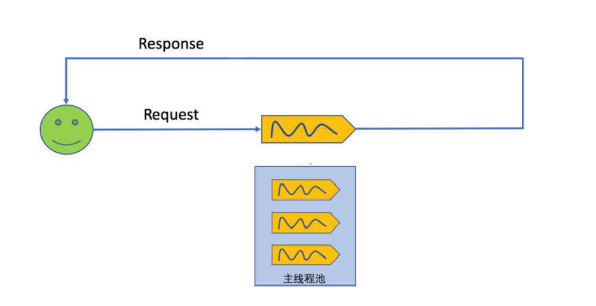
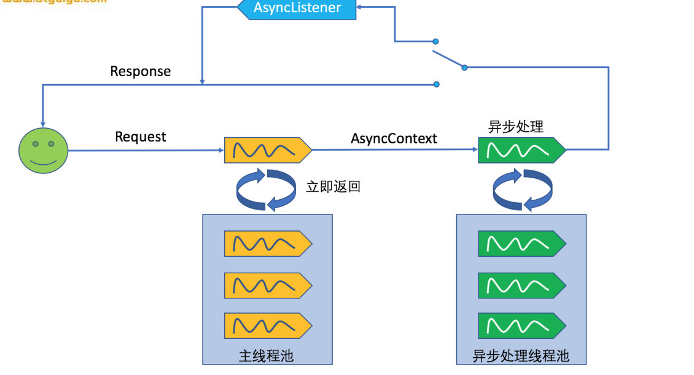

# springMVC异步请求




上面是同步请求过程。

`servlet 3.0`异步请求

```java
@WebServlet(value="/async",asyncSupported=true)
public class HelloAsyncServlet extends HttpServlet {
	@Override
	protected void doGet(HttpServletRequest req, HttpServletResponse resp) throws ServletException, IOException {
		//1、支持异步处理asyncSupported=true
		//2、开启异步模式
		System.out.println("主线程开始。。。"+Thread.currentThread()+"==>"+System.currentTimeMillis());
		AsyncContext startAsync = req.startAsync();
		
		//3、业务逻辑进行异步处理;开始异步处理
		startAsync.start(new Runnable() {
			@Override
			public void run() {
				try {
					System.out.println("副线程开始。。。"+Thread.currentThread()+"==>"+System.currentTimeMillis());
					sayHello();
					startAsync.complete();
					//获取到异步上下文
					AsyncContext asyncContext = req.getAsyncContext();
					//4、获取响应
					ServletResponse response = asyncContext.getResponse();
					response.getWriter().write("hello async...");
					System.out.println("副线程结束。。。"+Thread.currentThread()+"==>"+System.currentTimeMillis());
				} catch (Exception e) {
				}
			}
		});		
		System.out.println("主线程结束。。。"+Thread.currentThread()+"==>"+System.currentTimeMillis());
	}

	public void sayHello() throws Exception{
		System.out.println(Thread.currentThread()+" processing...");
		Thread.sleep(3000);
	}
}
```

下面是异步请求过程。 



主线程池是`Tomcat`容器中， 异步请求是当一个请求过来的时候，主线程直接执行。启动另外一个线程完成任务。

springMVC 异步执行过程。

```java
/**
	 * 1、控制器返回Callable
	 * 2、Spring异步处理，将Callable 提交到 TaskExecutor 使用一个隔离的线程进行执行
	 * 3、DispatcherServlet和所有的Filter退出web容器的线程，但是response 保持打开状态；
	 * 4、Callable返回结果，SpringMVC将请求重新派发给容器，恢复之前的处理；
	 * 5、根据Callable返回的结果。SpringMVC继续进行视图渲染流程等（从收请求-视图渲染）。
	 * 
	 * preHandle.../springmvc-annotation/async01
		主线程开始...Thread[http-bio-8081-exec-3,5,main]==>1513932494700
		主线程结束...Thread[http-bio-8081-exec-3,5,main]==>1513932494700
		=========DispatcherServlet及所有的Filter退出线程============================
		
		================等待Callable执行==========
		副线程开始...Thread[MvcAsync1,5,main]==>1513932494707
		副线程开始...Thread[MvcAsync1,5,main]==>1513932496708
		================Callable执行完成==========
		
		================再次收到之前重发过来的请求========
		preHandle.../springmvc-annotation/async01
		postHandle...（Callable的之前的返回值就是目标方法的返回值）
		afterCompletion...
		
		异步的拦截器:
			1）、原生API的AsyncListener
			2）、SpringMVC：实现AsyncHandlerInterceptor；
	 * @return
	 */
```

1. 返回`callable`处理结果、

```java
   @ResponseBody
	@RequestMapping("/async01")
	public Callable<String> async01(){
		System.out.println("主线程开始..."+Thread.currentThread()+"==>"+System.currentTimeMillis());
		
		Callable<String> callable = new Callable<String>() {
			@Override
	public String call() throws Exception {
	       System.out.println("副线程开始..."+Thread.currentThread()+"==>"+System.currentTimeMillis());
				Thread.sleep(2000);
				System.out.println("副线程开始..."+Thread.currentThread()+"==>"+System.currentTimeMillis());
				return "Callable<String> async01()";
			}
		};
		
		System.out.println("主线程结束..."+Thread.currentThread()+"==>"+System.currentTimeMillis());
		return callable;
	}

```

2. 返回`DeferredResult `处理结果

```java
@ResponseBody
	@RequestMapping("/createOrder")
	public DeferredResult<Object> createOrder(){
		DeferredResult<Object> deferredResult = new DeferredResult<>((long)3000, "create fail...");
			
		DeferredResultQueue.save(deferredResult);
		
		return deferredResult;
	}
	
	@ResponseBody
	@RequestMapping("/create")
	public String create(){
		//创建订单
		String order = UUID.randomUUID().toString();
		DeferredResult<Object> deferredResult = DeferredResultQueue.get();
		deferredResult.setResult(order);
		return "success===>"+order;
	}
```

```java
public class DeferredResultQueue {	
	private static Queue<DeferredResult<Object>> queue = new ConcurrentLinkedQueue<DeferredResult<Object>>();
	
	public static void save(DeferredResult<Object> deferredResult){
		queue.add(deferredResult);
	}	
	public static DeferredResult<Object> get( ){
		return queue.poll();
	}

}
```

以上代码处理模型是流程如下：


