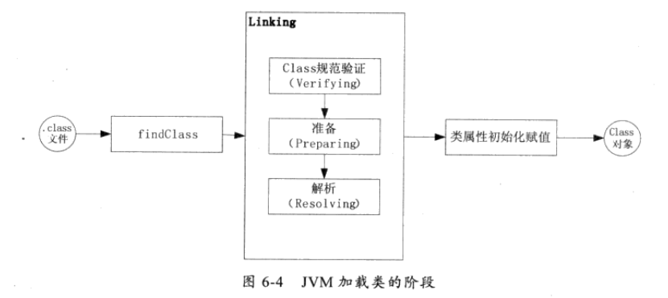

#                 分析ClassLoader加载机制

### `classLoader`


- `BootstrapClassloader`并不属于JVM 类层次。最顶层`ExtClassLoader`
- jVM 加载class 文件


### 如何加载class文件

- 类加载阶段分为**加载、连接、初始化**三个阶段




- 第一阶段，通过类加载器的findClass方法（ClassLoader 留给子类实现）或者loadClass方法 等加载到内存中

  **双亲委派模型**

  - 双亲委派的意思是如果一个类加载器需要加载类，那么首先它会把这个类请求委派给父类加载器去完成，每一层都是如此。一直递归到顶层，当父加载器无法完成这个请求时，子类才会尝试去加载。

  ```java
   protected Class<?> loadClass(String name, boolean resolve)
          throws ClassNotFoundException
      {
          synchronized (getClassLoadingLock(name)) {
              // First, check if the class has already been loaded
              Class<?> c = findLoadedClass(name);
              if (c == null) {
                  long t0 = System.nanoTime();
                  try {
                  
                      //父 加载器不为空 交给父去加载
                      if (parent != null) {
                          c = parent.loadClass(name, false);
                      } else {
                      // 如果为空 BootstrapClassLoader 加载
                      // 说明这个BootstrapClassLoader 不在双亲机制中。
                          c = findBootstrapClassOrNull(name);
                      }
                  } catch (ClassNotFoundException e) {
                      // ClassNotFoundException thrown if class not found
                      // from the non-null parent class loader
                  }
  
                  if (c == null) {
                      // If still not found, then invoke findClass in order
                      // to find the class.
                      long t1 = System.nanoTime();
                      // 否则通过findClass 加载.
                      c = findClass(name);
  
                      // this is the defining class loader; record the stats
                      sun.misc.PerfCounter.getParentDelegationTime().addTime(t1 - t0);
                      sun.misc.PerfCounter.getFindClassTime().addElapsedTimeFrom(t1);
                      sun.misc.PerfCounter.getFindClasses().increment();
                  }
              }
              if (resolve) {
                  resolveClass(c);
              }
              return c;
          }
      }
  ```

  **三个类加载器**

  - `Bootstrap ClassLoader`

    <JAVA_HOME>\lib目录中或被-Xbootclasspath指定的路径中的并且文件名是被虚拟机识别的文件。

  - `Extension ClassLoader`

    它是Java实现的，独立于虚拟机，主要负责加载<JAVA_HOME>\lib\ext目录中或被java.ext.dirs系统变量所指定的路径的类库。

  - `Application ClassLoader`

    主要负责加载用户类路径(classPath)上的类库，如果我们没有实现自定义的类加载器,那么这个类加载器就是程序中的默认加载器。

    

  


- 第二阶段 验证和解析

  

- 第三阶段 初始化Class 对象

### Java 类的生命周期


### 实现自己的类加载器


```java
public class PathClassLoader extends ClassLoader {

    private String classPath;
    private  String packageName = "cn.ccu.reflect";

    public PathClassLoader(String classPath) {
        this.classPath = classPath;
    }


    @Override
    protected Class<?> findClass(String name) throws ClassNotFoundException {
        // 检查是否被加载到虚拟机中了。
        Class<?> aClass = findLoadedClass(name);
        if(aClass != null){
            return aClass;
        }
        if(packageName.startsWith(name)){
            byte[] classDate = getDate(name);
            if(classDate==null){
                throw new ClassNotFoundException();
            }else {
                return defineClass(name,classDate,0,classDate.length);
            }
        }else {
            return super.findClass(name);
        }
    }

    private byte[] getDate(String className) {
        String path =  classPath+ File.separatorChar +
                className.replace('.',File.separatorChar)+".class";
        try {
            InputStream in = new FileInputStream(path);
            ByteArrayOutputStream out  = new ByteArrayOutputStream();
            byte[] buffer = new byte[1024];
            int length = 0;
            while (( length = in.read(buffer)) != -1){
                out.write(buffer,0,length);
            }
            return out.toByteArray();
        } catch (Exception e) {
            e.printStackTrace();
        }
        return null;
    }


    public static void main(String[] args) throws Exception {
        //  输出：\
        System.out.println("++" +File.separatorChar+"++");

       // System.out.println(packageName.startsWith("cn.ccu.reflect.ServiceImpl.class"));

    }
}

```

```java
public class URLPathClassLoader extends URLClassLoader {

    private String packageName = "cn.ccu.reflect";

    public URLPathClassLoader(URL[] urls, ClassLoader parent) {
        super(urls, parent);
    }

    @Override
    protected Class<?> findClass(String name) throws ClassNotFoundException {
    // Invoke {findLoadedClass(String)} to check if the class has already been loaded. 
        Class<?> aClass = findLoadedClass(name);
        if(aClass != null){
            return aClass;
        }
        if(!packageName.startsWith(name)){
            return super.findClass(name);
        }else {
            // 这一步逻辑 如何理解.
           return findClass(name);
        }
    }
}

```


```java
public class ClassReloader extends ClassLoader {

    private String classPath;
    private  String classname = "cn.ccu.reflect.ServiceImpl";

    public ClassReloader(String classPath) {
        super();
        this.classPath = classPath;
    }
    @Override
    protected Class<?> findClass(String name) throws ClassNotFoundException {
        byte[] classDate = getDate(name);
        if (classDate == null) {
            throw new ClassNotFoundException();
        } else {
            return defineClass(classname, classDate, 0, classDate.length);
        }

    }

    private byte[] getDate(String className) {
        String path = classPath+className;
        try {
            InputStream in = new FileInputStream(path);
            ByteArrayOutputStream out  = new ByteArrayOutputStream();
            byte[] buffer = new byte[1024];
            int length = 0;
            while (( length = in.read(buffer)) != -1){
                out.write(buffer,0,length);
            }
            return out.toByteArray();
        } catch (Exception e) {
            e.printStackTrace();
        }
        return null;
    }


    public static void main(String[] args) throws Exception {
        //  输出：\
        System.out.println("++" +File.separatorChar+"++");

       // System.out.println(packageName.startsWith("cn.ccu.reflect.ServiceImpl.class"));
        // 演示热部署
        // 先编译一个Class文件
        String path = "D:/ideaspace/Java-Patterns/src/cn/ccu/reflect/";
        ClassReloader pathClassLoader1= new ClassReloader(path);
        Class<?> c1 = pathClassLoader1.findClass("ServiceImpl.class");
        System.out.println(c1.newInstance());
        ClassReloader pathClassLoader2= new ClassReloader(path);
        Class<?> c2 = pathClassLoader2.findClass("ServiceImpl.class");
        System.out.println(c2.newInstance());

    }
}
```

### Java应不应该动态加载类


