#                 分析Java I/O 工作机制

### 磁盘IO工作机制

- 标准访问文件方式

  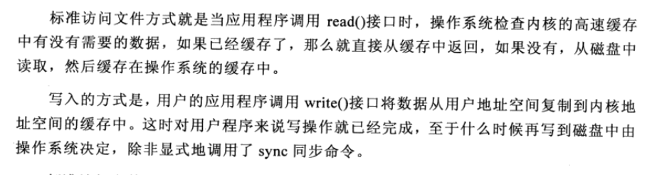
  
  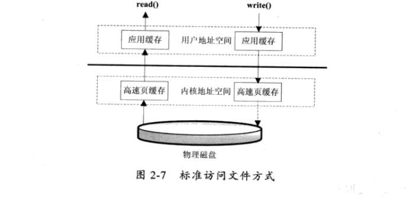

- 直接IO方式

  应用程序直接访问应用程序

  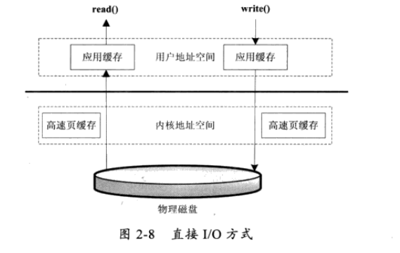

- 同步访问文件方式（阻塞）

  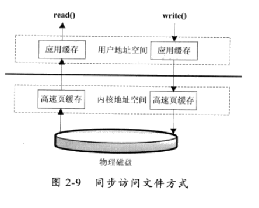

- 异步访问文件方式（不会阻塞等待）

  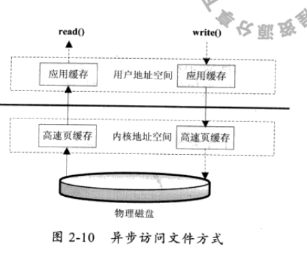

- 内存映射方式

   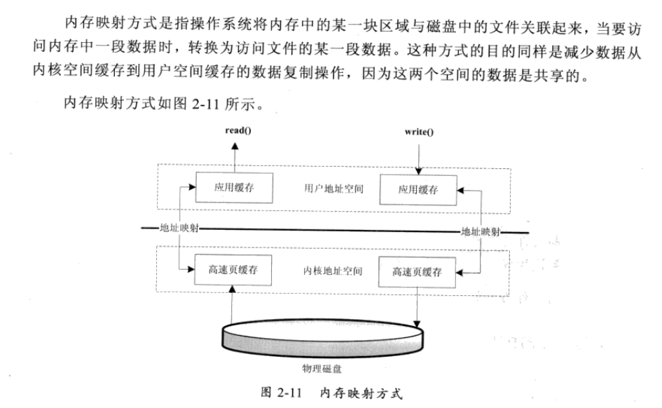

### Java访问磁盘文件

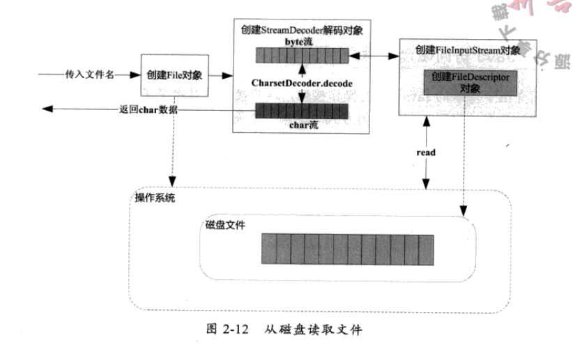

- Java序列化技术

  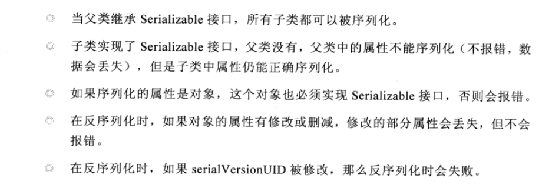

### 网络I/O工作机制

- TCP状态转化（细节待研究）

  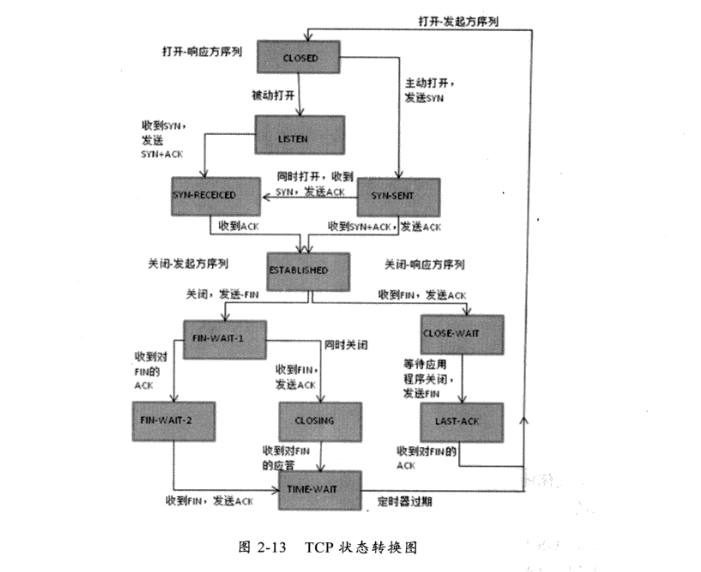

- 影响网络传输的因素

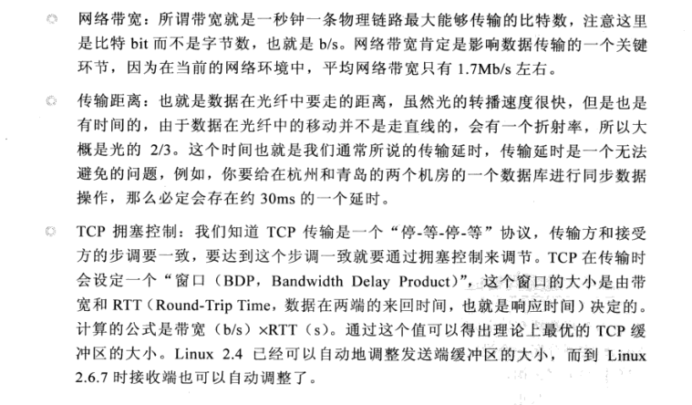

- Java Socket工作机制

  大部分情况下，我们都是使用基于TCP/IP流套接字，它是一种稳定的通信协议。

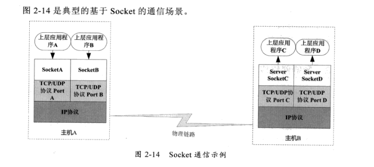

- 建立通信链路

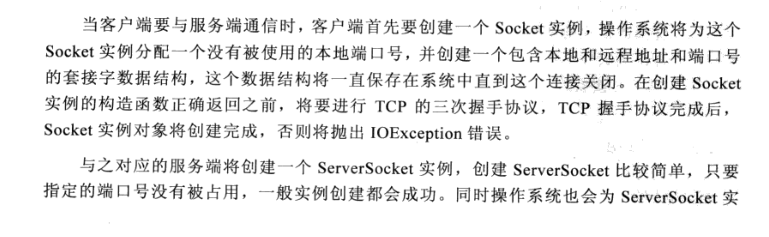

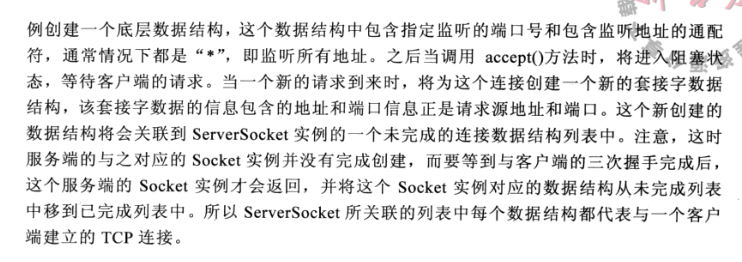

- 数据传输

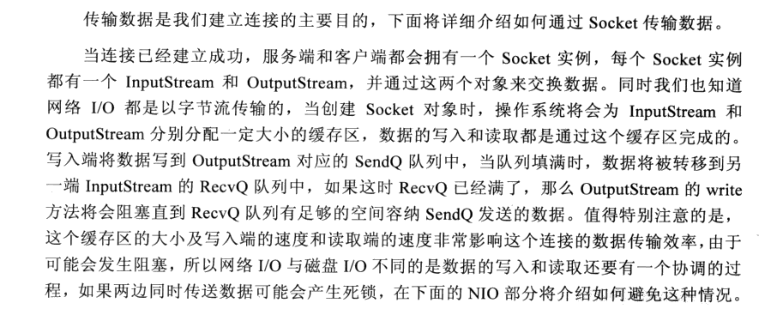

### NIO的工作方式

- NIO相关类图

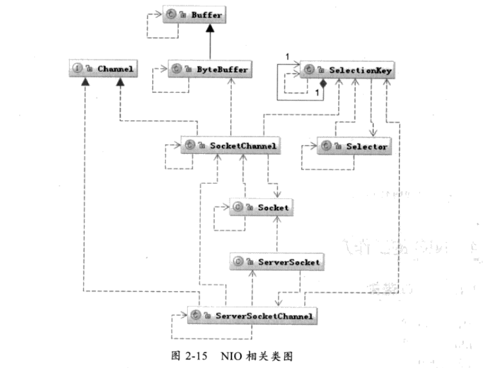

- Channel 核心概念：类比某种具体交通工具，汽车或者高铁。
- Selector核心概念： 比作一个车辆调度系统，负责监控每辆车的运行状态，已经出站，还在路上等。
- buffer： 比作车上的座位。

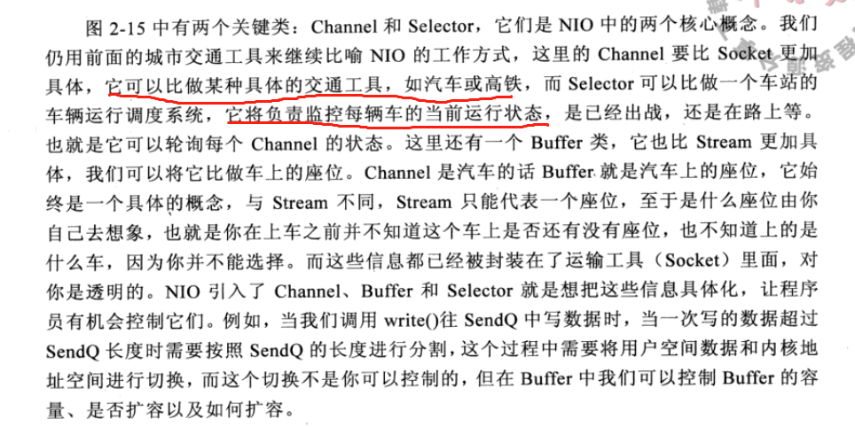

- 基于NIO工作方式的Socket请求的处理过程

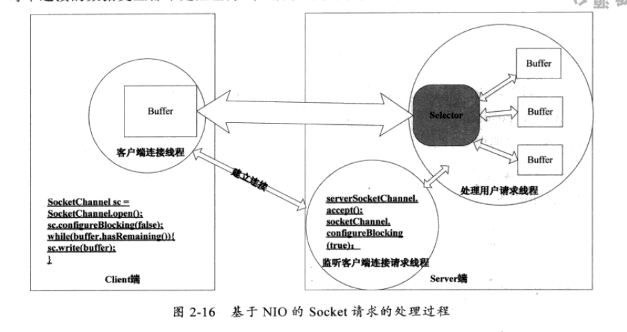

- buffer的工作方式

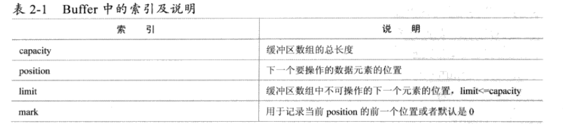

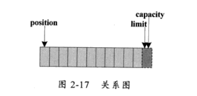

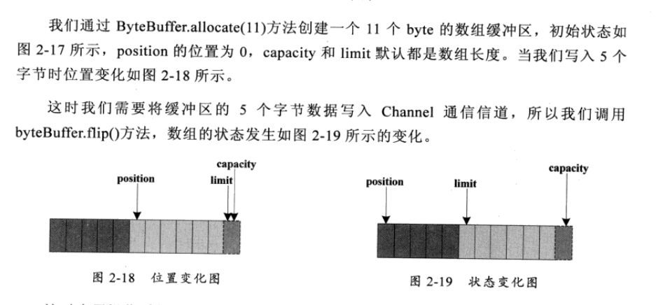

- NIO的数据访问方式
  - `FileChannel.transferXXX` 减少数据从内核到用户空间的复制，数据直接在内核空间中移动，在Linux中通过sendfile系统调用。

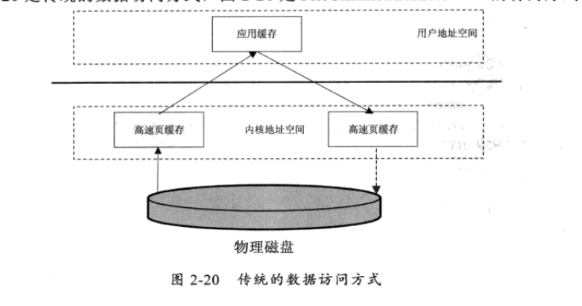

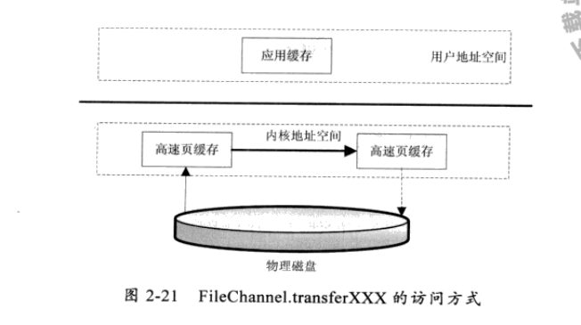

- 同步和异步，阻塞和非阻塞组合方式分析分析

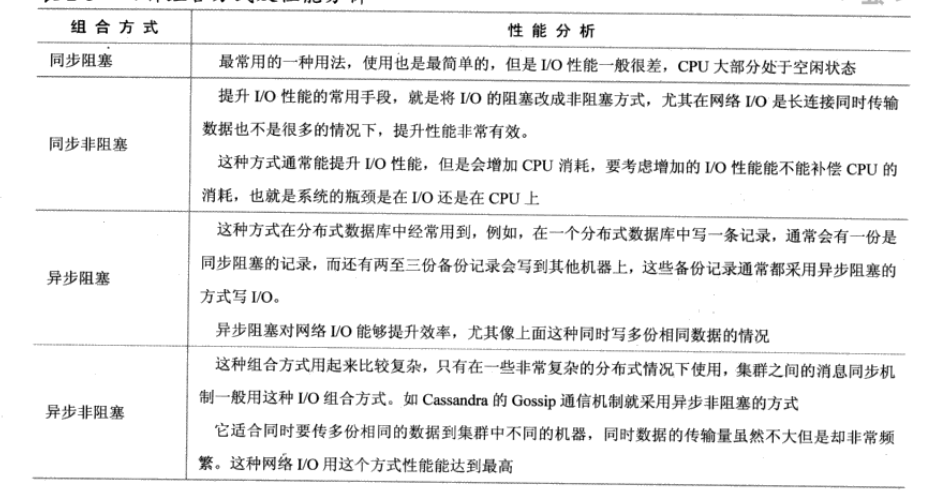

### NIO常用设计模式解析

- 适配器模式： 把一个类的接口变成客户端所接受的另一种接口，从而使连个接口不匹配的而无法在一起工作的两个类在一起工作。

  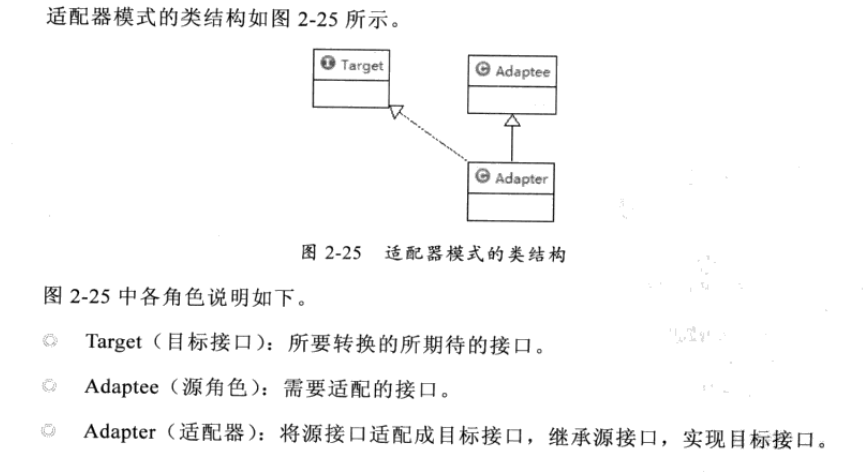

  - java I/O中的适配器模式,比如:`InputStreamReader`

    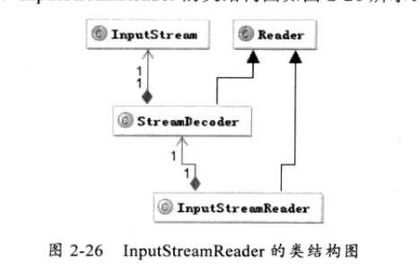

- 装饰者模式:将某个类重新装配一下。使之跟漂亮。

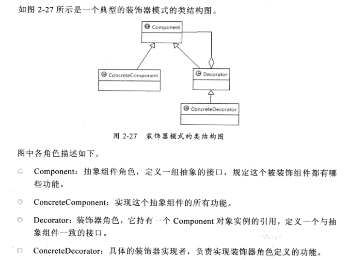

- java中运用，比如`FilterInputStream` 具体实现`BufferInputStream`

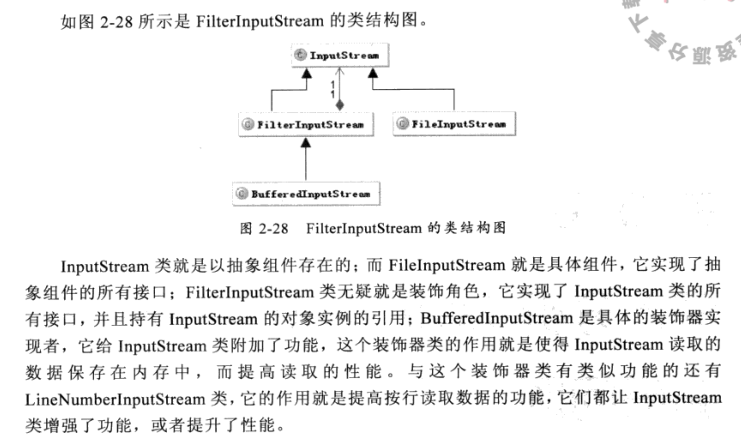

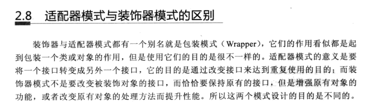

