#                理解cookie和session

### 理解cookie

- cookie  有两个版本Version 0 和Version 1

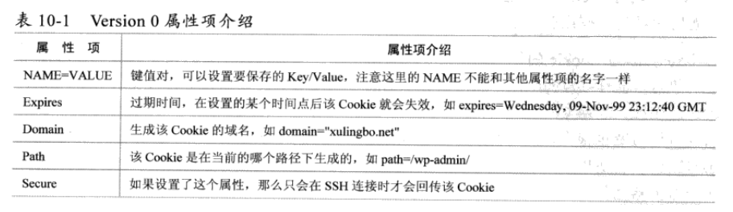

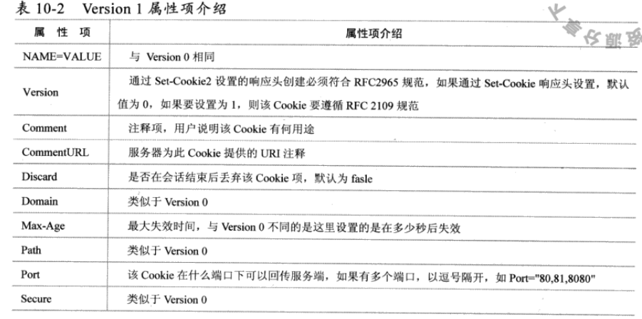

- cookie使用

  ```java
   Cookie cookie = new Cookie("access_token", UUID.randomUUID().toString());
   cookie.setHttpOnly(true);
   cookie.setPath("/");
   cookie.setDomain("localhost");
   response.addCookie(cookie);
  ```

  ```java 
  Cookie[] cookies = request.getCookies(); 
  for(Cookie cookieTemp : cookies){  
       String  cookieIdentity = cookieTemp.getName();               
      if(cookieIdentity.equals(AppConstants.COOKIE_IDENTITY)){               
      // setMaxAge(参数)：参数为负数代表关闭浏览器时清除cookie，
      // 参数为0时代表删除cookie，参数为正数时代表cookie存在多少秒。             
          cookieTemp.setMaxAge(0);        
          response.addCookie(cookieTemp);      
     }    
   } 
  ```

  

- cookie 使用有限制 ，浏览器对cookie 的数量和大小有限制。

-  cookie安全问题

### 理解session

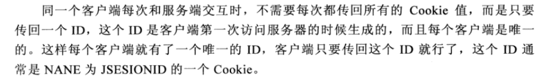

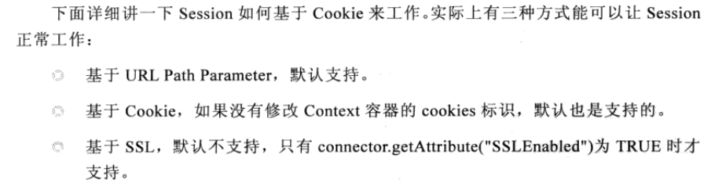

- session工作

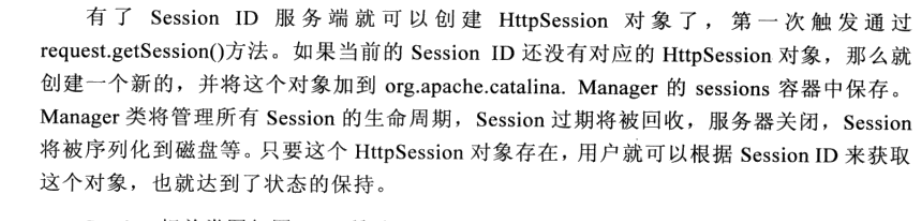

### 分布式session框架

- 解决那些问题

  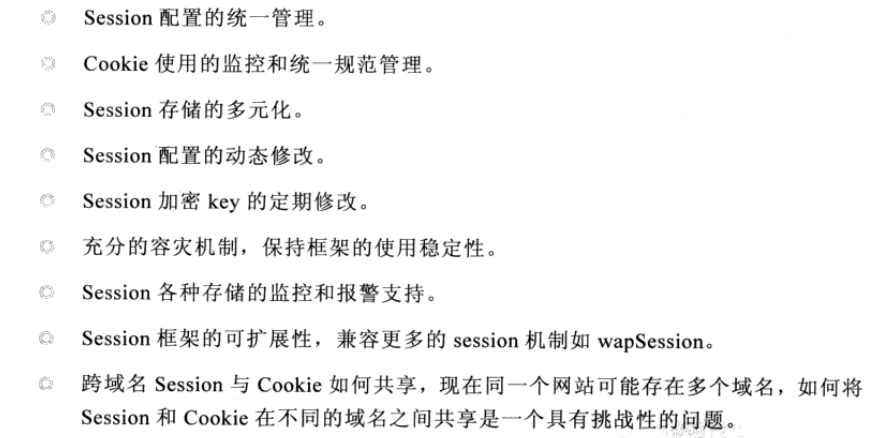

- 实现思路

  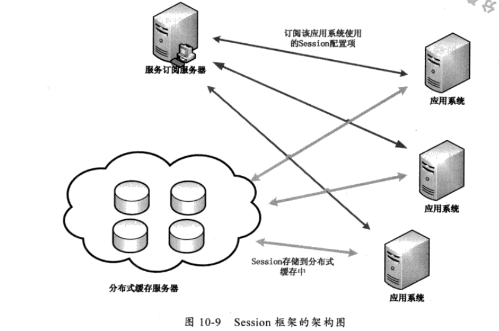

- 如何解决跨域名解决cookie共享的问题

  - https://www.cnblogs.com/dream-to-pku/p/10361350.html 可以参考

  - redis+ token

    简单的说，token只是一个标识，以token加redis为例，服务端将token保存在redis中，客服端访问时带上token，如果在redis中能够查到这个token，说明身份有效。

  - jwt （不是很理解）

    jwt不需要查库，本身已经包含了用户的相关信息，可以直接通过服务端解析出相关的信息，与session，token的最大区别就是服务端不保存任何信息.

  - 跨域名同步session

  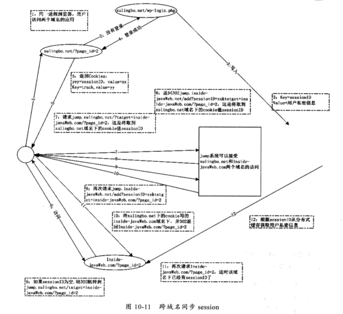

### cookie压缩

```java
// 代码
 public void compressCookie(Cookie c, HttpServletResponse response){
        try {
            ByteArrayOutputStream bos =  new ByteArrayOutputStream();
            DeflaterOutputStream dos = new DeflaterOutputStream(bos);
            dos.write(c.getValue().getBytes());
            dos.close();
            System.out.println("before compress length :"+c.getValue().getBytes().length);
            String compress = new BASE64Encoder().encode(bos.toByteArray());
            response.addCookie(new Cookie("compress",compress));
            System.out.println("after compress length "+ compress.getBytes().length);
        } catch (IOException e) {
            e.printStackTrace();
        }
    }

    public void unCompressCookie(Cookie cookie){
        try {
            ByteArrayOutputStream out = new ByteArrayOutputStream();
            byte[] compress = new BASE64Decoder().
                    decodeBuffer(new String(cookie.getValue().getBytes()));
            ByteArrayInputStream bis = new ByteArrayInputStream(compress);
            InflaterInputStream iis = new InflaterInputStream(bis);
            byte[] b = new byte[1024];
            int count;
            while((count= iis.read())!= -1){
                out.write(b,0,count);
            }
            iis.close();
            System.out.println(out.toByteArray());
        } catch (IOException e) {
            e.printStackTrace();
        }
    }
```


### 解决表单重复提交

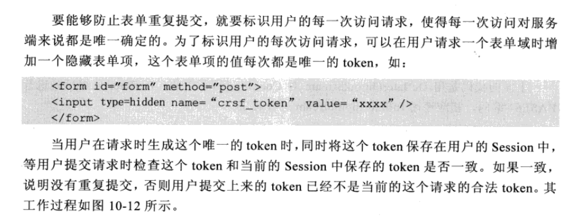

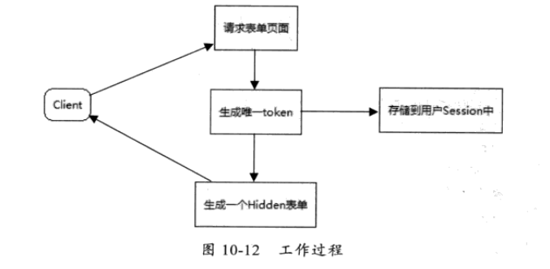

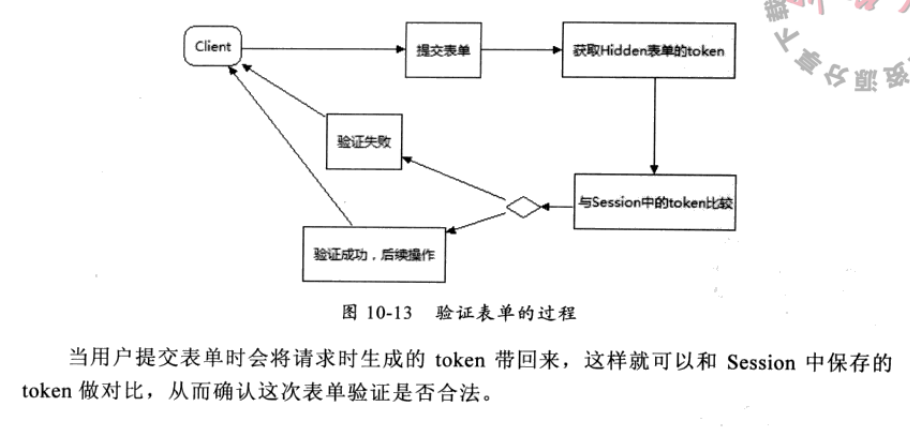

- 首次提交表单时session的token与表单携带的token一致走正常流程，然后将会删除session保存的token。当再次提交表单时由于session的token为空则不通过。从而实现了防止表单重复提交。