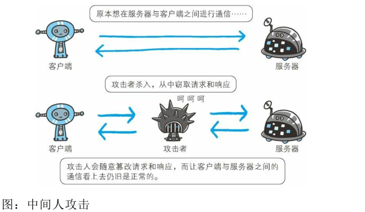
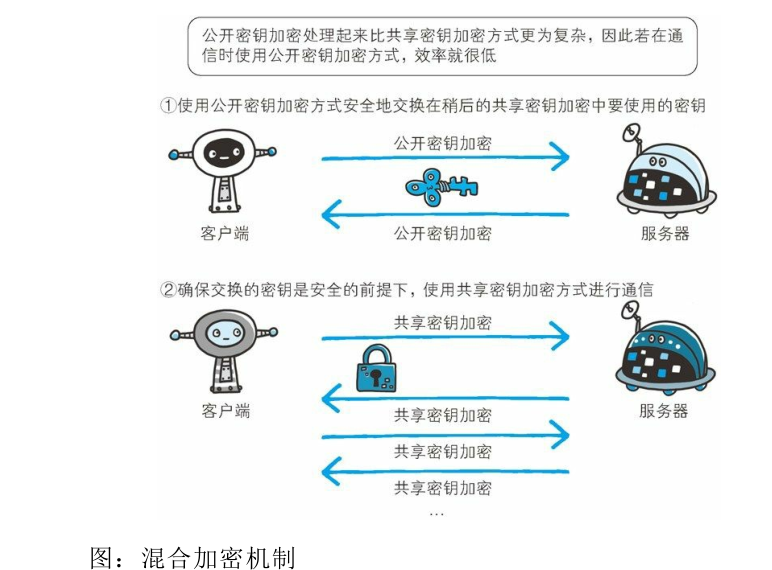
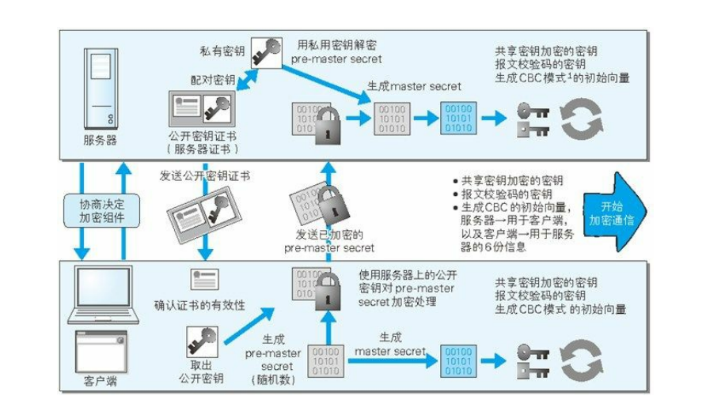
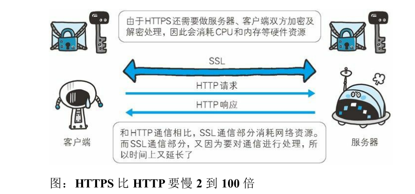

#               确保 Web 安全的HTTPS

### HTTP 的缺点

- 通信使用明文（不加密），内容可能会被窃听

  > - TCP/IP 是可能被窃听的网络
  >
  > 如果要问为什么通信时不加密是一个缺点，这是因为，按TCP/IP 协议族的工作机制，通信内容在所有的通信线路上都有可能遭到窥视。
  >
  > 所谓互联网，是由能连通到全世界的网络组成的。无论世界哪个角落的服务器在和客户端通信时，在此通信线路上的某些网络设备、光缆、计算机等都不可能是个人的私有物，所以不排除某个环节中会遭到恶意窥视行为。
  >
  > - 加密处理防止被窃听
  >
  > 通信的加密
  > 一种方式就是将通信加密。HTTP 协议中没有加密机制，但可以通过和 SSL（Secure Socket Layer，安全套接层）或TLS（Transport Layer Security，安全层传输协议）的组合使用，加密 HTTP 的通信内容。
  >
  > 内容的加密
  >
  > 还有一种将参与通信的内容本身加密的方式。由于 HTTP 协议中没有加密机制，那么就对 HTTP 协议传输的内容本身加密。即把HTTP 报文里所含的内容进行加密处理。
  >
  > 由于该方式不同于 SSL 或 TLS 将整个通信线路加密处理，所以内容仍有被篡改的风险。

- 不验证通信方的身份，因此有可能遭遇伪装

  > - 任何人都可发起请求
  >
  > 在 HTTP 协议通信时，由于不存在确认通信方的处理步骤，任何人都可以发起请求。另外，服务器只要接收到请求，不管对方是谁都会返回一个响应（但也仅限于发送端的 IP 地址和端口号没有被 Web 服务器设定限制访问的前提下）。
  >
  > - 查明对手的证书
  >
  > 虽然使用 HTTP 协议无法确定通信方，但如果使用 SSL 则可以。SSL 不仅提供加密处理，而且还使用了一种被称为证书的手段，可用于确定方.
  >
  > 

- 无法证明报文的完整性，所以有可能已遭篡改

  > 接收到的内容可能有误
  >
  > 请求或响应在传输途中，遭攻击者拦截并篡改内容的攻击称为中间人攻击
  >
  > 
  >
  > 如何防止篡改
  >
  > 虽然有使用 HTTP 协议确定报文完整性的方法，但事实上并不便捷、可靠。其中常用的是 MD5 和 SHA-1 等散列值校验的方法，以及用来确认文件的**数字签名方法**。

### HTTP+ 加密 + 认证 + 完整性保护=HTTPS

> 1. HTTPS 是身披 SSL 外壳的 HTTP
>
> 只是 HTTP 通信接口部分用SSL（Secure Socket Layer）和 TLS（Transport Layer Security）协议代
> 替而已。
>
> 2. 相互交换密钥的公开密钥加密技术
>
> - **共享密钥加密的困境**
>
>   加密和解密同用一个密钥的方式称为共享密钥加密（Common keycrypto system），也被叫做**对称密钥加密。**
>
>   以共享密钥方式加密时必须将密钥也发给对方。可究竟怎样才能安全地转交？在互联网上转发密钥时，如果通信被监听那么密钥就可会落入攻击者之手，同时也就失去了加密的意义。另外还得设法安全地保管接收到的密钥。
>
> - **使用两把密钥的公开密钥加密**
>
>   公开密钥加密方式很好地解决了共享密钥加密的困难。
>   公开密钥加密使用一对**非对称的密钥**。一把叫做私有密钥（private key），另一把叫做公开密钥（public key）。顾名思义，私有密钥不能让其他任何人知道，而公开密钥则可以随意发布，任何人都可以获得。
>
>   使用公开密钥加密方式，发送密文的一方使用对方的公开密钥进行加密处理，对方收到被加密的信息后，再使用自己的私有密钥进行解密。利用这种方式，不需要发送用来解密的私有密钥，也不必担心密钥被攻击者窃听而盗走。
>
> - **HTTPS 采用混合加密机制**
>
>   HTTPS 采用共享密钥加密和公开密钥加密两者并用的混合加密机制。若密钥能够实现安全交换，那么有可能会考虑仅使用公开密钥加密来通信。但是公开密钥加密与共享密钥加密相比，其处理速度要慢。
>
>   

> - **证明公开密钥正确性的证书**
>
>   使用由数字证书认证机构（CA，CertificateAuthority）和其相关机关颁发的公开密钥证书。
>
>   数字证书认证机构处于客户端与服务器双方都可信赖的第三方机构的立场上。
>
>   我们来介绍一下数字证书认证机构的业务流程。首先，**服务器的运营人员向数字证书认证机构提出公开密钥的申请。数字证书认证机构在判明提出申请者的身份之后**，**会对已申请的公开密钥做数字签名，然后分配这个已签名的公开密钥，并将该公开密钥放入公钥证书后绑定在一起**。服务器会将这份由数字证书认证机构颁发的公钥证书发送给客户端，以进行公开密钥加密方式通信。**公钥证书也可叫做数字证书或直接称为证书**。接到证书的客户端可使用数字证书认证机构的公开密钥，对那张证书上的数字签名进行验证，一旦验证通过，客户端便可明确两件事：
>
>   一，认证服务器的公开密钥的是真实有效的数字证书认证机构。
>
>   二，服务器的公开密钥是值得信赖的。此处认证机关的公开密钥必须安全地转交给客户端。使用通信方式时，如何安全转交是一件很困难的事，因此，多数浏览器开发商发布版本时，会事先在内部植入常用认证机关的公开密钥。
>
> - **HTTPS 的安全通信机制**

1 CBC 模式（Cipher Block Chaining）又名密码分组链接模式。在此模式下，将前一个明文块加密处理后和下一个明文块做 XOR 运算，使之重叠，然后再对运算结果做加密处理。对第一个明文块做加密时，要么使用前一段密文的最后一块，要么利用外部生成的初始向量（initial vector，IV）。

